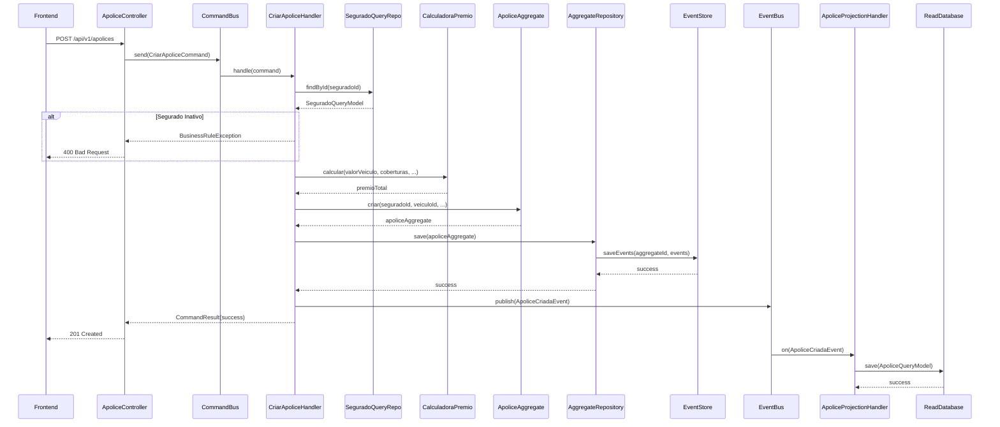
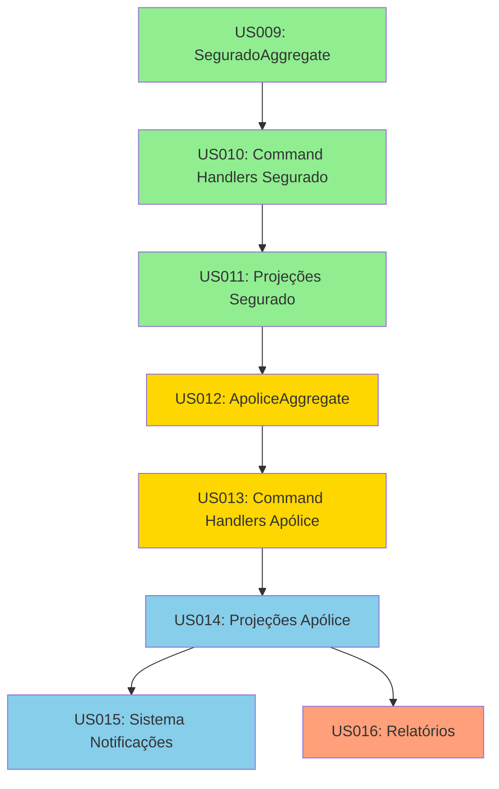

# Plan Specification - Épico 2: Domínio de Segurados e Apólices

## 1. Visão Geral do Plano

### 1.1 Objetivo
Implementar o domínio core de negócios para gestão de segurados e apólices de seguro automotivo, utilizando Event Sourcing e CQRS sobre a infraestrutura estabelecida no Épico 1.

### 1.2 Escopo
- 8 User Stories (US009-US016)
- 165 Story Points
- 4 Sprints de 2 semanas cada
- Duração total: 8 semanas

### 1.3 Entregas Principais
- Domain Model completo (Aggregates, Value Objects, Enums)
- Command Handlers com validações de negócio
- Event Handlers para Event Sourcing
- Projection Handlers para CQRS
- Query Services otimizados com cache
- APIs REST documentadas
- Sistema de notificações básico
- Dashboard operacional
- Relatórios analíticos

---

## 2. Organização em Sprints

### SPRINT 1 (2 semanas) - Fundação: Domínio de Segurados
**Objetivo**: Implementar gestão completa de segurados com CRUD funcional

#### US009: Aggregate de Segurado com Eventos Ricos (21 pts)
**Responsável**: Desenvolvedor Sênior (DDD/Event Sourcing)

**Tarefas**:
1. **Criar estrutura de domínio base** (3 pts)
   - [ ] Criar package `com.seguradora.hibrida.aggregate.segurado`
   - [ ] Definir enum `SeguradoStatus` (ATIVO, INATIVO)
   - [ ] Criar diagrama de máquina de estados

2. **Implementar Value Objects** (5 pts)
   - [ ] Criar `Email` com validação RFC 5322
   - [ ] Criar `Telefone` com validação brasileira (DDD + número)
   - [ ] Criar `Endereco` com todos os campos
   - [ ] Criar validador `CpfValidator` com dígito verificador
   - [ ] Implementar equals/hashCode para todos os VOs

3. **Implementar SeguradoAggregate** (8 pts)
   - [ ] Criar classe `SeguradoAggregate extends AggregateRoot`
   - [ ] Implementar factory method `criar()` com validações
   - [ ] Implementar método `atualizar()` com detecção de mudanças
   - [ ] Implementar método `desativar()` com motivo obrigatório
   - [ ] Implementar método `reativar()` com validações
   - [ ] Adicionar validações de invariantes (idade 18-80 anos)

4. **Criar Domain Events** (3 pts)
   - [ ] Criar `SeguradoCriadoEvent` com todos os dados
   - [ ] Criar `SeguradoAtualizadoEvent` com diff
   - [ ] Criar `SeguradoDesativadoEvent` com motivo
   - [ ] Criar `SeguradoReativadoEvent`
   - [ ] Implementar serialização JSON para todos os eventos

5. **Implementar Event Sourcing Handlers** (2 pts)
   - [ ] Adicionar `@EventSourcingHandler` para `on(SeguradoCriadoEvent)`
   - [ ] Adicionar handler para `on(SeguradoAtualizadoEvent)`
   - [ ] Adicionar handler para `on(SeguradoDesativadoEvent)`
   - [ ] Adicionar handler para `on(SeguradoReativadoEvent)`
   - [ ] Testar reconstrução de estado via replay de eventos

**Critérios de Aceite da Tarefa**:
- ✅ SeguradoAggregate completo com todos os métodos
- ✅ Todos os eventos definidos e serializáveis
- ✅ Validações de negócio funcionando
- ✅ Reconstrução via Event Sourcing testada
- ✅ Cobertura de testes > 90%

---

#### US010: Command Handlers para Segurado (13 pts)
**Responsável**: Desenvolvedor Pleno (Backend)

**Tarefas**:
1. **Criar Commands** (3 pts)
   - [ ] Criar `CriarSeguradoCommand` com Bean Validation
   - [ ] Criar `AtualizarSeguradoCommand` com versionamento
   - [ ] Criar `DesativarSeguradoCommand` com motivo
   - [ ] Criar `ReativarSeguradoCommand`
   - [ ] Adicionar builders para todos os commands

2. **Implementar CriarSeguradoCommandHandler** (4 pts)
   - [ ] Criar handler implementando `CommandHandler<CriarSeguradoCommand>`
   - [ ] Validar unicidade de CPF no query repository
   - [ ] Validar unicidade de email
   - [ ] Construir Value Objects a partir do command
   - [ ] Criar aggregate e persistir via repository
   - [ ] Retornar `CommandResult` com ID do segurado

3. **Implementar demais Command Handlers** (4 pts)
   - [ ] Implementar `AtualizarSeguradoCommandHandler`
   - [ ] Implementar `DesativarSeguradoCommandHandler`
   - [ ] Implementar `ReativarSeguradoCommandHandler`
   - [ ] Adicionar controle de concorrência otimista

4. **Configurar Command Bus** (2 pts)
   - [ ] Registrar todos os handlers no `CommandHandlerRegistry`
   - [ ] Configurar timeout de 15s para comandos de segurado
   - [ ] Configurar métricas customizadas (latência, throughput)
   - [ ] Testar roteamento automático

**Critérios de Aceite da Tarefa**:
- ✅ Todos os command handlers funcionando
- ✅ Validações de unicidade implementadas
- ✅ Controle de concorrência testado
- ✅ Métricas coletadas automaticamente
- ✅ Cobertura de testes > 85%

---

#### US011: Projeções Otimizadas de Segurado (13 pts)
**Responsável**: Desenvolvedor Pleno (Backend + Banco de Dados)

**Tarefas**:
1. **Criar Query Model (Entity JPA)** (3 pts)
   - [ ] Criar `SeguradoQueryModel` no schema `projections`
   - [ ] Mapear todos os campos desnormalizados
   - [ ] Adicionar índices: cpf (unique), nome, email (unique), status
   - [ ] Adicionar índice composto (status, dataCadastro)

2. **Criar migração Flyway** (2 pts)
   - [ ] Criar `V6__Create_Segurado_View.sql`
   - [ ] Definir tabela `projections.segurado_view`
   - [ ] Criar índices para performance
   - [ ] Adicionar comentários descritivos
   - [ ] Testar migração em ambiente local

3. **Implementar SeguradoProjectionHandler** (5 pts)
   - [ ] Criar handler estendendo `AbstractProjectionHandler`
   - [ ] Implementar `@EventHandler` para `SeguradoCriadoEvent`
   - [ ] Implementar handler para `SeguradoAtualizadoEvent`
   - [ ] Implementar handler para `SeguradoDesativadoEvent`
   - [ ] Implementar handler para `SeguradoReativadoEvent`
   - [ ] Adicionar tratamento de erros e retry

4. **Criar Query Repository** (2 pts)
   - [ ] Criar `SeguradoQueryRepository extends JpaRepository`
   - [ ] Adicionar query `findByCpf(String cpf)`
   - [ ] Adicionar query `existsByCpf(String cpf)`
   - [ ] Adicionar query `existsByEmail(String email)`
   - [ ] Adicionar query customizada `buscarPorTermo(String termo)`
   - [ ] Adicionar queries por status e período

5. **Implementar Query Service** (1 pt)
   - [ ] Criar `SeguradoQueryService`
   - [ ] Adicionar método `buscarPorCpf()` com cache
   - [ ] Adicionar método `buscar()` com múltiplos filtros
   - [ ] Adicionar método `obterEstatisticas()`
   - [ ] Configurar cache Redis com TTL de 5 minutos

**Critérios de Aceite da Tarefa**:
- ✅ Query model otimizado criado
- ✅ Projection handler processando todos os eventos
- ✅ Consultas com performance < 50ms (P95)
- ✅ Cache funcionando corretamente
- ✅ Rebuild manual de projeção testado

---

### SPRINT 2 (2 semanas) - Core: Domínio de Apólices
**Objetivo**: Implementar gestão completa de apólices com cálculos automáticos

#### US012: Aggregate de Apólice com Relacionamentos (34 pts)
**Responsável**: Desenvolvedor Sênior (DDD/Event Sourcing) + Desenvolvedor Pleno

**Tarefas**:
1. **Criar estrutura de domínio** (5 pts)
   - [ ] Criar package `com.seguradora.hibrida.aggregate.apolice`
   - [ ] Definir enum `ApoliceStatus` (VIGENTE, VENCIDA, CANCELADA, SUSPENSA)
   - [ ] Definir enum `TipoCobertura` com 6 opções + fator prêmio
   - [ ] Definir enum `TipoFranquia` (NORMAL, REDUZIDA, MAJORADA) + fator
   - [ ] Criar diagrama de máquina de estados

2. **Implementar Domain Services** (8 pts)
   - [ ] Criar `CalculadoraPremio` service
   - [ ] Implementar cálculo base (5% do valor do veículo)
   - [ ] Aplicar fatores de cobertura
   - [ ] Aplicar fator de franquia
   - [ ] Aplicar percentual de desconto
   - [ ] Criar `CalculadoraDevolucao` service
   - [ ] Implementar regra de direito de arrependimento (7 dias)
   - [ ] Implementar cálculo pro-rata

3. **Implementar ApoliceAggregate** (12 pts)
   - [ ] Criar classe `ApoliceAggregate extends AggregateRoot`
   - [ ] Implementar factory method `criar()` com CalculadoraPremio
   - [ ] Implementar método `atualizarCobertura()` com recálculo
   - [ ] Implementar método `cancelar()` com CalculadoraDevolucao
   - [ ] Implementar método `renovar()` retornando novo aggregate
   - [ ] Adicionar gerador de número de apólice (APO-AAAA-NNNNNN)
   - [ ] Validar relacionamento com segurado e veículo
   - [ ] Validar período de vigência (30-365 dias)

4. **Criar Domain Events** (5 pts)
   - [ ] Criar `ApoliceCriadaEvent` com todos os dados
   - [ ] Criar `ApoliceAtualizadaEvent` com novos valores
   - [ ] Criar `ApoliceCanceladaEvent` com motivo e devolução
   - [ ] Criar `ApoliceRenovadaEvent` vinculando apólices
   - [ ] Implementar serialização JSON

5. **Implementar Event Sourcing Handlers** (4 pts)
   - [ ] Adicionar handlers para todos os eventos
   - [ ] Testar reconstrução de estado complexo
   - [ ] Testar snapshots com apólice completa
   - [ ] Validar integridade dos cálculos após replay

**Critérios de Aceite da Tarefa**:
- ✅ ApoliceAggregate completo com todos os métodos
- ✅ Cálculos de prêmio e devolução corretos
- ✅ Relacionamentos validados
- ✅ Todos os eventos definidos
- ✅ Cobertura de testes > 90%

---

#### US013: Command Handlers para Apólice (21 pts)
**Responsável**: Desenvolvedor Pleno (Backend)

**Tarefas**:
1. **Criar Commands** (4 pts)
   - [ ] Criar `CriarApoliceCommand` com validação completa
   - [ ] Criar `AtualizarCoberturaCommand`
   - [ ] Criar `CancelarApoliceCommand` com motivo
   - [ ] Criar `RenovarApoliceCommand`
   - [ ] Adicionar builders e validações Bean Validation

2. **Implementar CriarApoliceCommandHandler** (8 pts)
   - [ ] Validar existência e status do segurado
   - [ ] Validar disponibilidade do veículo (sem cobertura vigente)
   - [ ] Injetar `CalculadoraPremio` service
   - [ ] Criar aggregate com cálculo automático
   - [ ] Persistir via repository
   - [ ] Retornar `CommandResult` com número da apólice e prêmio
   - [ ] Publicar evento para geração de PDF (assíncrono)

3. **Implementar demais Command Handlers** (7 pts)
   - [ ] Implementar `AtualizarCoberturaCommandHandler`
   - [ ] Implementar `CancelarApoliceCommandHandler`
   - [ ] Implementar `RenovarApoliceCommandHandler`
   - [ ] Adicionar validações específicas por operação
   - [ ] Configurar timeouts (30s para criação, 15s para outros)

4. **Configurar Command Bus** (2 pts)
   - [ ] Registrar todos os handlers
   - [ ] Configurar métricas de emissão
   - [ ] Adicionar logs estruturados
   - [ ] Testar fluxo end-to-end

**Critérios de Aceite da Tarefa**:
- ✅ Todos os command handlers funcionando
- ✅ Cálculos automáticos corretos
- ✅ Validações de relacionamento implementadas
- ✅ Timeout configurado adequadamente
- ✅ Cobertura de testes > 85%

---

### SPRINT 3 (2 semanas) - Consultas e Notificações
**Objetivo**: Implementar consultas otimizadas e sistema de notificações

#### US014: Projeções de Apólice com Dados Relacionados (21 pts)
**Responsável**: Desenvolvedor Pleno (Backend + Banco de Dados)

**Tarefas**:
1. **Criar Query Model complexo** (4 pts)
   - [ ] Criar `ApoliceQueryModel` com dados do segurado
   - [ ] Mapear relacionamento many-to-many de coberturas
   - [ ] Adicionar campos calculados (dias restantes, etc)
   - [ ] Criar índices estratégicos

2. **Criar migração Flyway** (3 pts)
   - [ ] Criar `V7__Create_Apolice_View.sql`
   - [ ] Definir tabela `projections.apolice_view`
   - [ ] Criar tabela auxiliar `apolice_coberturas`
   - [ ] Criar índices compostos para consultas

3. **Implementar ApoliceProjectionHandler** (8 pts)
   - [ ] Implementar handler para `ApoliceCriadaEvent`
   - [ ] Buscar dados do segurado para desnormalizar
   - [ ] Implementar handler para `ApoliceAtualizadaEvent`
   - [ ] Implementar handler para `ApoliceCanceladaEvent`
   - [ ] Implementar handler para eventos de Segurado (atualização cascata)
   - [ ] Adicionar tratamento de erros

4. **Criar Query Repository** (3 pts)
   - [ ] Criar `ApoliceQueryRepository`
   - [ ] Adicionar queries por número, segurado, veículo
   - [ ] Adicionar query `findVencendoEntre(inicio, fim)`
   - [ ] Adicionar queries analíticas (count, avg, etc)
   - [ ] Otimizar queries com JPQL/Native SQL

5. **Implementar Query Service** (3 pts)
   - [ ] Criar `ApoliceQueryService`
   - [ ] Implementar `buscarPorNumero()` com cache
   - [ ] Implementar `buscarPorSegurado()` com cache por CPF
   - [ ] Implementar `buscarVencendoProximos30Dias()`
   - [ ] Implementar `obterDashboard()` com métricas
   - [ ] Configurar cache inteligente (TTL 10 minutos)

**Critérios de Aceite da Tarefa**:
- ✅ Query model com dados relacionados
- ✅ Desnormalização funcionando
- ✅ Consultas complexas < 50ms
- ✅ Cache inteligente operacional
- ✅ Dashboard com métricas em tempo real

---

#### US015: Sistema de Notificações de Apólice (21 pts)
**Responsável**: Desenvolvedor Pleno (Backend + Integrações)

**Tarefas**:
1. **Criar estrutura de notificações** (4 pts)
   - [ ] Criar package `com.seguradora.hibrida.notification`
   - [ ] Definir enum `TipoNotificacao` (VENCIMENTO, ALTERACAO, etc)
   - [ ] Definir enum `CanalNotificacao` (EMAIL, SMS, WHATSAPP)
   - [ ] Criar interface `NotificationService`

2. **Implementar NotificacaoEventHandler** (8 pts)
   - [ ] Criar handler assíncrono para eventos de apólice
   - [ ] Implementar lógica de notificação de vencimento
   - [ ] Verificar dias antes do vencimento (30, 15, 7, 0)
   - [ ] Implementar notificação de alteração de cobertura
   - [ ] Implementar notificação de cancelamento
   - [ ] Adicionar controle de preferências do segurado

3. **Implementar Scheduler de Vencimentos** (5 pts)
   - [ ] Criar `@Scheduled` job para verificar vencimentos
   - [ ] Executar diariamente às 8h
   - [ ] Buscar apólices vencendo nos próximos 30 dias
   - [ ] Calcular dias restantes e enviar notificação adequada
   - [ ] Registrar envios para evitar duplicação

4. **Implementar canais de notificação (simplificado)** (4 pts)
   - [ ] Implementar `EmailNotificationService` (mock)
   - [ ] Implementar `SmsNotificationService` (mock)
   - [ ] Implementar `WhatsAppNotificationService` (mock)
   - [ ] Adicionar templates de mensagem
   - [ ] Implementar fallback entre canais
   - [ ] Registrar tentativas de envio

**Critérios de Aceite da Tarefa**:
- ✅ Event handler de notificações funcionando
- ✅ Notificações automáticas de vencimento
- ✅ Scheduler executando diariamente
- ✅ Múltiplos canais com fallback
- ✅ Logs de tentativas de envio

---

### SPRINT 4 (2 semanas) - Analytics e Refinamentos
**Objetivo**: Implementar relatórios, otimizar performance e preparar para produção

#### US016: Relatórios de Segurados e Apólices (21 pts)
**Responsável**: Desenvolvedor Pleno + Analista de BI

**Tarefas**:
1. **Criar projeção analítica** (5 pts)
   - [ ] Criar `DashboardProjection` agregando métricas
   - [ ] Implementar handler para eventos relevantes
   - [ ] Atualizar contadores em tempo real
   - [ ] Adicionar cache para métricas (TTL 2 minutos)

2. **Implementar Dashboard Operacional** (8 pts)
   - [ ] Criar endpoint `/api/v1/dashboard`
   - [ ] Retornar métricas principais:
     - Total de segurados (ativos/inativos)
     - Total de apólices (vigentes/vencidas/canceladas)
     - Apólices emitidas no mês
     - Apólices vencendo em 30 dias
     - Taxa de renovação
     - Prêmio médio
   - [ ] Adicionar gráfico de evolução mensal (últimos 12 meses)
   - [ ] Implementar filtros por período e produto

3. **Implementar Relatórios Analíticos** (6 pts)
   - [ ] Criar `RelatorioService`
   - [ ] Implementar relatório de segurados por perfil
   - [ ] Implementar relatório de apólices por produto
   - [ ] Implementar relatório de renovação/cancelamento
   - [ ] Implementar relatório de performance comercial
   - [ ] Adicionar exportação para Excel/CSV

4. **Implementar agendamento de relatórios** (2 pts)
   - [ ] Criar scheduler para relatórios automáticos
   - [ ] Configurar envio semanal para gestores
   - [ ] Implementar geração em background
   - [ ] Armazenar histórico de relatórios

**Critérios de Aceite da Tarefa**:
- ✅ Dashboard operacional funcionando
- ✅ Métricas em tempo real (< 2s de lag)
- ✅ Relatórios analíticos completos
- ✅ Exportação funcionando
- ✅ Agendamento automático configurado

---

#### Tarefas Adicionais da Sprint 4

**Otimização de Performance** (5 pts)
- [ ] Analisar queries lentas com `pg_stat_statements`
- [ ] Adicionar índices faltantes
- [ ] Otimizar queries com JOIN desnecessários
- [ ] Configurar connection pool adequadamente
- [ ] Executar testes de carga (JMeter)
- [ ] Validar performance < 50ms para consultas (P95)
- [ ] Validar throughput > 1000 eventos/segundo

**Documentação Técnica** (3 pts)
- [ ] Atualizar README.md com setup do Épico 2
- [ ] Documentar APIs com OpenAPI/Swagger
- [ ] Criar diagramas de sequência para fluxos principais
- [ ] Documentar regras de negócio
- [ ] Criar guia de troubleshooting

**Testes de Integração** (5 pts)
- [ ] Criar testes end-to-end para criação de segurado
- [ ] Criar testes end-to-end para emissão de apólice
- [ ] Testar renovação de apólice
- [ ] Testar cancelamento e devolução
- [ ] Validar notificações automáticas
- [ ] Configurar TestContainers para testes isolados

**Preparação para Produção** (3 pts)
- [ ] Configurar profiles (dev, test, prod)
- [ ] Adicionar health checks específicos do Épico 2
- [ ] Configurar métricas Prometheus
- [ ] Configurar alertas para métricas críticas
- [ ] Criar runbook de operação
- [ ] Realizar smoke tests em ambiente de staging

---

## 3. Estrutura de Pacotes Proposta

```
com.seguradora.hibrida/
├── aggregate/
│   ├── segurado/
│   │   ├── SeguradoAggregate.java
│   │   ├── SeguradoStatus.java
│   │   ├── Email.java
│   │   ├── Telefone.java
│   │   ├── Endereco.java
│   │   └── events/
│   │       ├── SeguradoCriadoEvent.java
│   │       ├── SeguradoAtualizadoEvent.java
│   │       ├── SeguradoDesativadoEvent.java
│   │       └── SeguradoReativadoEvent.java
│   └── apolice/
│       ├── ApoliceAggregate.java
│       ├── ApoliceStatus.java
│       ├── TipoCobertura.java
│       ├── TipoFranquia.java
│       ├── CalculadoraPremio.java
│       ├── CalculadoraDevolucao.java
│       └── events/
│           ├── ApoliceCriadaEvent.java
│           ├── ApoliceAtualizadaEvent.java
│           ├── ApoliceCanceladaEvent.java
│           └── ApoliceRenovadaEvent.java
├── command/
│   ├── segurado/
│   │   ├── CriarSeguradoCommand.java
│   │   ├── CriarSeguradoCommandHandler.java
│   │   ├── AtualizarSeguradoCommand.java
│   │   ├── AtualizarSeguradoCommandHandler.java
│   │   ├── DesativarSeguradoCommand.java
│   │   ├── DesativarSeguradoCommandHandler.java
│   │   ├── ReativarSeguradoCommand.java
│   │   └── ReativarSeguradoCommandHandler.java
│   └── apolice/
│       ├── CriarApoliceCommand.java
│       ├── CriarApoliceCommandHandler.java
│       ├── AtualizarCoberturaCommand.java
│       ├── AtualizarCoberturaCommandHandler.java
│       ├── CancelarApoliceCommand.java
│       ├── CancelarApoliceCommandHandler.java
│       ├── RenovarApoliceCommand.java
│       └── RenovarApoliceCommandHandler.java
├── projection/
│   ├── segurado/
│   │   ├── SeguradoProjectionHandler.java
│   │   ├── SeguradoQueryModel.java
│   │   └── SeguradoQueryRepository.java
│   └── apolice/
│       ├── ApoliceProjectionHandler.java
│       ├── ApoliceQueryModel.java
│       └── ApoliceQueryRepository.java
├── query/
│   ├── SeguradoQueryService.java
│   └── ApoliceQueryService.java
├── api/
│   ├── SeguradoController.java
│   ├── ApoliceController.java
│   └── DashboardController.java
├── notification/
│   ├── NotificacaoEventHandler.java
│   ├── NotificationService.java
│   ├── EmailNotificationService.java
│   ├── SmsNotificationService.java
│   └── WhatsAppNotificationService.java
├── relatorio/
│   ├── RelatorioService.java
│   ├── DashboardProjection.java
│   └── RelatorioScheduler.java
└── config/
    ├── Epico2Configuration.java
    ├── CacheConfiguration.java
    └── NotificationConfiguration.java
```

---

## 4. Diagrama de Sequência - Criação de Apólice



---

## 5. Dependências entre Histórias



**Legenda:**
- 🟢 Verde: Sprint 1 (Segurados)
- 🟡 Amarelo: Sprint 2 (Apólices Core)
- 🔵 Azul: Sprint 3 (Consultas e Notificações)
- 🟠 Laranja: Sprint 4 (Analytics)

---

## 6. Marcos e Entregas

### Marco 1: Fim da Sprint 1
**Data**: Final da semana 2

**Entregas**:
- ✅ CRUD completo de segurados funcionando
- ✅ Event Sourcing para segurados
- ✅ Projeções de consulta otimizadas
- ✅ APIs REST documentadas

**Critérios de Aceite**:
- [ ] Demonstração funcional para stakeholders
- [ ] Validação de regras de negócio com gerente comercial
- [ ] Testes de usabilidade com 2 operadores
- [ ] Performance de consultas < 50ms
- [ ] Cobertura de testes > 85%

---

### Marco 2: Fim da Sprint 2
**Data**: Final da semana 4

**Entregas**:
- ✅ Emissão de apólice funcionando end-to-end
- ✅ Cálculo automático de prêmio
- ✅ Relacionamento segurado-apólice validado
- ✅ Renovação e cancelamento implementados

**Critérios de Aceite**:
- [ ] Demonstração de emissão completa
- [ ] Validação de cálculos com atuária
- [ ] Teste de renovação com dados reais
- [ ] Testes de integração end-to-end passando
- [ ] Cobertura de testes > 85%

---

### Marco 3: Fim da Sprint 3
**Data**: Final da semana 6

**Entregas**:
- ✅ Dashboard operacional funcionando
- ✅ Notificações automáticas de vencimento
- ✅ Consultas avançadas < 50ms
- ✅ Cache inteligente operacional

**Critérios de Aceite**:
- [ ] Dashboard validado por gestores
- [ ] Notificações testadas em produção (modo teste)
- [ ] Performance validada com testes de carga
- [ ] Cache hit rate > 80%

---

### Marco 4: Fim da Sprint 4
**Data**: Final da semana 8

**Entregas**:
- ✅ Relatórios analíticos completos
- ✅ Sistema otimizado e pronto para produção
- ✅ Documentação completa
- ✅ Testes de integração 100% passando

**Critérios de Aceite**:
- [ ] Relatórios validados por gestores
- [ ] Performance atendendo todos os NFRs
- [ ] Smoke tests em staging bem-sucedidos
- [ ] Documentação revisada e aprovada
- [ ] Sistema aprovado para deploy em produção

---

## 7. Riscos e Mitigações

### Riscos Técnicos

| ID | Risco | Probabilidade | Impacto | Mitigação | Responsável |
|----|-------|---------------|---------|-----------|-------------|
| RT01 | Complexidade do cálculo de prêmio | Média | Alto | Validar fórmulas com atuária antes de implementar; criar testes com casos reais | Tech Lead |
| RT02 | Performance de consultas com JOIN | Média | Médio | Desnormalizar dados; usar índices estratégicos; implementar cache | DBA |
| RT03 | Lag de projeções > 2 segundos | Baixa | Alto | Monitorar lag continuamente; otimizar projection handlers; aumentar paralelismo | Desenvolvedor Sênior |
| RT04 | Inconsistência entre write e read models | Baixa | Alto | Implementar rebuild automático; monitorar integrity checks; testes de carga | Desenvolvedor Sênior |
| RT05 | Falha em notificações | Média | Médio | Implementar retry com backoff; usar dead letter queue; múltiplos canais | Desenvolvedor Pleno |

### Riscos de Negócio

| ID | Risco | Probabilidade | Impacto | Mitigação | Responsável |
|----|-------|---------------|---------|-----------|-------------|
| RN01 | Mudança em regras de negócio durante sprint | Alta | Médio | Validar requisitos no início; manter flexibilidade na modelagem | Product Owner |
| RN02 | Integração com sistema legado | Média | Alto | Definir contrato de integração cedo; criar adaptadores; testes em staging | Arquiteto |
| RN03 | Disponibilidade de stakeholders para validação | Média | Médio | Agendar demos com antecedência; gravar demonstrações | Scrum Master |
| RN04 | Volume de notificações maior que estimado | Baixa | Médio | Implementar throttling; monitorar custos; usar batch processing | Tech Lead |

### Riscos de Equipe

| ID | Risco | Probabilidade | Impacto | Mitigação | Responsável |
|----|-------|---------------|---------|-----------|-------------|
| RE01 | Conhecimento insuficiente em DDD/Event Sourcing | Média | Alto | Treinamento antes do início; pair programming; code reviews rigorosos | Tech Lead |
| RE02 | Ausência de membro da equipe | Baixa | Médio | Documentação clara; knowledge sharing; backup por tarefa | Scrum Master |
| RE03 | Bloqueios técnicos | Média | Médio | Daily standups para identificar cedo; mob programming para resolver | Scrum Master |

---

## 8. Cerimônias Ágeis

### Sprint Planning (1ª feira de cada sprint - 4h)
**Participantes**: Time completo + Product Owner + Scrum Master

**Agenda**:
1. Review do backlog priorizado (30 min)
2. Apresentação das User Stories da sprint (1h)
3. Quebra de tarefas e estimativas (1h 30min)
4. Definição do Sprint Goal (30 min)
5. Commitment da equipe (30 min)

**Saídas**:
- Sprint Backlog detalhado
- Sprint Goal definido
- Tarefas estimadas e atribuídas
- Definition of Done revisada

---

### Daily Standup (todos os dias - 15 min)
**Participantes**: Time de desenvolvimento

**Formato**:
- O que fiz ontem?
- O que farei hoje?
- Há algum impedimento?

**Foco**: Identificar bloqueios rapidamente

---

### Sprint Review (última 6ª feira - 2h)
**Participantes**: Time + Stakeholders + Product Owner

**Agenda**:
1. Apresentação do Sprint Goal (10 min)
2. Demonstração de funcionalidades (1h)
3. Coleta de feedback (30 min)
4. Atualização do Product Backlog (20 min)

**Saídas**:
- Feedback documentado
- Ajustes no backlog
- Histórias aceitas/rejeitadas

---

### Sprint Retrospective (última 6ª feira - 1h 30min)
**Participantes**: Time + Scrum Master

**Formato**: Start-Stop-Continue

**Agenda**:
1. O que funcionou bem? (30 min)
2. O que pode melhorar? (30 min)
3. Ações de melhoria (30 min)

**Saídas**:
- Lista de ações de melhoria
- Responsáveis definidos
- Itens para próxima retrospective

---

## 9. Métricas de Acompanhamento

### Métricas de Desenvolvimento

**Velocity**:
- Sprint 1: Meta 50-55 pontos
- Sprint 2: Meta 55-60 pontos
- Sprint 3: Meta 40-45 pontos
- Sprint 4: Meta 40-45 pontos

**Burndown Chart**: Atualizado diariamente

**Code Quality**:
- Cobertura de testes: > 85% (meta)
- Complexidade ciclomática: < 8 (meta)
- Duplicação de código: < 3% (meta)
- Bugs críticos: 0 (meta)

### Métricas de Performance

**Consultas (Read Side)**:
- Latência P50: < 20ms
- Latência P95: < 50ms
- Latência P99: < 100ms
- Cache hit rate: > 80%

**Comandos (Write Side)**:
- Latência P50: < 50ms
- Latência P95: < 100ms
- Latência P99: < 200ms
- Taxa de sucesso: > 99.5%

**Event Processing**:
- Throughput: > 1000 eventos/segundo
- Lag de projeções: < 2 segundos
- Taxa de erros: < 0.5%

### Métricas de Negócio

**Adoção**:
- Segurados cadastrados por dia
- Apólices emitidas por dia
- Taxa de renovação
- Tempo médio de emissão

**Satisfação**:
- NPS de operadores: > 8
- Taxa de erro em cadastros: < 2%
- Tempo de treinamento: < 2 horas

---

## 10. Estratégia de Deploy

### Ambientes

**Development (DEV)**:
- Deploy automático a cada commit na branch `develop`
- Testes automatizados executados
- Dados de teste sintéticos

**Testing (TEST)**:
- Deploy manual após aprovação
- Testes de integração completos
- Dados de teste realistas
- Smoke tests automatizados

**Staging (STG)**:
- Deploy manual após testes em TEST
- Ambiente idêntico a produção
- Dados anonimizados de produção
- Testes de aceitação com usuários

**Production (PROD)**:
- Deploy gradual (canary deployment)
- Rollback automático em caso de falhas
- Monitoramento intensivo nas primeiras 24h

### Pipeline CI/CD

```
1. Commit → GitHub
   ↓
2. CI Pipeline (GitHub Actions)
   - Compile
   - Unit Tests
   - Integration Tests
   - Code Quality (SonarQube)
   - Security Scan (Snyk)
   ↓
3. Build Docker Image
   ↓
4. Push to Registry
   ↓
5. Deploy to DEV (auto)
   ↓
6. Smoke Tests
   ↓
7. Deploy to TEST (manual approval)
   ↓
8. Integration Tests
   ↓
9. Deploy to STAGING (manual approval)
   ↓
10. UAT Tests
   ↓
11. Deploy to PROD (manual approval + canary)
```

### Rollback Strategy

**Critérios para Rollback**:
- Taxa de erro > 5%
- Latência P95 > 200ms
- Disponibilidade < 99%
- Falha em health check

**Processo**:
1. Detectar anomalia via monitoramento
2. Alertar equipe automaticamente
3. Avaliar impacto (< 5 minutos)
4. Executar rollback automático
5. Investigar causa raiz
6. Corrigir e redeployar

---

## 11. Critérios de Sucesso do Épico

### Técnicos
- ✅ Todas as 8 User Stories implementadas
- ✅ Cobertura de testes > 85%
- ✅ Performance de consultas < 50ms (P95)
- ✅ Throughput > 1000 eventos/segundo
- ✅ Lag de projeções < 2 segundos
- ✅ Zero bugs críticos em produção
- ✅ Documentação completa e atualizada

### Negócio
- ✅ Tempo de cadastro de segurado < 2 minutos
- ✅ Tempo de emissão de apólice < 5 minutos
- ✅ Taxa de erro em cadastros < 2%
- ✅ Satisfação de operadores > 4.0/5.0
- ✅ 100% dos casos de uso validados

### Operacional
- ✅ Deploy em produção bem-sucedido
- ✅ Sistema operando com 99.5% de disponibilidade
- ✅ Monitoramento completo configurado
- ✅ Runbook de operação documentado
- ✅ Equipe treinada e confiante

---

## 12. Próximos Passos Após Conclusão

### Imediatos (Semana 9)
1. **Retrospectiva do Épico**
   - Lições aprendidas
   - Melhorias para próximos épicos
   - Documentação de padrões estabelecidos

2. **Preparação para Épico 3** (Veículos)
   - Análise de requisitos
   - Refinamento de histórias
   - Setup de ambiente

### Curto Prazo (Semanas 10-12)
3. **Épico 3: Domínio de Veículos** (76 pontos)
   - US017-US020
   - 4 histórias em 3 sprints
   - Relacionamento com Apólices

### Médio Prazo (Semanas 13-20)
4. **Épico 4: Core de Sinistros** (240 pontos)
   - US021-US028
   - 8 histórias em 6 sprints
   - Workflow completo de sinistros

---

## 13. Glossário Técnico

| Termo | Definição |
|-------|----------|
| **Aggregate** | Cluster de objetos de domínio tratados como unidade única |
| **Value Object** | Objeto imutável identificado por seus atributos |
| **Domain Event** | Registro de algo que aconteceu no domínio |
| **Event Sourcing** | Persistência de estado como sequência de eventos |
| **CQRS** | Command Query Responsibility Segregation |
| **Projection** | Modelo de leitura derivado de eventos |
| **Command** | Intenção de mudar o estado do sistema |
| **Query** | Requisição de leitura sem efeitos colaterais |
| **Snapshot** | Estado compactado de um aggregate |
| **Replay** | Reprocessamento de eventos históricos |

---

**Versão:** 1.0  
**Data:** 09/03/2026  
**Autor:** Sistema de Especificações Turing Loop  
**Status:** Pronto para Execução  
**Próximo Passo**: Revisar Task List Specification para detalhamento completo de atividades