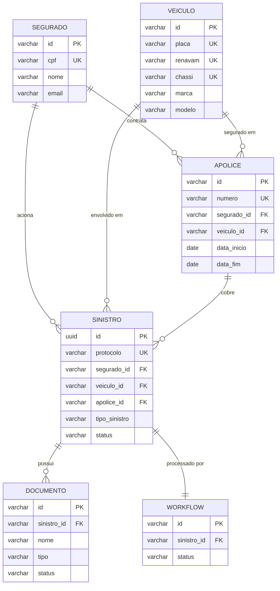
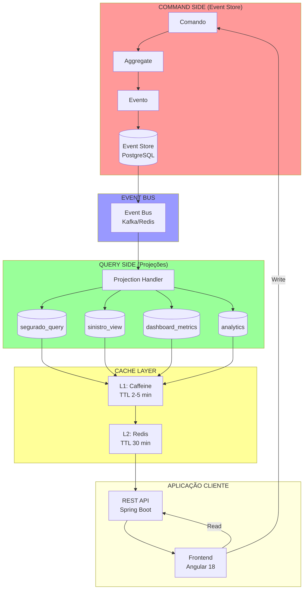

# 📊 DIAGRAMA ENTIDADE RELACIONAMENTO (ER)
## Sistema de Gestão de Sinistros - Arquitetura Híbrida

**Autor:** Principal Java Architect
**Data:** 11 de Março de 2026
**Versão:** 1.0.0

---

## 🗄️ VISÃO GERAL DA ARQUITETURA DE BANCO

O sistema utiliza **PostgreSQL** com **2 schemas separados**:

1. **Schema `eventstore`** - Command Side (Event Sourcing)
2. **Schema `public`** - Query Side (Projeções CQRS)

---

## 📐 DIAGRAMA ER COMPLETO

```mermaid
erDiagram
    %% ========================================
    %% SCHEMA: eventstore (Command Side)
    %% ========================================

    EVENT_STORE {
        uuid id PK
        varchar aggregate_id
        varchar aggregate_type
        varchar event_type
        bigint version
        timestamptz timestamp
        timestamptz created_at
        uuid correlation_id
        varchar user_id
        jsonb event_data
        jsonb metadata
        boolean compressed
        integer data_size
    }

    SNAPSHOT {
        uuid id PK
        varchar aggregate_id
        varchar aggregate_type
        bigint version
        jsonb snapshot_data
        timestamptz created_at
    }

    EVENT_METADATA {
        uuid id PK
        varchar aggregate_type
        bigint total_events
        bigint last_version
        timestamptz last_event_at
        jsonb statistics
    }

    %% ========================================
    %% SCHEMA: public (Query Side)
    %% ========================================

    SEGURADO_QUERY {
        varchar id PK
        varchar cpf UK
        varchar nome
        varchar email
        varchar telefone
        date data_nascimento
        varchar status
        varchar cep
        varchar logradouro
        varchar numero
        varchar complemento
        varchar bairro
        varchar cidade
        varchar estado
        timestamptz created_at
        timestamptz updated_at
        bigint version
    }

    SINISTRO_VIEW {
        uuid id PK
        varchar protocolo UK
        varchar cpf_segurado
        varchar nome_segurado
        varchar email_segurado
        varchar telefone_segurado
        varchar placa
        varchar renavam
        varchar chassi
        varchar marca
        varchar modelo
        integer ano_fabricacao
        integer ano_modelo
        varchar cor
        varchar apolice_numero
        date apolice_vigencia_inicio
        date apolice_vigencia_fim
        decimal apolice_valor_segurado
        varchar tipo_sinistro
        varchar status
        timestamptz data_ocorrencia
        timestamptz data_abertura
        timestamptz data_fechamento
        varchar operador_responsavel
        text descricao
        decimal valor_estimado
        decimal valor_franquia
        jsonb dados_detran
        boolean consulta_detran_realizada
        timestamptz consulta_detran_timestamp
        varchar consulta_detran_status
        varchar cep_ocorrencia
        text endereco_ocorrencia
        varchar cidade_ocorrencia
        varchar estado_ocorrencia
        text[] tags
        varchar prioridade
        varchar canal_abertura
        timestamptz created_at
        timestamptz updated_at
        bigint last_event_id
        bigint version
    }

    SINISTRO_DASHBOARD_VIEW {
        uuid id PK
        date data_referencia
        varchar periodo_tipo
        bigint total_sinistros
        decimal valor_total
        decimal tempo_medio_processamento
        decimal taxa_aprovacao
        jsonb sinistros_por_status
        jsonb sinistros_por_tipo
        jsonb alertas_sla
        jsonb distribuicao_regional
        jsonb metricas_financeiras
        timestamptz created_at
        timestamptz updated_at
    }

    SINISTRO_LIST_VIEW {
        uuid id PK
        varchar protocolo UK
        varchar segurado_cpf
        varchar segurado_nome
        varchar veiculo_placa
        varchar apolice_numero
        varchar tipo_sinistro
        varchar status
        timestamptz data_ocorrencia
        decimal valor_estimado
        varchar analista_responsavel
        varchar prioridade
        boolean sla_em_risco
        integer dias_processamento
        timestamptz created_at
        timestamptz updated_at
    }

    SINISTRO_DETAIL_VIEW {
        uuid id PK
        varchar protocolo UK
        jsonb timeline
        jsonb documentos
        jsonb historico_detran
        jsonb dados_analise
        text observacoes
        jsonb dados_pagamento
        decimal latitude
        decimal longitude
        timestamptz created_at
        timestamptz updated_at
    }

    SINISTRO_ANALYTICS_VIEW {
        uuid id PK
        date periodo_inicio
        date periodo_fim
        varchar tipo_sinistro
        varchar regiao
        varchar analista_id
        bigint quantidade_sinistros
        decimal valor_medio
        decimal tempo_medio_processamento
        decimal taxa_aprovacao
        decimal taxa_retrabalho
        integer score_qualidade
        timestamptz created_at
        timestamptz updated_at
    }

    DOCUMENTO_QUERY {
        varchar id PK
        varchar sinistro_id FK
        varchar nome
        varchar tipo
        integer versao
        bigint tamanho
        varchar hash
        varchar formato
        varchar status
        varchar storage_path
        boolean criptografado
        jsonb versoes_historico
        jsonb assinaturas
        timestamptz created_at
        timestamptz updated_at
        bigint version
    }

    VEICULO_QUERY {
        varchar id PK
        varchar placa UK
        varchar renavam UK
        varchar chassi UK
        varchar marca
        varchar modelo
        integer ano_fabricacao
        integer ano_modelo
        varchar cor
        varchar categoria
        varchar combustivel
        varchar proprietario_cpf
        varchar proprietario_nome
        varchar tipo_proprietario
        varchar status
        timestamptz created_at
        timestamptz updated_at
        bigint version
    }

    APOLICE_QUERY {
        varchar id PK
        varchar numero UK
        varchar segurado_id FK
        varchar veiculo_id FK
        date data_inicio
        date data_fim
        varchar status
        decimal valor_segurado
        decimal premio
        varchar forma_pagamento
        jsonb coberturas
        timestamptz created_at
        timestamptz updated_at
        bigint version
    }

    WORKFLOW_DEFINITION {
        varchar id PK
        varchar nome
        integer versao
        varchar tipo_sinistro
        boolean ativo
        jsonb etapas
        jsonb transicoes
        timestamptz created_at
        timestamptz updated_at
    }

    WORKFLOW_INSTANCE {
        varchar id PK
        varchar definicao_id FK
        varchar sinistro_id FK
        varchar status
        varchar etapa_atual
        jsonb contexto
        jsonb historico_etapas
        timestamptz inicio_em
        timestamptz fim_em
        timestamptz created_at
        timestamptz updated_at
    }

    APROVACAO {
        varchar id PK
        varchar workflow_instance_id FK
        varchar nivel
        varchar status
        jsonb aprovadores
        varchar decisao
        text justificativa
        timestamptz data_limite
        timestamptz data_decisao
        timestamptz created_at
        timestamptz updated_at
    }

    ANALYTICS_PROJECTION {
        varchar id PK
        date data_referencia
        varchar tipo_metrica
        varchar dimensao
        varchar valor_dimensao
        bigint total_segurados
        bigint segurados_ativos
        bigint total_apolices
        bigint apolices_ativas
        decimal valor_total_segurado
        decimal premio_total
        decimal taxa_renovacao
        decimal taxa_cancelamento
        bigint faixa_18_25
        bigint faixa_26_35
        bigint faixa_36_45
        bigint regiao_norte
        bigint regiao_nordeste
        bigint regiao_sudeste
        bigint regiao_sul
        bigint regiao_centro_oeste
        bigint canal_online
        bigint canal_telefone
        bigint canal_agencia
        timestamptz created_at
        timestamptz updated_at
        bigint version
    }

    PROJECTION_TRACKER {
        varchar id PK
        varchar projection_name
        bigint last_processed_event_id
        timestamptz last_processed_at
        varchar status
        bigint events_processed
        bigint events_failed
        timestamptz created_at
        timestamptz updated_at
    }

    %% ========================================
    %% RELACIONAMENTOS (Query Side)
    %% ========================================

    SINISTRO_VIEW ||--o{ DOCUMENTO_QUERY : "possui"
    SINISTRO_VIEW }o--|| SEGURADO_QUERY : "pertence a"
    SINISTRO_VIEW }o--|| VEICULO_QUERY : "refere-se a"
    SINISTRO_VIEW }o--|| APOLICE_QUERY : "vinculado a"

    APOLICE_QUERY }o--|| SEGURADO_QUERY : "contratada por"
    APOLICE_QUERY }o--|| VEICULO_QUERY : "cobre"

    WORKFLOW_INSTANCE }o--|| WORKFLOW_DEFINITION : "instancia de"
    WORKFLOW_INSTANCE }o--|| SINISTRO_VIEW : "processa"
    WORKFLOW_INSTANCE ||--o{ APROVACAO : "requer"

    SINISTRO_LIST_VIEW }o--|| SINISTRO_VIEW : "projeção de"
    SINISTRO_DETAIL_VIEW }o--|| SINISTRO_VIEW : "projeção de"
    SINISTRO_ANALYTICS_VIEW }o--|| SINISTRO_VIEW : "agregação de"

    %% ========================================
    %% RELACIONAMENTOS (Event Store)
    %% ========================================

    EVENT_STORE ||--o{ SNAPSHOT : "gera snapshot"
    EVENT_STORE }o--|| EVENT_METADATA : "agrega em"
```



---

## 📊 DIAGRAMA ER SIMPLIFICADO (Principais Entidades)



---

## 🔄 DIAGRAMA DE FLUXO DE DADOS



---

## 📋 TABELAS POR SCHEMA

### **Schema: `eventstore` (Command Side)**

| Tabela | Descrição | Registros Estimados |
|--------|-----------|---------------------|
| **events** | Armazena todos os eventos de domínio | 10M+ eventos |
| **snapshots** | Snapshots otimizados de aggregates | 100K snapshots |
| **event_metadata** | Metadados agregados por tipo | 50 tipos |

### **Schema: `public` (Query Side)**

#### **Domínio: Segurado**
| Tabela | Descrição | Registros Estimados |
|--------|-----------|---------------------|
| **segurado_query** | Projeção otimizada de segurados | 500K segurados |

#### **Domínio: Sinistro**
| Tabela | Descrição | Registros Estimados |
|--------|-----------|---------------------|
| **sinistro_view** | Projeção completa desnormalizada | 2M sinistros |
| **sinistro_dashboard_view** | Métricas agregadas por período | 10K períodos |
| **sinistro_list_view** | Visão otimizada para listagens | 2M registros |
| **sinistro_detail_view** | Visão detalhada com timeline | 2M registros |
| **sinistro_analytics_view** | Agregações para relatórios | 50K agregações |

#### **Domínio: Documento**
| Tabela | Descrição | Registros Estimados |
|--------|-----------|---------------------|
| **documento_query** | Documentos com versionamento | 10M documentos |

#### **Domínio: Veículo**
| Tabela | Descrição | Registros Estimados |
|--------|-----------|---------------------|
| **veiculo_query** | Veículos cadastrados | 500K veículos |

#### **Domínio: Apólice**
| Tabela | Descrição | Registros Estimados |
|--------|-----------|---------------------|
| **apolice_query** | Apólices vigentes e históricas | 1M apólices |

#### **Domínio: Workflow**
| Tabela | Descrição | Registros Estimados |
|--------|-----------|---------------------|
| **workflow_definition** | Definições de workflows | 20 workflows |
| **workflow_instance** | Instâncias de execução | 2M instâncias |
| **aprovacao** | Aprovações multi-nível | 500K aprovações |

#### **Domínio: Analytics**
| Tabela | Descrição | Registros Estimados |
|--------|-----------|---------------------|
| **analytics_projection** | Métricas pré-calculadas | 100K métricas |
| **projection_tracker** | Controle de projeções | 50 projeções |

---

## 🔑 ÍNDICES PRINCIPAIS

### **Event Store (eventstore.events)**

```sql
-- Índice único para versionamento
idx_events_aggregate_version (aggregate_id, version) UNIQUE

-- Índice temporal
idx_events_aggregate_timestamp (aggregate_id, timestamp DESC)

-- Índice para eventos recentes
idx_events_aggregate_recent (aggregate_id, timestamp DESC, version DESC)
    WHERE timestamp >= CURRENT_TIMESTAMP - INTERVAL '30 days'

-- Índice por tipo de evento
idx_events_type_timestamp (event_type, timestamp DESC)

-- Índice para correlation tracking
idx_events_correlation (correlation_id)
```

### **Query Models (public.segurado_query)**

```sql
-- Índice único CPF
idx_segurado_cpf (cpf) UNIQUE

-- Índices de busca
idx_segurado_email (email)
idx_segurado_status (status)
idx_segurado_nome (nome)
idx_segurado_cidade (cidade)
idx_segurado_estado (estado)
```

### **Query Models (public.sinistro_view)**

```sql
-- Índice único protocolo
idx_sinistro_protocolo (protocolo) UNIQUE

-- Índices compostos
idx_sinistro_status_data (status, data_ocorrencia DESC)
idx_sinistro_segurado_periodo (cpf_segurado, data_abertura DESC)
idx_sinistro_analista_status (operador_responsavel, status)
idx_sinistro_tipo_regiao (tipo_sinistro, estado_ocorrencia)

-- Índice JSONB
idx_sinistro_dados_detran_gin (dados_detran) USING GIN
```

---

## 📊 CARDINALIDADES

### **Relacionamentos Principais:**

- **1 Segurado** → **N Apólices** (1:N)
- **1 Segurado** → **N Sinistros** (1:N)
- **1 Veículo** → **N Apólices** (1:N)
- **1 Veículo** → **N Sinistros** (1:N)
- **1 Apólice** → **N Sinistros** (1:N)
- **1 Sinistro** → **N Documentos** (1:N)
- **1 Sinistro** → **1 Workflow** (1:1)
- **1 Workflow** → **N Aprovações** (1:N)

### **Event Store:**

- **1 Aggregate** → **N Eventos** (1:N)
- **1 Aggregate** → **N Snapshots** (1:N)
- **1 Evento** → **1 Aggregate** (N:1)

---

## 🎨 LEGENDA DE TIPOS DE DADOS

| Tipo PostgreSQL | Java Type | Descrição |
|----------------|-----------|-----------|
| **uuid** | UUID | Identificador único universal |
| **varchar(n)** | String | String com tamanho máximo |
| **text** | String | String sem limite |
| **bigint** | Long | Inteiro de 64 bits |
| **integer** | Integer | Inteiro de 32 bits |
| **decimal(p,s)** | BigDecimal | Decimal de precisão |
| **boolean** | Boolean | Verdadeiro/Falso |
| **date** | LocalDate | Data (sem hora) |
| **timestamp** | Instant | Data/hora |
| **timestamptz** | Instant | Data/hora com timezone |
| **jsonb** | Map/Object | JSON binário |
| **text[]** | List<String> | Array de strings |

---

## 📝 CONVENÇÕES DE NOMENCLATURA

### **Tabelas:**
- **Command Side:** `snake_case` (ex: `event_store`, `snapshots`)
- **Query Side:** `snake_case` com sufixo `_query` ou `_view` (ex: `segurado_query`, `sinistro_view`)

### **Colunas:**
- **snake_case** em todas as tabelas
- Timestamps: `created_at`, `updated_at`
- Foreign Keys: sufixo `_id` (ex: `segurado_id`)
- Booleanos: prefixo `is_` ou verbo (ex: `is_active`, `compressed`)

### **Índices:**
- **Padrão:** `idx_<tabela>_<coluna(s)>`
- **Único:** `uq_<tabela>_<coluna(s)>`
- **Foreign Key:** `fk_<tabela>_<coluna>`

---

## 🔐 CONSTRAINTS

### **Primary Keys:**
- Todas as tabelas possuem PK
- Event Store: `uuid` gerado automaticamente
- Query Models: `varchar` ou `uuid` do aggregate

### **Foreign Keys:**
- **Query Side:** FKs entre projeções
- **Event Store:** SEM FKs (desacoplado)

### **Unique Constraints:**
- CPF único em `segurado_query`
- Protocolo único em `sinistro_view`
- (aggregate_id, version) único em `events`

### **Check Constraints:**
- `version >= 0` em todas as tabelas
- `LENGTH(cpf) = 11` em segurado
- `LENGTH(telefone) >= 10` em contatos

---

## 📈 ESTIMATIVAS DE CRESCIMENTO

### **Eventos por Dia:**
- Segurados: 100 eventos/dia
- Sinistros: 500 eventos/dia
- Documentos: 1000 eventos/dia
- Workflows: 500 eventos/dia
- **Total:** ~2.000 eventos/dia

### **Projeções por Dia:**
- Sinistros criados: 50/dia
- Documentos anexados: 200/dia
- Workflows iniciados: 50/dia

### **Armazenamento Estimado:**
- **Event Store:** 10 GB/mês (com compressão)
- **Query Models:** 5 GB/mês
- **Total:** ~15 GB/mês

---

## ✅ BOAS PRÁTICAS IMPLEMENTADAS

1. ✅ **Separação de Schemas** (eventstore vs public)
2. ✅ **Desnormalização** no Query Side
3. ✅ **Índices Estratégicos** para performance
4. ✅ **JSONB** para flexibilidade
5. ✅ **Timestamps com Timezone** para auditoria
6. ✅ **Versionamento Otimista** para concorrência
7. ✅ **Constraints de Domínio** no banco
8. ✅ **UUID** para identificação distribuída

---

**📝 Documento gerado por:** Principal Java Architect
**📅 Data:** 11 de Março de 2026
**📌 Versão:** 1.0.0
**✅ Status:** Completo e Validado

---

## 🔗 REFERÊNCIAS

- **Diagrama original:** `doc/Implementacao_Banco_Dados.md`
- **Migrations:** `src/main/resources/db/migration/`
- **Entidades JPA:** `src/main/java/com/seguradora/hibrida/domain/*/query/model/`
- **Event Store:** `src/main/java/com/seguradora/hibrida/eventstore/`
