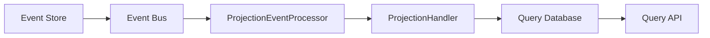

# 📊 PROJECTION HANDLERS - PARTE 1: FUNDAMENTOS E CONCEITOS
## Roteiro Técnico para Analistas Java Junior

### 🎯 **OBJETIVO DESTA PARTE**
Compreender os fundamentos das projeções no contexto CQRS, sua importância na arquitetura e como são implementadas no projeto.

---

## 🏗️ **CONCEITOS FUNDAMENTAIS**

### **📋 O que são Projeções?**

**Definição:**
Projeções são **representações otimizadas dos dados** derivadas dos eventos do Event Store, especificamente projetadas para **consultas eficientes** no lado Query do CQRS.

**Analogia Simples:**
```
Event Store (Write Side)    →    Projeções (Read Side)
├── SinistroCriado         →    ├── SinistroListView
├── SinistroAtualizado     →    ├── SinistroDetailView  
├── SinistroFinalizado     →    └── DashboardView
└── ConsultaDetranFeita    →    
```

### **🎯 Por que Usar Projeções?**

**Problemas que Resolvem:**
1. **Performance**: Consultas rápidas sem reconstruir agregados
2. **Flexibilidade**: Múltiplas visões dos mesmos dados
3. **Escalabilidade**: Read models independentes
4. **Otimização**: Estruturas específicas para cada caso de uso

**Exemplo Prático:**
```java
// ❌ SEM Projeção - Lento
public SinistroDetailView buscarSinistro(String id) {
    List<DomainEvent> eventos = eventStore.loadEvents(id);
    Sinistro agregado = Sinistro.fromEvents(eventos); // Reconstrução custosa
    return mapToDetailView(agregado);
}

// ✅ COM Projeção - Rápido  
public SinistroDetailView buscarSinistro(String id) {
    return sinistroQueryRepository.findById(id); // Consulta direta
}
```

---

## 🏛️ **ARQUITETURA DAS PROJEÇÕES**

### **📐 Estrutura Geral**

```
Projection System
├── ProjectionHandler<T> (Interface)
├── ProjectionEventProcessor (Coordenador)
├── ProjectionTracker (Controle de posição)
├── ProjectionRegistry (Registro de handlers)
└── Query Models (Modelos de leitura)
```

### **🔄 Fluxo de Processamento**



**Passos do Fluxo:**
1. **Evento** é persistido no Event Store
2. **Event Bus** notifica os handlers
3. **ProjectionEventProcessor** coordena o processamento
4. **ProjectionHandler** atualiza a projeção
5. **Query Database** armazena dados otimizados
6. **Query API** serve consultas rápidas

---

## 🧩 **COMPONENTES PRINCIPAIS**

### **📋 ProjectionHandler Interface**

**Localização**: `com.seguradora.hibrida.projection.ProjectionHandler`

```java
public interface ProjectionHandler<T extends DomainEvent> {
    
    /**
     * Processa um evento e atualiza a projeção.
     */
    void handle(T event);
    
    /**
     * Tipo de evento processado.
     */
    Class<T> getEventType();
    
    /**
     * Nome único da projeção.
     */
    String getProjectionName();
    
    /**
     * Configurações opcionais
     */
    default boolean isAsync() { return true; }
    default int getOrder() { return 100; }
    default boolean isRetryable() { return true; }
}
```

### **🎯 Características Importantes**

**1. Idempotência:**
```java
@Override
public void handle(SinistroEvent event) {
    // ✅ Operação idempotente - pode ser executada múltiplas vezes
    SinistroQueryModel existing = repository.findById(event.getAggregateId());
    
    if (existing == null || existing.getLastEventId() < event.getEventId()) {
        // Processar apenas se for novo ou mais recente
        updateProjection(event);
    }
}
```

**2. Ordem de Processamento:**
```java
@Component
public class SinistroProjectionHandler implements ProjectionHandler<SinistroEvent> {
    
    @Override
    public int getOrder() {
        return 10; // Processar antes de outros handlers (menor = maior prioridade)
    }
}
```

---

## 📊 **TIPOS DE PROJEÇÕES NO PROJETO**

### **🎯 1. List Views (Listagens)**

**Propósito**: Exibir listas otimizadas com filtros e paginação

**Exemplo - SinistroListView:**
```java
@Entity
@Table(name = "sinistro_list_view", schema = "projections")
public class SinistroListView {
    
    @Id
    private UUID id;
    
    private String protocolo;
    private String nomeSegurado;
    private String status;
    private Instant dataAbertura;
    private BigDecimal valorEstimado;
    
    // Campos otimizados para filtros
    private String cpfSegurado;
    private String placa;
    private String operadorResponsavel;
    
    // Campos para busca textual
    @Column(columnDefinition = "tsvector")
    private String searchVector;
}
```

### **🎯 2. Detail Views (Detalhes)**

**Propósito**: Exibir informações completas de uma entidade

**Exemplo - SinistroDetailView:**
```java
@Entity
@Table(name = "sinistro_detail_view", schema = "projections")
public class SinistroDetailView {
    
    @Id
    private UUID id;
    
    // Informações básicas
    private String protocolo;
    private String descricao;
    private String status;
    
    // Informações do segurado
    private String nomeSegurado;
    private String cpfSegurado;
    private String emailSegurado;
    
    // Informações do veículo
    private String placa;
    private String marca;
    private String modelo;
    
    // Dados DETRAN (JSON)
    @Type(JsonType.class)
    private Map<String, Object> dadosDetran;
    
    // Histórico de eventos (desnormalizado)
    @Type(JsonType.class)
    private List<EventoHistorico> historico;
}
```

### **🎯 3. Dashboard Views (Agregações)**

**Propósito**: Dados agregados para dashboards e relatórios

**Exemplo - DashboardView:**
```java
@Entity
@Table(name = "dashboard_view", schema = "projections")
public class DashboardView {
    
    @Id
    private String id; // Ex: "dashboard-2024-03"
    
    // Contadores
    private Long totalSinistros;
    private Long sinistrosAbertos;
    private Long sinistrosFechados;
    
    // Valores
    private BigDecimal valorTotalEstimado;
    private BigDecimal valorMedioSinistro;
    
    // Distribuições
    @Type(JsonType.class)
    private Map<String, Long> sinistrosPorStatus;
    
    @Type(JsonType.class)
    private Map<String, Long> sinistrosPorTipo;
    
    // Período de referência
    private LocalDate periodoInicio;
    private LocalDate periodoFim;
}
```

---

## 🔄 **TRACKING DE PROJEÇÕES**

### **📍 ProjectionTracker**

**Localização**: `com.seguradora.hibrida.projection.tracking.ProjectionTracker`

```java
@Entity
@Table(name = "projection_tracker")
public class ProjectionTracker {
    
    @Id
    private String projectionName;
    
    private Long lastProcessedEventId;
    private Instant lastProcessedAt;
    
    private ProjectionStatus status; // ACTIVE, PAUSED, ERROR, DISABLED
    
    private Long eventsProcessed;
    private Long eventsFailed;
    
    private String lastErrorMessage;
    private Instant lastErrorAt;
    
    // Métodos de controle
    public void updatePosition(Long eventId) {
        this.lastProcessedEventId = eventId;
        this.lastProcessedAt = Instant.now();
        this.eventsProcessed++;
    }
    
    public void recordFailure(String errorMessage) {
        this.eventsFailed++;
        this.lastErrorMessage = errorMessage;
        this.lastErrorAt = Instant.now();
        this.status = ProjectionStatus.ERROR;
    }
}
```

### **🎯 Status de Projeções**

```java
public enum ProjectionStatus {
    ACTIVE,     // Processando eventos normalmente
    PAUSED,     // Pausada temporariamente
    ERROR,      // Com erro, precisa intervenção
    DISABLED,   // Desabilitada permanentemente
    REBUILDING  // Em processo de rebuild
}
```

---

## 🏗️ **IMPLEMENTAÇÃO BÁSICA**

### **📝 Exemplo Completo - SinistroProjectionHandler**

```java
@Component
@Slf4j
public class SinistroProjectionHandler extends AbstractProjectionHandler<SinistroEvent> {
    
    private final SinistroQueryRepository repository;
    private final MeterRegistry meterRegistry;
    
    public SinistroProjectionHandler(SinistroQueryRepository repository,
                                   MeterRegistry meterRegistry) {
        this.repository = repository;
        this.meterRegistry = meterRegistry;
    }
    
    @Override
    public void doHandle(SinistroEvent event) {
        switch (event.getEventType()) {
            case "SinistroCriado" -> handleSinistroCriado(event);
            case "SinistroAtualizado" -> handleSinistroAtualizado(event);
            case "SinistroFinalizado" -> handleSinistroFinalizado(event);
            case "ConsultaDetranConcluida" -> handleConsultaDetran(event);
            default -> log.warn("Evento não tratado: {}", event.getEventType());
        }
    }
    
    private void handleSinistroCriado(SinistroEvent event) {
        SinistroQueryModel sinistro = new SinistroQueryModel();
        sinistro.setId(UUID.fromString(event.getAggregateId()));
        sinistro.setProtocolo(event.getProtocolo());
        sinistro.setDescricao(event.getDescricao());
        sinistro.setStatus("ABERTO");
        sinistro.setDataAbertura(event.getTimestamp());
        sinistro.setLastEventId(event.getEventId());
        
        repository.save(sinistro);
        
        log.info("Sinistro criado na projeção: {}", event.getProtocolo());
    }
    
    @Override
    public Class<SinistroEvent> getEventType() {
        return SinistroEvent.class;
    }
    
    @Override
    public String getProjectionName() {
        return "SinistroProjection";
    }
    
    @Override
    public int getOrder() {
        return 10; // Alta prioridade
    }
}
```

---

## 🎯 **PADRÕES E BOAS PRÁTICAS**

### **✅ Padrões Recomendados**

**1. Nomenclatura Consistente:**
```java
// ✅ Bom
public class SinistroProjectionHandler implements ProjectionHandler<SinistroEvent>
public class SeguradoProjectionHandler implements ProjectionHandler<SeguradoEvent>

// ❌ Evitar
public class SinistroHandler implements ProjectionHandler<SinistroEvent>
public class ProcessadorSegurado implements ProjectionHandler<SeguradoEvent>
```

**2. Separação de Responsabilidades:**
```java
@Component
public class SinistroProjectionHandler extends AbstractProjectionHandler<SinistroEvent> {
    
    // ✅ Delegar lógica complexa para services
    private final SinistroProjectionService projectionService;
    
    @Override
    public void doHandle(SinistroEvent event) {
        projectionService.processEvent(event);
    }
}
```

**3. Tratamento de Erros:**
```java
@Override
public void doHandle(SinistroEvent event) {
    try {
        processEvent(event);
        recordSuccess(event, processingTime);
    } catch (Exception e) {
        recordError(event, processingTime, e);
        throw new ProjectionException(getProjectionName(), event.getEventType(), e);
    }
}
```

### **⚠️ Armadilhas Comuns**

1. **Não implementar idempotência**
2. **Não tratar eventos fora de ordem**
3. **Não registrar métricas adequadamente**
4. **Não considerar performance de queries**

---

## 🎓 **EXERCÍCIO PRÁTICO**

### **📝 Implementar Handler Básico**

Crie um `SeguradoProjectionHandler` que:

1. **Processe eventos de segurado**
2. **Mantenha uma projeção otimizada**
3. **Implemente idempotência**
4. **Registre métricas básicas**

**Template:**
```java
@Component
public class SeguradoProjectionHandler extends AbstractProjectionHandler<SeguradoEvent> {
    
    // Sua implementação aqui
    
    @Override
    public void doHandle(SeguradoEvent event) {
        // Implementar processamento
    }
    
    @Override
    public String getProjectionName() {
        return "SeguradoProjection";
    }
}
```

---

## 📚 **REFERÊNCIAS**

- **Código**: `com.seguradora.hibrida.projection`
- **Exemplos**: `SinistroProjectionHandler`, `SeguradoProjectionHandler`
- **Configuração**: `ProjectionConfiguration`
- **Testes**: `ProjectionHandlerTest`

---

**📍 Próxima Parte**: [Projections - Parte 2: Implementação e Configuração](./07-projections-parte-2.md)

---

**📚 Roteiro elaborado por:** Principal Java Architect  
**🎯 Foco:** Fundamentos e conceitos das projeções  
**⏱️ Tempo estimado:** 45 minutos  
**🔧 Hands-on:** Implementação de handler básico