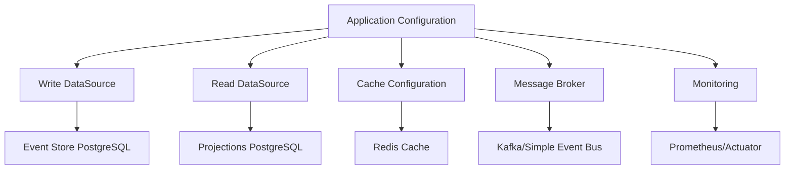

# ⚙️ CONFIGURAÇÕES E DATASOURCES - PARTE 1
## Fundamentos de Configuração na Arquitetura Híbrida

### 🎯 **OBJETIVOS DESTA PARTE**
- Compreender a arquitetura de configuração
- Entender a separação de DataSources
- Conhecer os padrões de configuração Spring Boot
- Configurar propriedades básicas da aplicação

---

## 🏗️ **ARQUITETURA DE CONFIGURAÇÃO**

### **📋 Visão Geral da Configuração**

Na arquitetura híbrida, a configuração é estruturada para suportar múltiplas responsabilidades:



#### **Separação de Responsabilidades:**
- ✅ **Write Side**: Event Store, Snapshots, Command processing
- ✅ **Read Side**: Projections, Query models, Dashboards
- ✅ **Cache**: Query optimization, Session management
- ✅ **Messaging**: Event Bus, Integration events
- ✅ **Monitoring**: Metrics, Health checks, Observability

### **🎯 Princípios de Configuração**

#### **1. Separation of Concerns**
```yaml
# Cada responsabilidade tem sua configuração específica
datasource:
  write:    # Para persistência de eventos
    url: jdbc:postgresql://eventstore-db:5432/eventstore
    hikari:
      maximum-pool-size: 20  # Otimizado para writes
  
  read:     # Para consultas otimizadas
    url: jdbc:postgresql://projections-db:5432/projections
    hikari:
      maximum-pool-size: 50  # Otimizado para reads
```

#### **2. Environment-Specific Configuration**
```yaml
# Configurações por ambiente
spring:
  profiles:
    active: ${SPRING_PROFILES_ACTIVE:dev}

---
# Desenvolvimento
spring:
  config:
    activate:
      on-profile: dev
  datasource:
    write:
      url: jdbc:postgresql://localhost:5432/dev_eventstore

---
# Produção
spring:
  config:
    activate:
      on-profile: prod
  datasource:
    write:
      url: jdbc:postgresql://prod-cluster:5432/eventstore
```

#### **3. Externalized Configuration**
```yaml
# Uso de variáveis de ambiente
datasource:
  write:
    url: ${WRITE_DB_URL:jdbc:postgresql://localhost:5432/eventstore}
    username: ${WRITE_DB_USERNAME:eventstore_user}
    password: ${WRITE_DB_PASSWORD:eventstore_pass}
```

---

## 📊 **ESTRUTURA DE CONFIGURAÇÃO**

### **🗂️ Organização de Arquivos**

```
src/main/resources/
├── application.yml                 # Configuração principal
├── application-dev.yml            # Desenvolvimento
├── application-test.yml           # Testes
├── application-staging.yml        # Homologação
├── application-prod.yml           # Produção
├── aggregate.yml                  # Configurações de agregados
├── command-bus.yml               # Configurações do Command Bus
├── event-bus.yml                 # Configurações do Event Bus
├── projection-rebuild.yml        # Configurações de rebuild
└── replay.yml                    # Configurações de replay
```

### **📋 application.yml - Estrutura Principal**

```yaml
# === INFORMAÇÕES DA APLICAÇÃO ===
spring:
  application:
    name: app-arquitetura-hibrida
    version: @project.version@
  
  profiles:
    active: ${SPRING_PROFILES_ACTIVE:dev}
  
  # === CONFIGURAÇÃO DE BANNER ===
  main:
    banner-mode: console
  
  banner:
    location: classpath:banner.txt

# === CONFIGURAÇÕES DO SERVIDOR ===
server:
  port: ${SERVER_PORT:8080}
  servlet:
    context-path: ${CONTEXT_PATH:/api}
  
  # Configurações de performance
  tomcat:
    threads:
      max: ${TOMCAT_MAX_THREADS:200}
      min-spare: ${TOMCAT_MIN_THREADS:10}
    max-connections: ${TOMCAT_MAX_CONNECTIONS:8192}
    connection-timeout: 20000
    keep-alive-timeout: 60000
  
  # Configurações de compressão
  compression:
    enabled: true
    mime-types: text/html,text/xml,text/plain,text/css,text/javascript,application/javascript,application/json
    min-response-size: 1024

# === CONFIGURAÇÕES DE LOGGING ===
logging:
  level:
    root: ${LOG_LEVEL_ROOT:INFO}
    com.seguradora.hibrida: ${LOG_LEVEL_APP:INFO}
    org.springframework.transaction: WARN
    org.hibernate.SQL: ${SQL_LOG_LEVEL:WARN}
    org.hibernate.type.descriptor.sql.BasicBinder: WARN
  
  pattern:
    console: "%clr(%d{HH:mm:ss.SSS}){faint} %clr(${LOG_LEVEL_PATTERN:-%5p}) %clr([%15.15t]){faint} %clr(%-40.40logger{39}){cyan} %clr(:){faint} %m%n${LOG_EXCEPTION_CONVERSION_WORD:-%wEx}"
    file: "%d{yyyy-MM-dd HH:mm:ss.SSS} [%thread] %-5level [%X{correlationId:-},%X{traceId:-},%X{spanId:-}] %logger{50} - %msg%n"
  
  file:
    name: ${LOG_FILE:logs/hibrida.log}
    max-size: ${LOG_FILE_MAX_SIZE:100MB}
    max-history: ${LOG_FILE_MAX_HISTORY:30}
    total-size-cap: ${LOG_FILE_TOTAL_SIZE:3GB}

# === CONFIGURAÇÕES DE MONITORAMENTO ===
management:
  endpoints:
    web:
      exposure:
        include: ${ACTUATOR_ENDPOINTS:health,info,metrics,prometheus}
      base-path: /actuator
      path-mapping:
        prometheus: metrics
  
  endpoint:
    health:
      show-details: ${HEALTH_SHOW_DETAILS:when-authorized}
      show-components: always
      probes:
        enabled: true
    
    info:
      enabled: true
    
    metrics:
      enabled: true
    
    prometheus:
      enabled: ${PROMETHEUS_ENABLED:true}
  
  # Configurações de métricas
  metrics:
    tags:
      application: ${spring.application.name}
      environment: ${ENVIRONMENT:unknown}
      version: ${spring.application.version}
    
    export:
      prometheus:
        enabled: ${PROMETHEUS_ENABLED:true}
        step: ${PROMETHEUS_STEP:30s}
        descriptions: true
    
    distribution:
      percentiles-histogram:
        http.server.requests: true
        spring.data.repository.invocations: true
      
      percentiles:
        http.server.requests: 0.5, 0.95, 0.99
        spring.data.repository.invocations: 0.5, 0.95, 0.99
      
      slo:
        http.server.requests: 10ms, 50ms, 100ms, 200ms, 500ms, 1s, 2s, 5s
  
  # Informações da aplicação
  info:
    app:
      name: ${spring.application.name}
      version: ${spring.application.version}
      description: "Arquitetura Híbrida - Sistema de Sinistros"
    
    build:
      artifact: "@project.artifactId@"
      name: "@project.name@"
      time: "@maven.build.timestamp@"
      version: "@project.version@"
    
    git:
      mode: full
    
    java:
      source: "@java.version@"
      target: "@java.version@"

# === CONFIGURAÇÕES DE SEGURANÇA ===
spring:
  security:
    user:
      name: ${SECURITY_USER:admin}
      password: ${SECURITY_PASSWORD:admin123}
      roles: ${SECURITY_ROLES:ADMIN,ACTUATOR}

# === CONFIGURAÇÕES DE SERIALIZAÇÃO ===
spring:
  jackson:
    serialization:
      write-dates-as-timestamps: false
      write-durations-as-timestamps: false
      indent-output: ${JACKSON_INDENT:false}
    
    deserialization:
      fail-on-unknown-properties: false
      accept-empty-string-as-null-object: true
    
    default-property-inclusion: non_null
    
    time-zone: ${TIMEZONE:America/Sao_Paulo}
    locale: ${LOCALE:pt_BR}

# === CONFIGURAÇÕES DE VALIDAÇÃO ===
spring:
  mvc:
    throw-exception-if-no-handler-found: true
  
  web:
    resources:
      add-mappings: false

# === CONFIGURAÇÕES DE THREAD POOL ===
spring:
  task:
    execution:
      pool:
        core-size: ${TASK_CORE_SIZE:8}
        max-size: ${TASK_MAX_SIZE:32}
        queue-capacity: ${TASK_QUEUE_CAPACITY:1000}
        keep-alive: ${TASK_KEEP_ALIVE:60s}
      
      thread-name-prefix: "hibrida-task-"
      shutdown:
        await-termination: true
        await-termination-period: 30s
    
    scheduling:
      pool:
        size: ${SCHEDULING_POOL_SIZE:4}
      thread-name-prefix: "hibrida-scheduling-"
```

---

## 🎯 **CONFIGURAÇÕES ESPECÍFICAS DA ARQUITETURA**

### **⚙️ Configurações de Event Sourcing**

```yaml
# === EVENT SOURCING ===
event-sourcing:
  enabled: ${EVENT_SOURCING_ENABLED:true}
  
  # Configurações de snapshot
  snapshot:
    enabled: ${SNAPSHOT_ENABLED:true}
    frequency: ${SNAPSHOT_FREQUENCY:100}  # A cada 100 eventos
    compression: ${SNAPSHOT_COMPRESSION:true}
    retention-days: ${SNAPSHOT_RETENTION:90}
    async: ${SNAPSHOT_ASYNC:true}
    
    # Configurações de compressão
    compression-level: ${SNAPSHOT_COMPRESSION_LEVEL:6}
    compression-algorithm: ${SNAPSHOT_COMPRESSION_ALGORITHM:gzip}
  
  # Configurações de archive
  archive:
    enabled: ${ARCHIVE_ENABLED:true}
    retention-months: ${ARCHIVE_RETENTION:12}
    compression-level: ${ARCHIVE_COMPRESSION_LEVEL:9}
    storage-type: ${ARCHIVE_STORAGE_TYPE:filesystem}
    storage-path: ${ARCHIVE_PATH:/var/lib/hibrida/archives}
    
    # Configurações de particionamento
    partition-strategy: ${ARCHIVE_PARTITION_STRATEGY:monthly}
    auto-archive: ${ARCHIVE_AUTO:true}
    archive-threshold-gb: ${ARCHIVE_THRESHOLD:10}
  
  # Configurações de replay
  replay:
    enabled: ${REPLAY_ENABLED:true}
    batch-size: ${REPLAY_BATCH_SIZE:1000}
    max-concurrent: ${REPLAY_MAX_CONCURRENT:2}
    timeout-minutes: ${REPLAY_TIMEOUT:60}
```

### **🔄 Configurações de CQRS**

```yaml
# === CQRS ===
cqrs:
  enabled: ${CQRS_ENABLED:true}
  
  # Configurações de lag
  read-side-lag-threshold: ${CQRS_LAG_THRESHOLD:1000}  # ms
  consistency-check-interval: ${CQRS_CHECK_INTERVAL:300}  # segundos
  
  # Configurações de rebuild automático
  auto-rebuild-on-lag: ${CQRS_AUTO_REBUILD:true}
  max-rebuild-attempts: ${CQRS_MAX_REBUILD_ATTEMPTS:3}
  rebuild-lag-threshold: ${CQRS_REBUILD_LAG_THRESHOLD:5000}  # ms
  
  # Configurações de monitoramento
  monitoring:
    enabled: ${CQRS_MONITORING_ENABLED:true}
    lag-alert-threshold: ${CQRS_LAG_ALERT:2000}  # ms
    error-rate-threshold: ${CQRS_ERROR_RATE_THRESHOLD:0.05}  # 5%
```

### **⚡ Configurações de Command Bus**

```yaml
# === COMMAND BUS ===
command-bus:
  enabled: ${COMMAND_BUS_ENABLED:true}
  
  # Configurações de timeout
  timeout-seconds: ${COMMAND_TIMEOUT:30}
  validation-timeout-seconds: ${COMMAND_VALIDATION_TIMEOUT:5}
  
  # Configurações de thread pool
  thread-pool:
    core-size: ${COMMAND_POOL_CORE:10}
    max-size: ${COMMAND_POOL_MAX:50}
    queue-capacity: ${COMMAND_POOL_QUEUE:1000}
    keep-alive-seconds: ${COMMAND_POOL_KEEP_ALIVE:60}
    thread-name-prefix: "command-"
  
  # Configurações de retry
  retry:
    enabled: ${COMMAND_RETRY_ENABLED:true}
    max-attempts: ${COMMAND_RETRY_MAX:3}
    initial-delay-ms: ${COMMAND_RETRY_INITIAL_DELAY:1000}
    max-delay-ms: ${COMMAND_RETRY_MAX_DELAY:10000}
    backoff-multiplier: ${COMMAND_RETRY_BACKOFF:2.0}
  
  # Configurações de métricas
  metrics:
    enabled: ${COMMAND_METRICS_ENABLED:true}
    detailed: ${COMMAND_METRICS_DETAILED:false}
    histogram-buckets: "10,50,100,200,500,1000,2000,5000"
  
  # Configurações de validação
  validation:
    enabled: ${COMMAND_VALIDATION_ENABLED:true}
    fail-fast: ${COMMAND_VALIDATION_FAIL_FAST:true}
    detailed-errors: ${COMMAND_VALIDATION_DETAILED:true}
```

---

## 📋 **CONFIGURAÇÃO DE PROPRIEDADES CUSTOMIZADAS**

### **🏗️ Configuration Properties Classes**

#### **ApplicationProperties.java:**
```java
@ConfigurationProperties(prefix = "app")
@Data
@Validated
public class ApplicationProperties {
    
    /**
     * Configurações gerais da aplicação
     */
    @NotNull
    private String name = "app-arquitetura-hibrida";
    
    @NotNull
    private String version = "1.0.0";
    
    private String description = "Sistema de Sinistros com Arquitetura Híbrida";
    
    /**
     * Configurações de feature flags
     */
    private FeatureFlags featureFlags = new FeatureFlags();
    
    /**
     * Configurações de integração
     */
    private Integration integration = new Integration();
    
    /**
     * Configurações de performance
     */
    private Performance performance = new Performance();
    
    @Data
    public static class FeatureFlags {
        private boolean eventSourcing = true;
        private boolean cqrs = true;
        private boolean snapshots = true;
        private boolean projectionRebuild = true;
        private boolean monitoring = true;
        private boolean cache = true;
        private boolean archive = false;
        private boolean replay = false;
    }
    
    @Data
    public static class Integration {
        
        @Valid
        private Detran detran = new Detran();
        
        @Valid
        private ExternalApi externalApi = new ExternalApi();
        
        @Data
        public static class Detran {
            @NotBlank
            private String url = "http://localhost:8081";
            
            @Min(1)
            @Max(300)
            private int timeoutSeconds = 30;
            
            @Min(1)
            @Max(10)
            private int maxRetries = 3;
            
            private boolean enabled = true;
            private String apiKey;
        }
        
        @Data
        public static class ExternalApi {
            @NotBlank
            private String baseUrl = "http://localhost:8082";
            
            @Min(1)
            @Max(300)
            private int timeoutSeconds = 60;
            
            private boolean enabled = false;
            private String authToken;
        }
    }
    
    @Data
    public static class Performance {
        
        @Min(1)
        @Max(1000)
        private int batchSize = 100;
        
        @Min(1)
        @Max(3600)
        private int cacheTimeoutSeconds = 300;
        
        @Min(1)
        @Max(100)
        private int maxConcurrentOperations = 10;
        
        private boolean enableCompression = true;
        private boolean enableCache = true;
        
        @Valid
        private Database database = new Database();
        
        @Data
        public static class Database {
            @Min(1)
            @Max(1000)
            private int queryTimeout = 30;
            
            @Min(1)
            @Max(10000)
            private int fetchSize = 1000;
            
            private boolean enableQueryCache = true;
            private boolean enableStatistics = true;
        }
    }
}
```

#### **EventSourcingProperties.java:**
```java
@ConfigurationProperties(prefix = "event-sourcing")
@Data
@Validated
public class EventSourcingProperties {
    
    private boolean enabled = true;
    
    @Valid
    private Snapshot snapshot = new Snapshot();
    
    @Valid
    private Archive archive = new Archive();
    
    @Valid
    private Replay replay = new Replay();
    
    @Data
    public static class Snapshot {
        private boolean enabled = true;
        
        @Min(1)
        @Max(10000)
        private int frequency = 100;
        
        private boolean compression = true;
        
        @Min(1)
        @Max(365)
        private int retentionDays = 90;
        
        private boolean async = true;
        
        @Min(1)
        @Max(9)
        private int compressionLevel = 6;
        
        @Pattern(regexp = "gzip|lz4|snappy")
        private String compressionAlgorithm = "gzip";
    }
    
    @Data
    public static class Archive {
        private boolean enabled = true;
        
        @Min(1)
        @Max(120)
        private int retentionMonths = 12;
        
        @Min(1)
        @Max(9)
        private int compressionLevel = 9;
        
        @Pattern(regexp = "filesystem|s3|gcs")
        private String storageType = "filesystem";
        
        @NotBlank
        private String storagePath = "/var/lib/hibrida/archives";
        
        @Pattern(regexp = "daily|weekly|monthly")
        private String partitionStrategy = "monthly";
        
        private boolean autoArchive = true;
        
        @Min(1)
        @Max(1000)
        private int archiveThresholdGb = 10;
    }
    
    @Data
    public static class Replay {
        private boolean enabled = true;
        
        @Min(1)
        @Max(10000)
        private int batchSize = 1000;
        
        @Min(1)
        @Max(10)
        private int maxConcurrent = 2;
        
        @Min(1)
        @Max(1440)
        private int timeoutMinutes = 60;
    }
}
```

---

## 🔧 **CONFIGURAÇÃO DE PROFILES**

### **📋 Profile Development**

#### **application-dev.yml:**
```yaml
# === DESENVOLVIMENTO ===
spring:
  config:
    activate:
      on-profile: dev

# Configurações de logging mais verbosas
logging:
  level:
    com.seguradora.hibrida: DEBUG
    org.springframework.transaction: DEBUG
    org.hibernate.SQL: DEBUG
    org.hibernate.type.descriptor.sql.BasicBinder: TRACE

# Configurações de desenvolvimento
app:
  feature-flags:
    monitoring: true
    cache: false  # Desabilitar cache em dev
    archive: false
    replay: true
  
  integration:
    detran:
      url: http://localhost:8081
      enabled: false  # Mock em desenvolvimento
    
    external-api:
      enabled: false

# Configurações específicas para dev
event-sourcing:
  snapshot:
    frequency: 10  # Snapshots mais frequentes para testes
    async: false   # Síncrono para debugging
  
  archive:
    enabled: false

command-bus:
  metrics:
    detailed: true  # Métricas detalhadas em dev

# Actuator com todos os endpoints expostos
management:
  endpoints:
    web:
      exposure:
        include: "*"
  
  endpoint:
    health:
      show-details: always

# Configurações de servidor para desenvolvimento
server:
  port: 8080
  error:
    include-stacktrace: always
    include-message: always
```

### **📋 Profile Test**

#### **application-test.yml:**
```yaml
# === TESTES ===
spring:
  config:
    activate:
      on-profile: test

# Configurações mínimas para testes
logging:
  level:
    root: WARN
    com.seguradora.hibrida: INFO
    org.springframework: WARN
    org.hibernate: WARN

# Desabilitar funcionalidades desnecessárias em testes
app:
  feature-flags:
    monitoring: false
    cache: false
    archive: false
    replay: false
  
  integration:
    detran:
      enabled: false
    external-api:
      enabled: false

# Configurações de Event Sourcing para testes
event-sourcing:
  enabled: true
  snapshot:
    enabled: false  # Desabilitar snapshots em testes
  archive:
    enabled: false

# Command Bus simplificado
command-bus:
  thread-pool:
    core-size: 2
    max-size: 5
    queue-capacity: 100
  
  metrics:
    enabled: false

# Desabilitar métricas em testes
management:
  endpoints:
    web:
      exposure:
        include: health,info
  
  metrics:
    export:
      prometheus:
        enabled: false

# Configurações de performance para testes rápidos
spring:
  task:
    execution:
      pool:
        core-size: 2
        max-size: 4
        queue-capacity: 50
```

---

## 📚 **RECURSOS DE REFERÊNCIA**

### **🔗 Links Úteis:**
- [Spring Boot Configuration Properties](https://docs.spring.io/spring-boot/docs/current/reference/html/features.html#features.external-config)
- [Configuration Metadata](https://docs.spring.io/spring-boot/docs/current/reference/html/configuration-metadata.html)
- [Profiles](https://docs.spring.io/spring-boot/docs/current/reference/html/features.html#features.profiles)
- [Actuator Endpoints](https://docs.spring.io/spring-boot/docs/current/reference/html/actuator.html#actuator.endpoints)

### **📖 Próximas Partes:**
- **Parte 2**: Configuração de DataSources Write e Read
- **Parte 3**: Configuração de Cache e Message Broker
- **Parte 4**: Health Checks e Monitoramento
- **Parte 5**: Configurações Avançadas e Troubleshooting

---

**📝 Parte 1 de 5 - Fundamentos de Configuração**  
**⏱️ Tempo estimado**: 45 minutos  
**🎯 Próximo**: [Parte 2 - DataSources Write e Read](./09-configuracoes-parte-2.md)