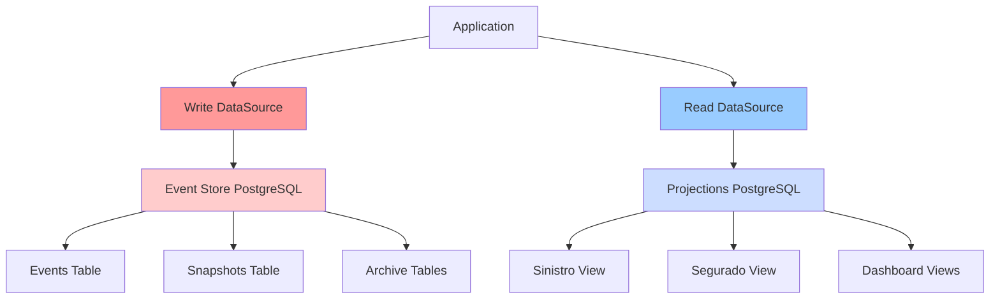

# ⚙️ CONFIGURAÇÕES E DATASOURCES - PARTE 2
## Configuração de DataSources Write e Read

### 🎯 **OBJETIVOS DESTA PARTE**
- Configurar DataSource para Write Side (Event Store)
- Configurar DataSource para Read Side (Projections)
- Implementar separação física de responsabilidades
- Otimizar configurações para cada tipo de workload

---

## 🗃️ **ARQUITETURA DE DATASOURCES**

### **📊 Separação Write/Read**



#### **Características de Cada DataSource:**

| **Aspecto** | **Write DataSource** | **Read DataSource** |
|-------------|---------------------|-------------------|
| **Propósito** | Persistir eventos | Consultas otimizadas |
| **Padrão de Acesso** | Insert-heavy | Select-heavy |
| **Consistência** | ACID completo | Eventual consistency |
| **Pool Size** | Menor (20-30) | Maior (50-100) |
| **Timeout** | Menor (30s) | Maior (60s) |
| **Otimizações** | Batch inserts | Query cache |

---

## 📝 **CONFIGURAÇÃO DO WRITE DATASOURCE**

### **⚙️ WriteDataSourceConfiguration.java**

```java
@Configuration
@EnableConfigurationProperties(WriteDataSourceProperties.class)
@EnableJpaRepositories(
    basePackages = "com.seguradora.hibrida.eventstore.repository",
    entityManagerFactoryRef = "writeEntityManagerFactory",
    transactionManagerRef = "writeTransactionManager"
)
@Slf4j
public class WriteDataSourceConfiguration {
    
    private final WriteDataSourceProperties properties;
    
    public WriteDataSourceConfiguration(WriteDataSourceProperties properties) {
        this.properties = properties;
    }
    
    @Bean
    @Primary
    @ConfigurationProperties("app.datasource.write.hikari")
    public DataSource writeDataSource() {
        log.info("Configurando Write DataSource para Event Store");
        log.info("URL: {}", properties.getUrl());
        
        HikariConfig config = new HikariConfig();
        
        // === CONFIGURAÇÕES BÁSICAS ===
        config.setJdbcUrl(properties.getUrl());
        config.setUsername(properties.getUsername());
        config.setPassword(properties.getPassword());
        config.setDriverClassName(properties.getDriverClassName());
        
        // === CONFIGURAÇÕES DO POOL ===
        config.setPoolName(properties.getHikari().getPoolName());
        config.setMaximumPoolSize(properties.getHikari().getMaximumPoolSize());
        config.setMinimumIdle(properties.getHikari().getMinimumIdle());
        config.setConnectionTimeout(properties.getHikari().getConnectionTimeout());
        config.setIdleTimeout(properties.getHikari().getIdleTimeout());
        config.setMaxLifetime(properties.getHikari().getMaxLifetime());
        config.setValidationTimeout(properties.getHikari().getValidationTimeout());
        
        // === CONFIGURAÇÕES ESPECÍFICAS PARA WRITE ===
        config.setConnectionTestQuery(properties.getConnectionTestQuery());
        config.setAutoCommit(false); // Controle manual de transações
        
        // === OTIMIZAÇÕES PARA WRITE WORKLOAD ===
        // Prepared Statements Cache
        config.addDataSourceProperty("cachePrepStmts", "true");
        config.addDataSourceProperty("prepStmtCacheSize", "250");
        config.addDataSourceProperty("prepStmtCacheSqlLimit", "2048");
        config.addDataSourceProperty("useServerPrepStmts", "true");
        
        // Batch Operations
        config.addDataSourceProperty("rewriteBatchedStatements", "true");
        config.addDataSourceProperty("useCompression", "true");
        
        // Connection Properties
        config.addDataSourceProperty("tcpKeepAlive", "true");
        config.addDataSourceProperty("socketTimeout", "30");
        config.addDataSourceProperty("loginTimeout", "10");
        
        // PostgreSQL Specific
        config.addDataSourceProperty("ApplicationName", "HibridaApp-WriteDS");
        config.addDataSourceProperty("assumeMinServerVersion", "12");
        
        // Schema Configuration
        if (properties.getDefaultSchema() != null) {
            config.setSchema(properties.getDefaultSchema());
            config.addDataSourceProperty("currentSchema", properties.getDefaultSchema());
        }
        
        // === CONFIGURAÇÕES DE MONITORAMENTO ===
        config.setMetricRegistry(createMetricRegistry("write"));
        config.setHealthCheckRegistry(createHealthCheckRegistry("write"));
        
        return new HikariDataSource(config);
    }
    
    @Bean
    @Primary
    public LocalContainerEntityManagerFactoryBean writeEntityManagerFactory(
            @Qualifier("writeDataSource") DataSource dataSource) {
        
        log.info("Configurando Write EntityManagerFactory");
        
        LocalContainerEntityManagerFactoryBean factory = new LocalContainerEntityManagerFactoryBean();
        factory.setDataSource(dataSource);
        factory.setPackagesToScan(
            "com.seguradora.hibrida.eventstore.entity",
            "com.seguradora.hibrida.snapshot.entity"
        );
        
        // === JPA VENDOR ADAPTER ===
        HibernateJpaVendorAdapter vendorAdapter = new HibernateJpaVendorAdapter();
        vendorAdapter.setGenerateDdl(false);
        vendorAdapter.setShowSql(properties.getJpa().isShowSql());
        vendorAdapter.setDatabasePlatform(properties.getJpa().getDialect());
        factory.setJpaVendorAdapter(vendorAdapter);
        
        // === PROPRIEDADES JPA/HIBERNATE ===
        Properties jpaProperties = new Properties();
        
        // Configurações básicas
        jpaProperties.put("hibernate.dialect", properties.getJpa().getDialect());
        jpaProperties.put("hibernate.hbm2ddl.auto", properties.getJpa().getDdlAuto());
        jpaProperties.put("hibernate.show_sql", properties.getJpa().isShowSql());
        jpaProperties.put("hibernate.format_sql", properties.getJpa().isFormatSql());
        
        // === OTIMIZAÇÕES PARA WRITE ===
        // Batch Processing
        jpaProperties.put("hibernate.jdbc.batch_size", properties.getJpa().getBatchSize());
        jpaProperties.put("hibernate.order_inserts", properties.getJpa().isOrderInserts());
        jpaProperties.put("hibernate.order_updates", properties.getJpa().isOrderUpdates());
        jpaProperties.put("hibernate.jdbc.batch_versioned_data", "true");
        
        // Connection Management
        jpaProperties.put("hibernate.connection.provider_disables_autocommit", "true");
        jpaProperties.put("hibernate.connection.autocommit", "false");
        
        // Performance Tuning
        jpaProperties.put("hibernate.jdbc.lob.non_contextual_creation", "true");
        jpaProperties.put("hibernate.temp.use_jdbc_metadata_defaults", "false");
        
        // Schema Configuration
        if (properties.getDefaultSchema() != null) {
            jpaProperties.put("hibernate.default_schema", properties.getDefaultSchema());
        }
        
        // === CONFIGURAÇÕES DE CACHE (DESABILITADO PARA WRITE) ===
        jpaProperties.put("hibernate.cache.use_second_level_cache", "false");
        jpaProperties.put("hibernate.cache.use_query_cache", "false");
        
        // === CONFIGURAÇÕES DE VALIDAÇÃO ===
        jpaProperties.put("hibernate.check_nullability", "true");
        jpaProperties.put("hibernate.validator.apply_to_ddl", "false");
        
        factory.setJpaProperties(jpaProperties);
        
        return factory;
    }
    
    @Bean
    @Primary
    public PlatformTransactionManager writeTransactionManager(
            @Qualifier("writeEntityManagerFactory") EntityManagerFactory entityManagerFactory) {
        
        log.info("Configurando Write TransactionManager");
        
        JpaTransactionManager transactionManager = new JpaTransactionManager();
        transactionManager.setEntityManagerFactory(entityManagerFactory);
        
        // === CONFIGURAÇÕES ESPECÍFICAS PARA WRITE ===
        transactionManager.setDefaultTimeout(properties.getTransactionTimeout());
        transactionManager.setRollbackOnCommitFailure(true);
        transactionManager.setValidateExistingTransaction(true);
        transactionManager.setGlobalRollbackOnParticipationFailure(true);
        
        // Configurações de isolamento
        transactionManager.setIsolationLevel(TransactionDefinition.ISOLATION_READ_COMMITTED);
        
        return transactionManager;
    }
    
    @Bean
    public HealthIndicator writeDataSourceHealthIndicator(
            @Qualifier("writeDataSource") DataSource dataSource) {
        return new DataSourceHealthIndicator(dataSource, "SELECT 1");
    }
    
    @Bean
    public MeterBinder writeDataSourceMetrics(@Qualifier("writeDataSource") DataSource dataSource) {
        return new DataSourcePoolMetrics(dataSource, "writeDataSource", "write", Tags.empty());
    }
    
    // === MÉTODOS AUXILIARES ===
    
    private MetricRegistry createMetricRegistry(String name) {
        MetricRegistry registry = new MetricRegistry();
        // Configurar métricas específicas se necessário
        return registry;
    }
    
    private HealthCheckRegistry createHealthCheckRegistry(String name) {
        HealthCheckRegistry registry = new HealthCheckRegistry();
        // Configurar health checks específicos se necessário
        return registry;
    }
    
    @PostConstruct
    public void logConfiguration() {
        log.info("=== WRITE DATASOURCE CONFIGURADO ===");
        log.info("URL: {}", properties.getUrl());
        log.info("Schema: {}", properties.getDefaultSchema());
        log.info("Pool Size: {} - {}", 
            properties.getHikari().getMinimumIdle(), 
            properties.getHikari().getMaximumPoolSize());
        log.info("Batch Size: {}", properties.getJpa().getBatchSize());
        log.info("Transaction Timeout: {}s", properties.getTransactionTimeout());
        log.info("=====================================");
    }
}
```

### **📋 WriteDataSourceProperties.java**

```java
@ConfigurationProperties(prefix = "app.datasource.write")
@Data
@Validated
public class WriteDataSourceProperties {
    
    private boolean enabled = true;
    
    @NotBlank
    private String url;
    
    @NotBlank
    private String username;
    
    @NotBlank
    private String password;
    
    private String driverClassName = "org.postgresql.Driver";
    private String defaultSchema = "events";
    private String connectionTestQuery = "SELECT 1";
    
    @Min(5)
    @Max(300)
    private int transactionTimeout = 30;
    
    @Valid
    private HikariConfig hikari = new HikariConfig();
    
    @Valid
    private JpaConfig jpa = new JpaConfig();
    
    @Valid
    private FlywayConfig flyway = new FlywayConfig();
    
    @Data
    public static class HikariConfig {
        private String poolName = "WritePool";
        
        @Min(1)
        @Max(100)
        private int maximumPoolSize = 20;
        
        @Min(1)
        @Max(50)
        private int minimumIdle = 5;
        
        @Min(1000)
        @Max(300000)
        private long connectionTimeout = 30000;
        
        @Min(60000)
        @Max(1800000)
        private long idleTimeout = 600000;
        
        @Min(300000)
        @Max(3600000)
        private long maxLifetime = 1800000;
        
        @Min(1000)
        @Max(30000)
        private long validationTimeout = 5000;
        
        @Min(1000)
        @Max(60000)
        private long leakDetectionThreshold = 0; // Desabilitado por padrão
    }
    
    @Data
    public static class JpaConfig {
        private String dialect = "org.hibernate.dialect.PostgreSQLDialect";
        
        @Pattern(regexp = "none|create|create-drop|validate|update")
        private String ddlAuto = "validate";
        
        private boolean showSql = false;
        private boolean formatSql = true;
        
        @Min(1)
        @Max(1000)
        private int batchSize = 50;
        
        private boolean orderInserts = true;
        private boolean orderUpdates = true;
    }
    
    @Data
    public static class FlywayConfig {
        private boolean enabled = true;
        private String[] locations = {"classpath:db/migration"};
        private String table = "flyway_schema_history";
        private boolean validateOnMigrate = true;
        private boolean cleanDisabled = true;
        private String baselineVersion = "1";
        private String baselineDescription = "Initial version";
    }
}
```

---

## 📊 **CONFIGURAÇÃO DO READ DATASOURCE**

### **⚙️ ReadDataSourceConfiguration.java**

```java
@Configuration
@EnableConfigurationProperties(ReadDataSourceProperties.class)
@EnableJpaRepositories(
    basePackages = "com.seguradora.hibrida.query.repository",
    entityManagerFactoryRef = "readEntityManagerFactory",
    transactionManagerRef = "readTransactionManager"
)
@Slf4j
public class ReadDataSourceConfiguration {
    
    private final ReadDataSourceProperties properties;
    
    public ReadDataSourceConfiguration(ReadDataSourceProperties properties) {
        this.properties = properties;
    }
    
    @Bean
    @ConfigurationProperties("app.datasource.read.hikari")
    public DataSource readDataSource() {
        log.info("Configurando Read DataSource para Projections");
        log.info("URL: {}", properties.getUrl());
        
        HikariConfig config = new HikariConfig();
        
        // === CONFIGURAÇÕES BÁSICAS ===
        config.setJdbcUrl(properties.getUrl());
        config.setUsername(properties.getUsername());
        config.setPassword(properties.getPassword());
        config.setDriverClassName(properties.getDriverClassName());
        
        // === CONFIGURAÇÕES DO POOL (OTIMIZADO PARA READ) ===
        config.setPoolName(properties.getHikari().getPoolName());
        config.setMaximumPoolSize(properties.getHikari().getMaximumPoolSize());
        config.setMinimumIdle(properties.getHikari().getMinimumIdle());
        config.setConnectionTimeout(properties.getHikari().getConnectionTimeout());
        config.setIdleTimeout(properties.getHikari().getIdleTimeout());
        config.setMaxLifetime(properties.getHikari().getMaxLifetime());
        config.setValidationTimeout(properties.getHikari().getValidationTimeout());
        
        // === CONFIGURAÇÕES ESPECÍFICAS PARA READ ===
        config.setConnectionTestQuery(properties.getConnectionTestQuery());
        config.setReadOnly(properties.isReadOnly());
        
        // === OTIMIZAÇÕES PARA READ WORKLOAD ===
        // Prepared Statements Cache (maior para reads)
        config.addDataSourceProperty("cachePrepStmts", "true");
        config.addDataSourceProperty("prepStmtCacheSize", "500");
        config.addDataSourceProperty("prepStmtCacheSqlLimit", "4096");
        config.addDataSourceProperty("useServerPrepStmts", "true");
        
        // Fetch Size para queries grandes
        config.addDataSourceProperty("defaultFetchSize", String.valueOf(properties.getFetchSize()));
        config.addDataSourceProperty("defaultRowFetchSize", String.valueOf(properties.getFetchSize()));
        
        // Connection Properties
        config.addDataSourceProperty("tcpKeepAlive", "true");
        config.addDataSourceProperty("socketTimeout", "60");
        config.addDataSourceProperty("loginTimeout", "10");
        
        // PostgreSQL Specific para Read
        config.addDataSourceProperty("ApplicationName", "HibridaApp-ReadDS");
        config.addDataSourceProperty("assumeMinServerVersion", "12");
        config.addDataSourceProperty("readOnly", String.valueOf(properties.isReadOnly()));
        
        // Schema Configuration
        if (properties.getDefaultSchema() != null) {
            config.setSchema(properties.getDefaultSchema());
            config.addDataSourceProperty("currentSchema", properties.getDefaultSchema());
        }
        
        // === CONFIGURAÇÕES DE FAILOVER ===
        if (properties.getFallback().isEnabled()) {
            configureFailover(config);
        }
        
        // === CONFIGURAÇÕES DE MONITORAMENTO ===
        config.setMetricRegistry(createMetricRegistry("read"));
        config.setHealthCheckRegistry(createHealthCheckRegistry("read"));
        
        return new HikariDataSource(config);
    }
    
    @Bean
    public LocalContainerEntityManagerFactoryBean readEntityManagerFactory(
            @Qualifier("readDataSource") DataSource dataSource) {
        
        log.info("Configurando Read EntityManagerFactory");
        
        LocalContainerEntityManagerFactoryBean factory = new LocalContainerEntityManagerFactoryBean();
        factory.setDataSource(dataSource);
        factory.setPackagesToScan("com.seguradora.hibrida.query.model");
        
        // === JPA VENDOR ADAPTER ===
        HibernateJpaVendorAdapter vendorAdapter = new HibernateJpaVendorAdapter();
        vendorAdapter.setGenerateDdl(false);
        vendorAdapter.setShowSql(properties.getJpa().isShowSql());
        vendorAdapter.setDatabasePlatform(properties.getJpa().getDialect());
        factory.setJpaVendorAdapter(vendorAdapter);
        
        // === PROPRIEDADES JPA/HIBERNATE ===
        Properties jpaProperties = new Properties();
        
        // Configurações básicas
        jpaProperties.put("hibernate.dialect", properties.getJpa().getDialect());
        jpaProperties.put("hibernate.hbm2ddl.auto", properties.getJpa().getDdlAuto());
        jpaProperties.put("hibernate.show_sql", properties.getJpa().isShowSql());
        jpaProperties.put("hibernate.format_sql", properties.getJpa().isFormatSql());
        
        // === OTIMIZAÇÕES PARA READ ===
        // Fetch Size
        jpaProperties.put("hibernate.jdbc.fetch_size", properties.getFetchSize());
        jpaProperties.put("hibernate.jdbc.use_streams_for_binary", "true");
        
        // Cache Configuration (habilitado para reads)
        jpaProperties.put("hibernate.cache.use_second_level_cache", 
            properties.getJpa().isUseSecondLevelCache());
        jpaProperties.put("hibernate.cache.use_query_cache", 
            properties.getJpa().isUseQueryCache());
        
        if (properties.getJpa().isUseSecondLevelCache()) {
            jpaProperties.put("hibernate.cache.region.factory_class", 
                "org.hibernate.cache.jcache.JCacheRegionFactory");
            jpaProperties.put("hibernate.javax.cache.provider", 
                "org.ehcache.jsr107.EhcacheCachingProvider");
        }
        
        // Read-Only Optimizations
        jpaProperties.put("hibernate.connection.autocommit", "true");
        jpaProperties.put("hibernate.default_batch_fetch_size", "16");
        
        // Performance Tuning
        jpaProperties.put("hibernate.jdbc.lob.non_contextual_creation", "true");
        jpaProperties.put("hibernate.temp.use_jdbc_metadata_defaults", "false");
        
        // Schema Configuration
        if (properties.getDefaultSchema() != null) {
            jpaProperties.put("hibernate.default_schema", properties.getDefaultSchema());
        }
        
        // === CONFIGURAÇÕES DE ESTATÍSTICAS ===
        jpaProperties.put("hibernate.generate_statistics", "true");
        jpaProperties.put("hibernate.session.events.log.LOG_QUERIES_SLOWER_THAN_MS", "1000");
        
        factory.setJpaProperties(jpaProperties);
        
        return factory;
    }
    
    @Bean
    public PlatformTransactionManager readTransactionManager(
            @Qualifier("readEntityManagerFactory") EntityManagerFactory entityManagerFactory) {
        
        log.info("Configurando Read TransactionManager");
        
        JpaTransactionManager transactionManager = new JpaTransactionManager();
        transactionManager.setEntityManagerFactory(entityManagerFactory);
        
        // === CONFIGURAÇÕES ESPECÍFICAS PARA READ ===
        transactionManager.setDefaultTimeout(properties.getTransactionTimeout());
        transactionManager.setReadOnly(true); // Read-only por padrão
        transactionManager.setValidateExistingTransaction(false);
        
        // Configurações de isolamento para reads
        transactionManager.setIsolationLevel(TransactionDefinition.ISOLATION_READ_COMMITTED);
        
        return transactionManager;
    }
    
    @Bean
    public HealthIndicator readDataSourceHealthIndicator(
            @Qualifier("readDataSource") DataSource dataSource) {
        return new DataSourceHealthIndicator(dataSource, "SELECT 1");
    }
    
    @Bean
    public MeterBinder readDataSourceMetrics(@Qualifier("readDataSource") DataSource dataSource) {
        return new DataSourcePoolMetrics(dataSource, "readDataSource", "read", Tags.empty());
    }
    
    // === CONFIGURAÇÃO DE FAILOVER ===
    
    private void configureFailover(HikariConfig config) {
        FallbackConfig fallback = properties.getFallback();
        
        log.info("Configurando failover para Read DataSource");
        log.info("Fallback URL: {}", fallback.getFallbackUrl());
        log.info("Max Retries: {}", fallback.getMaxRetries());
        
        // Configurações de failover específicas do PostgreSQL
        config.addDataSourceProperty("targetServerType", "preferSecondary");
        config.addDataSourceProperty("hostRecheckSeconds", "10");
        config.addDataSourceProperty("loadBalanceHosts", "true");
        
        // Configurações de retry
        config.addDataSourceProperty("connectTimeout", "10");
        config.addDataSourceProperty("socketTimeout", "30");
        config.addDataSourceProperty("cancelSignalTimeout", "10");
        
        // URL com múltiplos hosts para failover
        if (fallback.getFallbackUrl() != null) {
            String primaryHost = extractHostFromUrl(properties.getUrl());
            String fallbackHost = extractHostFromUrl(fallback.getFallbackUrl());
            
            String failoverUrl = properties.getUrl().replace(primaryHost, 
                primaryHost + "," + fallbackHost);
            config.setJdbcUrl(failoverUrl);
            
            log.info("Failover URL configurada: {}", failoverUrl);
        }
    }
    
    private String extractHostFromUrl(String url) {
        // Extrair host da URL JDBC
        // jdbc:postgresql://host:port/database -> host:port
        return url.substring(url.indexOf("//") + 2, url.lastIndexOf("/"));
    }
    
    // === MÉTODOS AUXILIARES ===
    
    private MetricRegistry createMetricRegistry(String name) {
        MetricRegistry registry = new MetricRegistry();
        return registry;
    }
    
    private HealthCheckRegistry createHealthCheckRegistry(String name) {
        HealthCheckRegistry registry = new HealthCheckRegistry();
        return registry;
    }
    
    @PostConstruct
    public void logConfiguration() {
        log.info("=== READ DATASOURCE CONFIGURADO ===");
        log.info("URL: {}", properties.getUrl());
        log.info("Schema: {}", properties.getDefaultSchema());
        log.info("Read Only: {}", properties.isReadOnly());
        log.info("Pool Size: {} - {}", 
            properties.getHikari().getMinimumIdle(), 
            properties.getHikari().getMaximumPoolSize());
        log.info("Fetch Size: {}", properties.getFetchSize());
        log.info("Transaction Timeout: {}s", properties.getTransactionTimeout());
        
        if (properties.getFallback().isEnabled()) {
            log.info("Failover habilitado: {}", properties.getFallback().getFallbackUrl());
        }
        
        log.info("====================================");
    }
}
```

---

## 📋 **CONFIGURAÇÕES YAML**

### **⚙️ application.yml - DataSources**

```yaml
# === CONFIGURAÇÕES DE DATASOURCES ===
app:
  datasource:
    # === WRITE DATASOURCE (EVENT STORE) ===
    write:
      enabled: ${WRITE_DS_ENABLED:true}
      url: ${WRITE_DB_URL:jdbc:postgresql://localhost:5432/eventstore}
      username: ${WRITE_DB_USERNAME:eventstore_user}
      password: ${WRITE_DB_PASSWORD:eventstore_pass}
      driver-class-name: org.postgresql.Driver
      default-schema: events
      connection-test-query: "SELECT 1"
      transaction-timeout: ${WRITE_TX_TIMEOUT:30}
      
      hikari:
        pool-name: WritePool
        maximum-pool-size: ${WRITE_POOL_MAX:20}
        minimum-idle: ${WRITE_POOL_MIN:5}
        connection-timeout: 30000
        idle-timeout: 600000
        max-lifetime: 1800000
        validation-timeout: 5000
        leak-detection-threshold: ${WRITE_LEAK_DETECTION:0}
      
      jpa:
        dialect: org.hibernate.dialect.PostgreSQLDialect
        ddl-auto: validate
        show-sql: ${WRITE_SHOW_SQL:false}
        format-sql: true
        batch-size: ${WRITE_BATCH_SIZE:50}
        order-inserts: true
        order-updates: true
      
      flyway:
        enabled: ${WRITE_FLYWAY_ENABLED:true}
        locations: 
          - classpath:db/migration
          - classpath:db/migration/eventstore
        table: flyway_schema_history_events
        validate-on-migrate: true
        clean-disabled: true
        baseline-version: "1.0"
        baseline-description: "Event Store Initial Schema"
    
    # === READ DATASOURCE (PROJECTIONS) ===
    read:
      enabled: ${READ_DS_ENABLED:true}
      url: ${READ_DB_URL:jdbc:postgresql://localhost:5432/projections}
      username: ${READ_DB_USERNAME:projections_user}
      password: ${READ_DB_PASSWORD:projections_pass}
      driver-class-name: org.postgresql.Driver
      default-schema: projections
      connection-test-query: "SELECT 1"
      read-only: ${READ_DS_READ_ONLY:true}
      fetch-size: ${READ_FETCH_SIZE:1000}
      transaction-timeout: ${READ_TX_TIMEOUT:60}
      
      hikari:
        pool-name: ReadPool
        maximum-pool-size: ${READ_POOL_MAX:50}
        minimum-idle: ${READ_POOL_MIN:10}
        connection-timeout: 30000
        idle-timeout: 300000
        max-lifetime: 1800000
        validation-timeout: 5000
        leak-detection-threshold: ${READ_LEAK_DETECTION:0}
      
      jpa:
        dialect: org.hibernate.dialect.PostgreSQLDialect
        ddl-auto: validate
        show-sql: ${READ_SHOW_SQL:false}
        format-sql: true
        use-second-level-cache: ${READ_USE_L2_CACHE:true}
        use-query-cache: ${READ_USE_QUERY_CACHE:true}
      
      flyway:
        enabled: ${READ_FLYWAY_ENABLED:true}
        locations: 
          - classpath:db/migration-projections
          - classpath:db/migration/views
        table: flyway_schema_history_projections
        validate-on-migrate: true
        clean-disabled: true
        baseline-version: "1.0"
        baseline-description: "Projections Initial Schema"
      
      # === CONFIGURAÇÕES DE FAILOVER ===
      fallback:
        enabled: ${READ_FAILOVER_ENABLED:false}
        fallback-url: ${READ_FAILOVER_URL:}
        max-retries: ${READ_FAILOVER_MAX_RETRIES:3}
        retry-interval: ${READ_FAILOVER_RETRY_INTERVAL:5000}
        health-check-interval: ${READ_FAILOVER_HEALTH_CHECK:30000}

# === CONFIGURAÇÕES POR AMBIENTE ===
---
spring:
  config:
    activate:
      on-profile: dev

# Desenvolvimento - DataSources locais
app:
  datasource:
    write:
      url: jdbc:postgresql://localhost:5432/hibrida_dev_events
      username: dev_user
      password: dev_pass
      jpa:
        show-sql: true
        ddl-auto: create-drop
      hikari:
        maximum-pool-size: 10
        minimum-idle: 2
    
    read:
      url: jdbc:postgresql://localhost:5432/hibrida_dev_projections
      username: dev_user
      password: dev_pass
      read-only: false  # Permitir writes em dev para testes
      jpa:
        show-sql: true
        ddl-auto: create-drop
      hikari:
        maximum-pool-size: 15
        minimum-idle: 3

---
spring:
  config:
    activate:
      on-profile: test

# Testes - H2 em memória
app:
  datasource:
    write:
      url: jdbc:h2:mem:testdb_write;DB_CLOSE_DELAY=-1;DB_CLOSE_ON_EXIT=FALSE
      driver-class-name: org.h2.Driver
      username: sa
      password: 
      default-schema: PUBLIC
      jpa:
        dialect: org.hibernate.dialect.H2Dialect
        ddl-auto: create-drop
        show-sql: false
      flyway:
        enabled: false
      hikari:
        maximum-pool-size: 5
        minimum-idle: 1
    
    read:
      url: jdbc:h2:mem:testdb_read;DB_CLOSE_DELAY=-1;DB_CLOSE_ON_EXIT=FALSE
      driver-class-name: org.h2.Driver
      username: sa
      password: 
      default-schema: PUBLIC
      read-only: false
      jpa:
        dialect: org.hibernate.dialect.H2Dialect
        ddl-auto: create-drop
        show-sql: false
        use-second-level-cache: false
        use-query-cache: false
      flyway:
        enabled: false
      hikari:
        maximum-pool-size: 5
        minimum-idle: 1

---
spring:
  config:
    activate:
      on-profile: prod

# Produção - Configurações otimizadas
app:
  datasource:
    write:
      hikari:
        maximum-pool-size: 30
        minimum-idle: 10
        leak-detection-threshold: 60000  # 60 segundos
      jpa:
        batch-size: 100
    
    read:
      hikari:
        maximum-pool-size: 100
        minimum-idle: 25
        leak-detection-threshold: 60000  # 60 segundos
      fetch-size: 2000
      fallback:
        enabled: true
        fallback-url: ${READ_DB_REPLICA_URL}
        max-retries: 5
        retry-interval: 2000
```

---

## 🔧 **HEALTH CHECKS ESPECÍFICOS**

### **📊 DataSourceHealthIndicator.java**

```java
@Component
public class DataSourceHealthIndicator implements HealthIndicator {
    
    private final DataSource dataSource;
    private final String query;
    private final String name;
    
    public DataSourceHealthIndicator(DataSource dataSource, String query, String name) {
        this.dataSource = dataSource;
        this.query = query;
        this.name = name;
    }
    
    @Override
    public Health health() {
        try {
            return checkDataSourceHealth();
        } catch (Exception e) {
            log.error("Erro ao verificar saúde do DataSource {}: {}", name, e.getMessage());
            return Health.down()
                .withDetail("error", e.getMessage())
                .withDetail("dataSource", name)
                .withDetail("timestamp", Instant.now())
                .build();
        }
    }
    
    private Health checkDataSourceHealth() throws SQLException {
        try (Connection connection = dataSource.getConnection()) {
            
            // === TESTE DE CONECTIVIDADE ===
            boolean isValid = connection.isValid(5);
            
            if (!isValid) {
                return Health.down()
                    .withDetail("reason", "Connection validation failed")
                    .withDetail("dataSource", name)
                    .build();
            }
            
            // === TESTE DE QUERY ===
            try (PreparedStatement statement = connection.prepareStatement(query);
                 ResultSet resultSet = statement.executeQuery()) {
                
                if (!resultSet.next()) {
                    return Health.down()
                        .withDetail("reason", "Query returned no results")
                        .withDetail("query", query)
                        .withDetail("dataSource", name)
                        .build();
                }
            }
            
            // === COLETA DE INFORMAÇÕES ===
            Map<String, Object> details = new HashMap<>();
            details.put("dataSource", name);
            details.put("database", connection.getMetaData().getDatabaseProductName());
            details.put("version", connection.getMetaData().getDatabaseProductVersion());
            details.put("url", connection.getMetaData().getURL());
            details.put("readOnly", connection.isReadOnly());
            details.put("autoCommit", connection.getAutoCommit());
            details.put("transactionIsolation", getTransactionIsolationName(connection.getTransactionIsolation()));
            details.put("timestamp", Instant.now());
            
            // === INFORMAÇÕES DO POOL (HIKARI) ===
            if (dataSource instanceof HikariDataSource) {
                addHikariPoolInfo(details, (HikariDataSource) dataSource);
            }
            
            return Health.up().withDetails(details).build();
        }
    }
    
    private void addHikariPoolInfo(Map<String, Object> details, HikariDataSource hikariDataSource) {
        HikariPoolMXBean poolMXBean = hikariDataSource.getHikariPoolMXBean();
        
        Map<String, Object> poolInfo = new HashMap<>();
        poolInfo.put("activeConnections", poolMXBean.getActiveConnections());
        poolInfo.put("idleConnections", poolMXBean.getIdleConnections());
        poolInfo.put("totalConnections", poolMXBean.getTotalConnections());
        poolInfo.put("threadsAwaitingConnection", poolMXBean.getThreadsAwaitingConnection());
        
        details.put("pool", poolInfo);
    }
    
    private String getTransactionIsolationName(int level) {
        return switch (level) {
            case Connection.TRANSACTION_NONE -> "NONE";
            case Connection.TRANSACTION_READ_UNCOMMITTED -> "READ_UNCOMMITTED";
            case Connection.TRANSACTION_READ_COMMITTED -> "READ_COMMITTED";
            case Connection.TRANSACTION_REPEATABLE_READ -> "REPEATABLE_READ";
            case Connection.TRANSACTION_SERIALIZABLE -> "SERIALIZABLE";
            default -> "UNKNOWN(" + level + ")";
        };
    }
}
```

---

## 📚 **RECURSOS DE REFERÊNCIA**

### **🔗 Links Úteis:**
- [HikariCP Configuration](https://github.com/brettwooldridge/HikariCP#configuration-knobs-baby)
- [PostgreSQL JDBC Configuration](https://jdbc.postgresql.org/documentation/head/connect.html)
- [Hibernate Performance Tuning](https://docs.jboss.org/hibernate/orm/5.6/userguide/html_single/Hibernate_User_Guide.html#performance)
- [Spring Data JPA Reference](https://docs.spring.io/spring-data/jpa/docs/current/reference/html/)

### **📖 Próximas Partes:**
- **Parte 3**: Configuração de Cache e Message Broker
- **Parte 4**: Health Checks e Monitoramento
- **Parte 5**: Configurações Avançadas e Troubleshooting

---

**📝 Parte 2 de 5 - DataSources Write e Read**  
**⏱️ Tempo estimado**: 60 minutos  
**🎯 Próximo**: [Parte 3 - Cache e Message Broker](./09-configuracoes-parte-3.md)