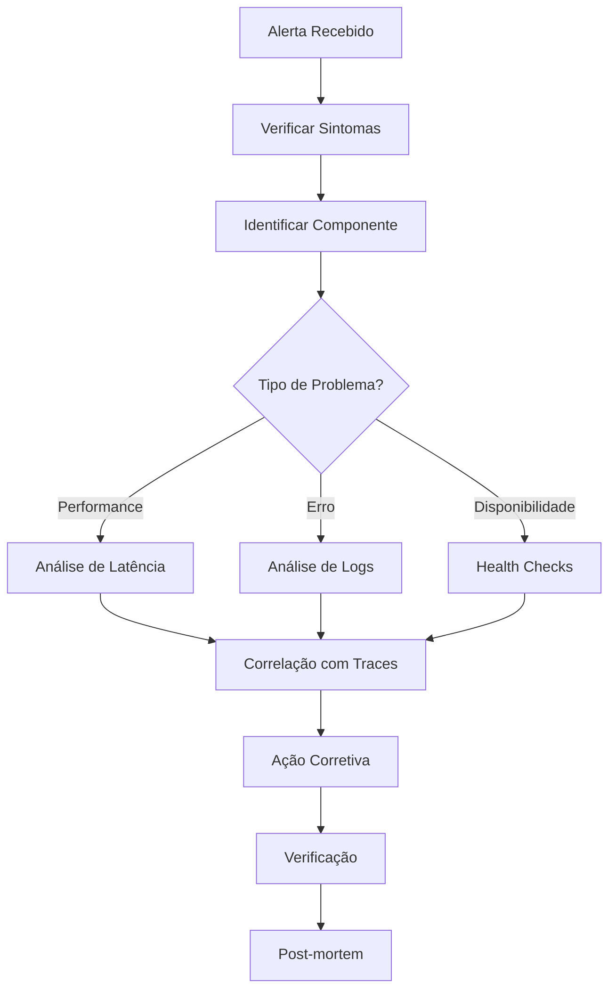

# 📊 MONITORAMENTO E OBSERVABILIDADE - PARTE 5
## Troubleshooting e Debugging

### 🎯 **OBJETIVOS DESTA PARTE**
- Dominar técnicas de troubleshooting para arquitetura híbrida
- Implementar debugging distribuído com tracing
- Criar playbooks para cenários comuns
- Configurar ferramentas de análise de performance

---

## 🔍 **ESTRATÉGIAS DE TROUBLESHOOTING**

### **📋 Metodologia de Investigação**

#### **The USE Method para Arquitetura Híbrida:**
- **U**tilization: Uso de recursos (CPU, memória, conexões)
- **S**aturation: Saturação de filas e pools
- **E**rrors: Taxa de erros em cada componente

#### **The RED Method para Services:**
- **R**ate: Taxa de requisições/comandos/eventos
- **E**rrors: Taxa de erros
- **D**uration: Latência/duração

### **🎯 Fluxo de Investigação Estruturado**



---

## 🔧 **FERRAMENTAS DE DEBUGGING**

### **📊 Distributed Tracing com Jaeger**

#### **docker-compose.tracing.yml:**
```yaml
version: '3.8'

services:
  jaeger:
    image: jaegertracing/all-in-one:latest
    container_name: jaeger
    ports:
      - "16686:16686"  # Jaeger UI
      - "14268:14268"  # Jaeger collector
      - "14250:14250"  # Jaeger gRPC
      - "6831:6831/udp"  # Jaeger agent
    environment:
      - COLLECTOR_ZIPKIN_HOST_PORT=:9411
      - SPAN_STORAGE_TYPE=elasticsearch
      - ES_SERVER_URLS=http://elasticsearch:9200
    networks:
      - monitoring

  elasticsearch:
    image: docker.elastic.co/elasticsearch/elasticsearch:7.15.0
    container_name: elasticsearch
    environment:
      - discovery.type=single-node
      - "ES_JAVA_OPTS=-Xms512m -Xmx512m"
    ports:
      - "9200:9200"
    volumes:
      - elasticsearch_data:/usr/share/elasticsearch/data
    networks:
      - monitoring

  kibana:
    image: docker.elastic.co/kibana/kibana:7.15.0
    container_name: kibana
    ports:
      - "5601:5601"
    environment:
      - ELASTICSEARCH_HOSTS=http://elasticsearch:9200
    depends_on:
      - elasticsearch
    networks:
      - monitoring

volumes:
  elasticsearch_data:

networks:
  monitoring:
    external: true
```

### **🔍 Configuração de Tracing Avançado**

#### **TraceConfiguration.java:**
```java
@Configuration
@EnableZipkinServer
public class TraceConfiguration {
    
    @Bean
    public Sampler customSampler() {
        return Sampler.create(0.1f); // 10% sampling em produção
    }
    
    @Bean
    public SpanCustomizer spanCustomizer() {
        return span -> {
            span.tag("service.name", "app-arquitetura-hibrida");
            span.tag("service.version", getApplicationVersion());
            span.tag("environment", getEnvironment());
        };
    }
    
    @Bean
    public TraceFilter traceFilter() {
        return new TraceFilter() {
            @Override
            public void doFilter(ServletRequest request, ServletResponse response, 
                               FilterChain chain) throws IOException, ServletException {
                
                HttpServletRequest httpRequest = (HttpServletRequest) request;
                
                // Adiciona informações de contexto ao trace
                Span currentSpan = tracer.currentSpan();
                if (currentSpan != null) {
                    currentSpan.tag("http.method", httpRequest.getMethod());
                    currentSpan.tag("http.url", httpRequest.getRequestURL().toString());
                    currentSpan.tag("user.id", extractUserId(httpRequest));
                }
                
                chain.doFilter(request, response);
            }
        };
    }
    
    private String extractUserId(HttpServletRequest request) {
        // Extrair user ID do token JWT ou session
        return "anonymous";
    }
    
    private String getApplicationVersion() {
        return getClass().getPackage().getImplementationVersion();
    }
    
    private String getEnvironment() {
        return System.getProperty("spring.profiles.active", "development");
    }
}
```

### **🎯 Instrumentação Manual para Debugging**

#### **DebugTraceService.java:**
```java
@Service
@Slf4j
public class DebugTraceService {
    
    private final Tracer tracer;
    
    public DebugTraceService(Tracer tracer) {
        this.tracer = tracer;
    }
    
    public <T> T traceOperation(String operationName, Supplier<T> operation) {
        Span span = tracer.nextSpan()
            .name(operationName)
            .tag("operation.type", "debug")
            .start();
            
        try (Tracer.SpanInScope ws = tracer.withSpanInScope(span)) {
            log.debug("Starting operation: {}", operationName);
            
            T result = operation.get();
            
            span.tag("operation.success", "true");
            log.debug("Operation completed successfully: {}", operationName);
            
            return result;
            
        } catch (Exception e) {
            span.tag("operation.success", "false");
            span.tag("error.message", e.getMessage());
            span.tag("error.type", e.getClass().getSimpleName());
            
            log.error("Operation failed: {}", operationName, e);
            throw e;
            
        } finally {
            span.end();
        }
    }
    
    public void addTraceContext(String key, String value) {
        Span currentSpan = tracer.currentSpan();
        if (currentSpan != null) {
            currentSpan.tag(key, value);
        }
        
        // Também adiciona ao MDC para logs
        MDC.put(key, value);
    }
    
    public void traceCommandExecution(Command command, Runnable execution) {
        Span span = tracer.nextSpan()
            .name("command-execution")
            .tag("command.type", command.getCommandType())
            .tag("command.id", command.getCommandId().toString())
            .start();
            
        try (Tracer.SpanInScope ws = tracer.withSpanInScope(span)) {
            addTraceContext("command.type", command.getCommandType());
            addTraceContext("command.id", command.getCommandId().toString());
            
            execution.run();
            
        } finally {
            span.end();
            MDC.clear();
        }
    }
    
    public void traceEventProcessing(DomainEvent event, Runnable processing) {
        Span span = tracer.nextSpan()
            .name("event-processing")
            .tag("event.type", event.getEventType())
            .tag("event.id", event.getEventId().toString())
            .tag("aggregate.id", event.getAggregateId())
            .start();
            
        try (Tracer.SpanInScope ws = tracer.withSpanInScope(span)) {
            addTraceContext("event.type", event.getEventType());
            addTraceContext("aggregate.id", event.getAggregateId());
            
            processing.run();
            
        } finally {
            span.end();
            MDC.clear();
        }
    }
}
```

---

## 📋 **PLAYBOOKS DE TROUBLESHOOTING**

### **🚨 Playbook: Alta Latência em Comandos**

#### **Sintomas:**
- Alerta: HighCommandLatency
- Usuários reportando lentidão
- Timeout em operações

#### **Investigação Inicial (2-5 minutos):**

```bash
# 1. Verificar métricas de latência
curl -s "http://prometheus:9090/api/v1/query?query=histogram_quantile(0.95,rate(commands_execution_time_seconds_bucket[5m]))" | jq '.data.result'

# 2. Identificar comandos mais lentos
curl -s "http://prometheus:9090/api/v1/query?query=topk(5,histogram_quantile(0.95,rate(commands_execution_time_seconds_bucket[5m]))by(type))" | jq '.data.result'

# 3. Verificar traces recentes
curl -s "http://jaeger:16686/api/traces?service=app-arquitetura-hibrida&lookback=1h&limit=20" | jq '.data[0]'
```

#### **Análise Detalhada (5-15 minutos):**

```sql
-- Verificar performance do banco (Event Store)
SELECT 
    query,
    mean_exec_time,
    calls,
    total_exec_time
FROM pg_stat_statements 
WHERE query LIKE '%events%'
ORDER BY mean_exec_time DESC 
LIMIT 10;

-- Verificar locks ativos
SELECT 
    blocked_locks.pid AS blocked_pid,
    blocked_activity.usename AS blocked_user,
    blocking_locks.pid AS blocking_pid,
    blocking_activity.usename AS blocking_user,
    blocked_activity.query AS blocked_statement,
    blocking_activity.query AS current_statement_in_blocking_process
FROM pg_catalog.pg_locks blocked_locks
JOIN pg_catalog.pg_stat_activity blocked_activity ON blocked_activity.pid = blocked_locks.pid
JOIN pg_catalog.pg_locks blocking_locks ON blocking_locks.locktype = blocked_locks.locktype
JOIN pg_catalog.pg_stat_activity blocking_activity ON blocking_activity.pid = blocking_locks.pid
WHERE NOT blocked_locks.granted;
```

#### **Ações Corretivas:**

```bash
# 1. Verificar pool de conexões
curl http://app:8080/actuator/metrics/hikaricp.connections.active

# 2. Reiniciar pools se necessário
curl -X POST http://app:8080/actuator/restart

# 3. Escalar horizontalmente (se disponível)
docker-compose up --scale app=2

# 4. Limpar cache se necessário
curl -X POST http://app:8080/api/cache/clear
```

### **🔄 Playbook: Lag Alto no CQRS**

#### **Sintomas:**
- Alerta: HighCQRSLag
- Dados desatualizados nas consultas
- Inconsistências temporárias

#### **Investigação (2-10 minutos):**

```bash
# 1. Verificar status das projeções
curl http://app:8080/api/projections/status | jq '.'

# 2. Identificar projeção mais atrasada
curl -s "http://prometheus:9090/api/v1/query?query=topk(5,projection_lag_seconds)" | jq '.data.result'

# 3. Verificar processamento de eventos
curl -s "http://prometheus:9090/api/v1/query?query=rate(eventbus_events_processed_total[5m])" | jq '.data.result'

# 4. Verificar erros em projeções
docker logs app-arquitetura-hibrida | grep -i "projection.*error" | tail -20
```

#### **Análise de Performance:**

```sql
-- Verificar performance das consultas de projeção
SELECT 
    schemaname,
    tablename,
    attname,
    n_distinct,
    correlation
FROM pg_stats 
WHERE tablename LIKE '%projection%'
ORDER BY n_distinct DESC;

-- Verificar índices faltantes
SELECT 
    schemaname,
    tablename,
    attname,
    n_distinct,
    correlation
FROM pg_stats 
WHERE schemaname = 'projections'
AND correlation < 0.1;
```

#### **Resolução:**

```bash
# 1. Reiniciar processamento de projeções
curl -X POST http://app:8080/api/projections/restart

# 2. Rebuild incremental se necessário
curl -X POST http://app:8080/api/projections/rebuild/incremental

# 3. Verificar e otimizar consultas lentas
curl http://app:8080/actuator/metrics/spring.data.repository.invocations
```

---

## 🔍 **ANÁLISE DE LOGS AVANÇADA**

### **📊 Configuração do ELK Stack**

#### **logstash.conf:**
```ruby
input {
  beats {
    port => 5044
  }
}

filter {
  if [fields][service] == "app-arquitetura-hibrida" {
    
    # Parse JSON logs
    json {
      source => "message"
    }
    
    # Extract trace information
    if [traceId] {
      mutate {
        add_field => { "trace_url" => "http://jaeger:16686/trace/%{traceId}" }
      }
    }
    
    # Parse command/event information
    if [logger_name] =~ /CommandHandler/ {
      mutate {
        add_tag => [ "command" ]
      }
    }
    
    if [logger_name] =~ /EventHandler/ {
      mutate {
        add_tag => [ "event" ]
      }
    }
    
    # Extract error information
    if [level] == "ERROR" {
      grok {
        match => { 
          "message" => "(?<error_type>\w+Exception): (?<error_message>.*)" 
        }
      }
    }
    
    # Add business context
    if [mdc][aggregateId] {
      mutate {
        add_field => { "business_entity" => "sinistro" }
      }
    }
  }
}

output {
  elasticsearch {
    hosts => ["elasticsearch:9200"]
    index => "app-logs-%{+YYYY.MM.dd}"
  }
  
  # Send errors to separate index for alerting
  if [level] == "ERROR" {
    elasticsearch {
      hosts => ["elasticsearch:9200"]
      index => "app-errors-%{+YYYY.MM.dd}"
    }
  }
}
```

### **🔍 Queries Úteis no Kibana**

#### **Queries para Debugging:**

```json
// Buscar por trace ID específico
{
  "query": {
    "match": {
      "traceId": "abc123def456"
    }
  }
}

// Buscar erros em comandos específicos
{
  "query": {
    "bool": {
      "must": [
        {"match": {"level": "ERROR"}},
        {"match": {"tags": "command"}},
        {"match": {"mdc.commandType": "CriarSinistroCommand"}}
      ]
    }
  }
}

// Buscar por aggregate ID
{
  "query": {
    "match": {
      "mdc.aggregateId": "sinistro-123"
    }
  },
  "sort": [
    {"@timestamp": {"order": "asc"}}
  ]
}

// Análise de performance por operação
{
  "aggs": {
    "operations": {
      "terms": {
        "field": "mdc.commandType.keyword"
      },
      "aggs": {
        "avg_duration": {
          "avg": {
            "field": "duration"
          }
        }
      }
    }
  }
}
```

---

## 🎯 **DEBUGGING DE CENÁRIOS ESPECÍFICOS**

### **🔧 Debug: Evento Perdido**

#### **Cenário:** Comando executado mas projeção não atualizada

```bash
# 1. Verificar se comando foi processado
curl -s "http://elasticsearch:9200/app-logs-*/_search" -H 'Content-Type: application/json' -d '{
  "query": {
    "bool": {
      "must": [
        {"match": {"mdc.commandId": "cmd-123"}},
        {"match": {"message": "Comando processado com sucesso"}}
      ]
    }
  }
}'

# 2. Verificar se evento foi persistido
curl -s "http://app:8080/api/eventstore/events/aggregate/sinistro-123" | jq '.[] | select(.eventId == "evt-456")'

# 3. Verificar se evento foi publicado
curl -s "http://elasticsearch:9200/app-logs-*/_search" -H 'Content-Type: application/json' -d '{
  "query": {
    "bool": {
      "must": [
        {"match": {"mdc.eventId": "evt-456"}},
        {"match": {"message": "Evento publicado"}}
      ]
    }
  }
}'

# 4. Verificar processamento na projeção
curl -s "http://elasticsearch:9200/app-logs-*/_search" -H 'Content-Type: application/json' -d '{
  "query": {
    "bool": {
      "must": [
        {"match": {"mdc.eventId": "evt-456"}},
        {"match": {"tags": "event"}},
        {"match": {"logger_name": "*ProjectionHandler"}}
      ]
    }
  }
}'
```

### **🔧 Debug: Performance Degradation**

#### **Cenário:** Sistema lento sem causa aparente

```bash
# 1. Análise de traces por latência
curl -s "http://jaeger:16686/api/traces?service=app-arquitetura-hibrida&minDuration=2s&lookback=1h" | jq '.data[] | {traceID, duration: .processes[].tags[] | select(.key=="duration") | .value}'

# 2. Análise de hot spots
curl -s "http://prometheus:9090/api/v1/query?query=topk(10,rate(method_execution_time_seconds_sum[5m])/rate(method_execution_time_seconds_count[5m]))" | jq '.data.result'

# 3. Verificar garbage collection
curl -s "http://app:8080/actuator/metrics/jvm.gc.pause" | jq '.measurements[] | select(.statistic=="TOTAL_TIME")'

# 4. Análise de thread dumps
curl -s "http://app:8080/actuator/threaddump" | jq '.threads[] | select(.threadState=="BLOCKED") | {threadName, blockedTime, stackTrace: .stackTrace[0:3]}'
```

---

## 📊 **FERRAMENTAS DE ANÁLISE**

### **🔍 APM com Elastic APM**

#### **elastic-apm.yml:**
```yaml
version: '3.8'

services:
  apm-server:
    image: docker.elastic.co/apm/apm-server:7.15.0
    container_name: apm-server
    ports:
      - "8200:8200"
    environment:
      - output.elasticsearch.hosts=["elasticsearch:9200"]
      - apm-server.host="0.0.0.0:8200"
      - apm-server.secret_token="your-secret-token"
    networks:
      - monitoring

  app:
    image: app-arquitetura-hibrida:latest
    environment:
      - ELASTIC_APM_SERVICE_NAME=app-arquitetura-hibrida
      - ELASTIC_APM_SERVER_URLS=http://apm-server:8200
      - ELASTIC_APM_SECRET_TOKEN=your-secret-token
      - ELASTIC_APM_ENVIRONMENT=production
      - ELASTIC_APM_APPLICATION_PACKAGES=com.seguradora.hibrida
    depends_on:
      - apm-server
```

### **📈 Profiling com Async Profiler**

#### **ProfilerConfiguration.java:**
```java
@Configuration
@Profile("profiling")
public class ProfilerConfiguration {
    
    @EventListener
    public void onApplicationReady(ApplicationReadyEvent event) {
        // Inicia profiling automático em ambiente de desenvolvimento
        if (isProfilingEnabled()) {
            startProfiling();
        }
    }
    
    private void startProfiling() {
        try {
            // Configurar async-profiler
            String command = "start,event=cpu,interval=1ms,file=/tmp/profile.html";
            
            // Executar profiling por 5 minutos
            Timer.schedule(() -> {
                stopProfiling();
            }, Duration.ofMinutes(5));
            
        } catch (Exception e) {
            log.warn("Failed to start profiling", e);
        }
    }
    
    private void stopProfiling() {
        // Parar profiling e gerar relatório
        log.info("Profiling completed. Report available at /tmp/profile.html");
    }
    
    private boolean isProfilingEnabled() {
        return "true".equals(System.getProperty("enable.profiling"));
    }
}
```

---

## 📚 **RECURSOS DE REFERÊNCIA**

### **🔗 Links Úteis:**
- [Jaeger Documentation](https://www.jaegertracing.io/docs/)
- [Elastic APM Java Agent](https://www.elastic.co/guide/en/apm/agent/java/current/index.html)
- [Spring Cloud Sleuth Reference](https://spring.io/projects/spring-cloud-sleuth)
- [Distributed Tracing Best Practices](https://opentracing.io/guides/)

### **📖 Resumo do Módulo:**
- **Parte 1**: Fundamentos de Observabilidade
- **Parte 2**: Configuração de Prometheus e Grafana
- **Parte 3**: Dashboards e Visualizações Avançadas
- **Parte 4**: Alertas e Notificações
- **Parte 5**: Troubleshooting e Debugging ✅

---

## 🎯 **PRÓXIMOS PASSOS**

Após completar este módulo de monitoramento, você deve:

1. **Implementar observabilidade** completa no core de sinistros
2. **Configurar alertas** específicos para seu domínio
3. **Criar runbooks** para cenários de sua aplicação
4. **Estabelecer SLIs/SLOs** para métricas de negócio

---

**📝 Parte 5 de 5 - Troubleshooting e Debugging**  
**⏱️ Tempo estimado**: 75 minutos  
**🎯 Próximo**: [Práticas de Desenvolvimento](./12-praticas-desenvolvimento-parte-1.md)