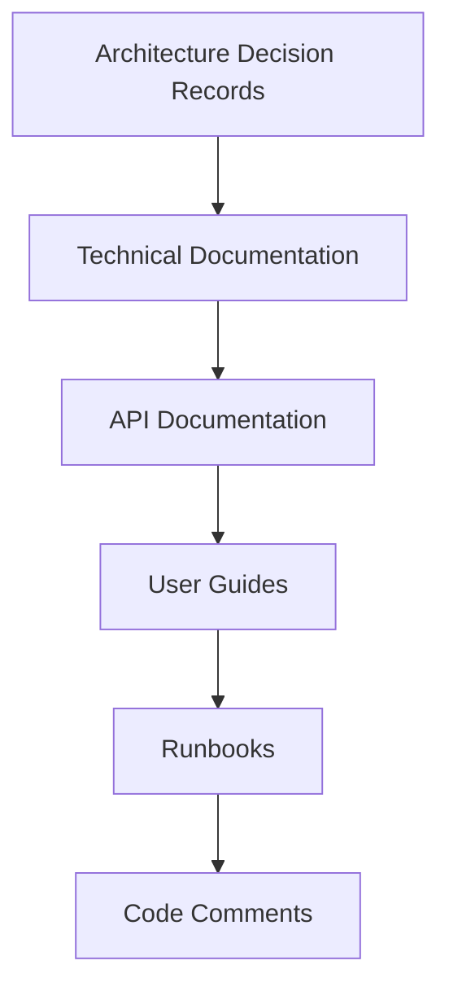

# 💻 PRÁTICAS DE DESENVOLVIMENTO - PARTE 5
## Documentação e Knowledge Sharing

### 🎯 **OBJETIVOS DESTA PARTE**
- Estabelecer padrões de documentação técnica
- Implementar knowledge sharing efetivo
- Criar processos de onboarding
- Configurar wikis e bases de conhecimento

---

## 📚 **ESTRATÉGIA DE DOCUMENTAÇÃO**

### **📋 Pirâmide de Documentação**



#### **Níveis de Documentação:**
- **🏗️ ADRs**: Decisões arquiteturais e contexto
- **📖 Technical Docs**: Guias técnicos detalhados
- **🔌 API Docs**: Documentação de APIs
- **👥 User Guides**: Guias para usuários finais
- **📋 Runbooks**: Procedimentos operacionais
- **💬 Code Comments**: Documentação inline

---

## 🏗️ **ARCHITECTURE DECISION RECORDS (ADRs)**

### **📝 Template de ADR**

#### **docs/adr/template.md:**
```markdown
# ADR-XXXX: [Título da Decisão]

## Status
[Proposto | Aceito | Rejeitado | Depreciado | Substituído por ADR-YYYY]

## Contexto
<!-- Descreva o contexto e o problema que levou à necessidade desta decisão -->

## Decisão
<!-- Descreva a decisão tomada -->

## Consequências
<!-- Descreva as consequências da decisão, tanto positivas quanto negativas -->

### Positivas
- 

### Negativas
- 

### Neutras
- 

## Alternativas Consideradas
<!-- Liste as alternativas que foram consideradas e por que foram rejeitadas -->

## Implementação
<!-- Descreva como a decisão será implementada -->

## Métricas de Sucesso
<!-- Como saberemos se esta decisão foi bem-sucedida? -->

## Links Relacionados
<!-- Links para documentos, issues, PRs relacionados -->

---
**Data**: YYYY-MM-DD  
**Autor**: [Nome]  
**Revisores**: [Nomes]  
**Status**: [Status atual]
```

### **📋 Exemplos de ADRs**

#### **docs/adr/ADR-001-event-sourcing-implementation.md:**
```markdown
# ADR-001: Implementação de Event Sourcing

## Status
Aceito

## Contexto
Precisamos implementar um sistema de sinistros que:
- Mantenha histórico completo de mudanças
- Permita auditoria detalhada
- Suporte reconstrução de estado
- Facilite análise temporal de dados

O sistema tradicional CRUD não atende esses requisitos adequadamente.

## Decisão
Implementaremos Event Sourcing como padrão principal de persistência:
- PostgreSQL como Event Store
- Eventos imutáveis com versionamento
- Snapshots para otimização de performance
- Projeções para consultas otimizadas

## Consequências

### Positivas
- Auditoria completa e automática
- Possibilidade de replay de eventos
- Flexibilidade para novas projeções
- Debugging facilitado
- Compliance com regulamentações

### Negativas
- Complexidade adicional
- Curva de aprendizado da equipe
- Overhead de storage
- Necessidade de versionamento de eventos

### Neutras
- Mudança no mindset de desenvolvimento
- Necessidade de ferramentas específicas

## Alternativas Consideradas

### 1. CRUD Tradicional + Audit Log
**Rejeitada**: Não oferece flexibilidade suficiente para reconstrução de estado

### 2. Change Data Capture (CDC)
**Rejeitada**: Dependente de tecnologia específica de banco

### 3. Hybrid Approach (CRUD + Events)
**Considerada**: Pode ser implementada futuramente para casos específicos

## Implementação
1. Setup PostgreSQL como Event Store
2. Implementar base classes para eventos
3. Criar agregados com Event Sourcing
4. Implementar projeções para consultas
5. Setup de snapshots para performance

## Métricas de Sucesso
- Tempo de auditoria < 1 segundo
- Reconstrução de agregado < 500ms
- Zero perda de dados históricos
- Compliance 100% com auditoria

## Links Relacionados
- [Event Sourcing Pattern](https://martinfowler.com/eaaDev/EventSourcing.html)
- [Issue #ARCH-001](https://github.com/seguradora/issues/ARCH-001)
- [Spike: Event Store POC](https://github.com/seguradora/pocs/event-store)

---
**Data**: 2024-01-15  
**Autor**: Arquiteto Principal  
**Revisores**: Tech Lead, Senior Developers  
**Status**: Aceito
```

#### **docs/adr/ADR-002-cqrs-separation.md:**
```markdown
# ADR-002: Separação CQRS com DataSources Distintos

## Status
Aceito

## Contexto
Com Event Sourcing implementado, precisamos otimizar consultas:
- Event Store não é otimizado para queries complexas
- Necessidade de diferentes modelos para leitura e escrita
- Requisitos de performance distintos
- Escalabilidade independente

## Decisão
Implementaremos CQRS com separação física:
- **Write Side**: Event Store (PostgreSQL otimizado para writes)
- **Read Side**: Projeções (PostgreSQL otimizado para reads)
- **Sincronização**: Event Bus assíncrono
- **Consistência**: Eventual consistency

## Consequências

### Positivas
- Performance otimizada para cada caso de uso
- Escalabilidade independente
- Modelos de dados específicos para cada necessidade
- Flexibilidade para diferentes tecnologias

### Negativas
- Complexidade de sincronização
- Consistência eventual
- Overhead de infraestrutura
- Monitoramento de lag

## Implementação
1. Setup de dois DataSources
2. Implementar Event Bus
3. Criar Projection Handlers
4. Monitoramento de lag CQRS
5. Estratégias de recovery

## Métricas de Sucesso
- Lag CQRS < 5 segundos (P95)
- Query performance < 100ms (P95)
- Write performance < 200ms (P95)
- Disponibilidade > 99.9%

---
**Data**: 2024-01-20  
**Autor**: Arquiteto Principal  
**Status**: Aceito
```

---

## 📖 **DOCUMENTAÇÃO TÉCNICA**

### **🔧 Guias Técnicos**

#### **docs/technical/event-sourcing-guide.md:**
```markdown
# Event Sourcing - Guia Técnico

## Visão Geral
Este guia explica como implementar Event Sourcing no projeto.

## Conceitos Fundamentais

### Eventos
Eventos representam fatos que aconteceram no passado:
```java
public class SinistroCriadoEvent extends DomainEvent {
    private final String protocolo;
    private final String cpfSegurado;
    private final BigDecimal valorEstimado;
    // ...
}
```

### Agregados
Agregados aplicam eventos para reconstruir estado:
```java
public class SinistroAggregate extends AggregateRoot {
    @EventSourcingHandler
    private void on(SinistroCriadoEvent event) {
        this.protocolo = event.getProtocolo();
        // ...
    }
}
```

## Padrões de Implementação

### 1. Criando Novos Eventos
```java
// 1. Definir o evento
public class NovoEventoEvent extends DomainEvent {
    // Campos imutáveis
}

// 2. Aplicar no agregado
public void executarAcao() {
    applyEvent(NovoEventoEvent.builder()
        .aggregateId(getId())
        .campo1(valor1)
        .build());
}

// 3. Handler no agregado
@EventSourcingHandler
private void on(NovoEventoEvent event) {
    // Atualizar estado
}
```

### 2. Versionamento de Eventos
```java
// Versão 1
public class SinistroCriadoEvent_V1 extends DomainEvent {
    private String valor; // Campo antigo
}

// Versão 2
public class SinistroCriadoEvent extends DomainEvent {
    private BigDecimal valorEstimado; // Campo novo
    
    // Migração automática
    public static SinistroCriadoEvent fromV1(SinistroCriadoEvent_V1 v1) {
        return SinistroCriadoEvent.builder()
            .valorEstimado(new BigDecimal(v1.getValor()))
            .build();
    }
}
```

## Boas Práticas

### ✅ Fazer
- Eventos imutáveis
- Nomes no passado (SinistroCriado, não CriarSinistro)
- Versionamento explícito
- Validações no agregado
- Snapshots para performance

### ❌ Evitar
- Eventos mutáveis
- Lógica de negócio em eventos
- Dependências externas em handlers
- Eventos muito grandes
- Quebrar imutabilidade

## Troubleshooting

### Problema: Evento não aplicado
```bash
# Verificar se evento foi persistido
curl http://localhost:8080/api/eventstore/events/aggregate/{id}

# Verificar logs do agregado
docker logs app | grep "EventSourcingHandler"
```

### Problema: Performance lenta
```bash
# Verificar necessidade de snapshot
curl http://localhost:8080/actuator/metrics/aggregate.reconstruction.time

# Criar snapshot manualmente
curl -X POST http://localhost:8080/api/aggregates/{id}/snapshot
```

## Referências
- [Event Sourcing Pattern](https://martinfowler.com/eaaDev/EventSourcing.html)
- [Código de exemplo](../examples/event-sourcing/)
- [Testes de referência](../../src/test/java/aggregate/)
```

### **🔌 API Documentation**

#### **docs/api/sinistros-api.md:**
```markdown
# API de Sinistros

## Visão Geral
API REST para gerenciamento de sinistros seguindo padrões CQRS.

## Endpoints

### Commands (Write Operations)

#### Criar Sinistro
```http
POST /api/sinistros
Content-Type: application/json

{
  "protocolo": "SIN-2024-001234",
  "cpfSegurado": "12345678901",
  "nomeSegurado": "João Silva",
  "descricao": "Colisão traseira na Av. Paulista",
  "valorEstimado": 5000.00,
  "placa": "ABC1234",
  "tipoSinistro": "COLISAO",
  "dataOcorrencia": "2024-01-15T10:30:00Z"
}
```

**Resposta de Sucesso (201):**
```json
{
  "success": true,
  "data": {
    "id": "550e8400-e29b-41d4-a716-446655440000",
    "protocolo": "SIN-2024-001234",
    "status": "ABERTO"
  },
  "timestamp": "2024-01-15T10:30:01Z"
}
```

**Resposta de Erro (400):**
```json
{
  "success": false,
  "errors": [
    {
      "field": "cpfSegurado",
      "message": "CPF inválido",
      "code": "INVALID_CPF"
    }
  ],
  "timestamp": "2024-01-15T10:30:01Z"
}
```

### Queries (Read Operations)

#### Buscar Sinistro por ID
```http
GET /api/sinistros/{id}
```

#### Listar Sinistros
```http
GET /api/sinistros?page=0&size=20&sort=dataAbertura,desc
```

**Filtros Disponíveis:**
- `status`: Status do sinistro
- `cpfSegurado`: CPF do segurado
- `dataAberturaInicio`: Data inicial
- `dataAberturaFim`: Data final

## Códigos de Erro

| Código | Descrição |
|--------|-----------|
| `INVALID_CPF` | CPF inválido |
| `DUPLICATE_PROTOCOL` | Protocolo já existe |
| `INVALID_VALUE` | Valor estimado inválido |
| `BUSINESS_RULE_VIOLATION` | Violação de regra de negócio |

## Rate Limiting
- 100 requests por minuto por IP
- 1000 requests por hora por usuário autenticado

## Autenticação
```http
Authorization: Bearer {jwt-token}
```

## Exemplos com cURL

### Criar Sinistro
```bash
curl -X POST http://localhost:8080/api/sinistros \
  -H "Content-Type: application/json" \
  -H "Authorization: Bearer $TOKEN" \
  -d '{
    "protocolo": "SIN-2024-001234",
    "cpfSegurado": "12345678901",
    "descricao": "Teste via cURL",
    "valorEstimado": 1000.00,
    "placa": "TEST123"
  }'
```

### Buscar Sinistros
```bash
curl "http://localhost:8080/api/sinistros?status=ABERTO&page=0&size=10" \
  -H "Authorization: Bearer $TOKEN"
```
```

---

## 👥 **KNOWLEDGE SHARING**

### **📋 Programa de Knowledge Sharing**

#### **Estrutura do Programa:**
```yaml
knowledge_sharing:
  tech_talks:
    frequency: "Quinzenal"
    duration: "45 minutos"
    format: "Apresentação + Q&A"
    topics:
      - "Event Sourcing na Prática"
      - "CQRS: Lições Aprendidas"
      - "Debugging Distribuído"
      - "Performance Tuning"
  
  code_reviews:
    frequency: "Contínua"
    focus: "Mentoria e aprendizado"
    guidelines: "docs/code-review-guidelines.md"
  
  documentation:
    wiki: "Confluence/Notion"
    runbooks: "docs/runbooks/"
    adrs: "docs/adr/"
    examples: "docs/examples/"
  
  onboarding:
    duration: "2 semanas"
    mentor_assigned: true
    checklist: "docs/onboarding-checklist.md"
```

### **🎓 Onboarding Process**

#### **docs/onboarding-checklist.md:**
```markdown
# Onboarding Checklist - Arquitetura Híbrida

## Semana 1: Fundamentos

### Dia 1-2: Setup e Conceitos
- [ ] Setup do ambiente de desenvolvimento
- [ ] Acesso aos repositórios e ferramentas
- [ ] Leitura dos ADRs principais (ADR-001 a ADR-005)
- [ ] Apresentação da arquitetura geral
- [ ] Reunião com mentor

### Dia 3-4: Event Sourcing
- [ ] Estudar guia de Event Sourcing
- [ ] Executar exemplos práticos
- [ ] Implementar primeiro evento (com mentoria)
- [ ] Code review do primeiro PR

### Dia 5: CQRS
- [ ] Estudar separação Command/Query
- [ ] Implementar primeira consulta
- [ ] Entender projeções
- [ ] Sessão de pair programming

## Semana 2: Prática

### Dia 1-2: Desenvolvimento Guiado
- [ ] Implementar user story completa
- [ ] Testes unitários e integração
- [ ] Deploy em ambiente de desenvolvimento
- [ ] Monitoramento e debugging

### Dia 3-4: Autonomia
- [ ] Implementar feature independentemente
- [ ] Documentar decisões técnicas
- [ ] Apresentar solução para equipe
- [ ] Feedback e melhorias

### Dia 5: Avaliação
- [ ] Revisão do progresso
- [ ] Feedback do mentor
- [ ] Plano de desenvolvimento
- [ ] Integração completa à equipe

## Recursos de Apoio
- **Mentor**: [Nome do mentor]
- **Buddy**: [Nome do buddy]
- **Canal Slack**: #arquitetura-hibrida-help
- **Documentação**: [Links principais]
```

### **📚 Wiki Structure**

#### **Estrutura do Wiki/Confluence:**
```
📁 Arquitetura Híbrida
├── 🏠 Home
│   ├── Visão Geral do Projeto
│   ├── Quick Start Guide
│   └── Links Importantes
├── 🏗️ Arquitetura
│   ├── ADRs (Architecture Decision Records)
│   ├── Diagramas de Arquitetura
│   ├── Padrões e Convenções
│   └── Glossário de Termos
├── 💻 Desenvolvimento
│   ├── Setup do Ambiente
│   ├── Guias Técnicos
│   ├── Code Review Guidelines
│   └── Troubleshooting
├── 🚀 Deploy e Operações
│   ├── Runbooks
│   ├── Monitoramento
│   ├── Alertas
│   └── Disaster Recovery
├── 📊 Métricas e KPIs
│   ├── Dashboards
│   ├── SLIs/SLOs
│   ├── Performance Benchmarks
│   └── Business Metrics
└── 👥 Equipe
    ├── Onboarding
    ├── Knowledge Sharing
    ├── Retrospectivas
    └── Lessons Learned
```

---

## 📋 **RUNBOOKS**

### **🚨 Runbook Template**

#### **docs/runbooks/template.md:**
```markdown
# Runbook: [Nome do Procedimento]

## Visão Geral
<!-- Breve descrição do que este runbook resolve -->

## Quando Usar
<!-- Sintomas ou situações que indicam uso deste runbook -->
- Alerta: [Nome do alerta]
- Sintoma: [Descrição do sintoma]
- Métrica: [Métrica específica]

## Severidade
- [ ] **P0 - Crítico**: Sistema indisponível
- [ ] **P1 - Alto**: Degradação severa
- [ ] **P2 - Médio**: Problema localizado
- [ ] **P3 - Baixo**: Melhoria/manutenção

## Pré-requisitos
- Acesso: [Sistemas necessários]
- Ferramentas: [Ferramentas necessárias]
- Conhecimento: [Conhecimento técnico necessário]

## Diagnóstico Rápido (< 5 minutos)
### 1. Verificações Iniciais
```bash
# Comandos para diagnóstico rápido
```

### 2. Métricas Chave
- Métrica 1: [Como verificar]
- Métrica 2: [Como verificar]

## Resolução Passo a Passo

### Ação Imediata (< 2 minutos)
1. [Primeiro passo crítico]
2. [Segundo passo crítico]

### Investigação (2-10 minutos)
1. [Passos de investigação]
2. [Coleta de evidências]

### Resolução (10-30 minutos)
1. [Passos de resolução]
2. [Verificação da solução]

## Verificação da Resolução
- [ ] [Critério 1 de sucesso]
- [ ] [Critério 2 de sucesso]
- [ ] [Critério 3 de sucesso]

## Escalação
Se o problema persistir após 30 minutos:
- **Próximo nível**: [Contato/equipe]
- **Informações necessárias**: [O que coletar]
- **Canais de comunicação**: [Slack/PagerDuty/etc]

## Prevenção
- [Ações para prevenir recorrência]
- [Melhorias sugeridas]
- [Monitoramento adicional]

## Histórico de Incidentes
| Data | Duração | Causa Raiz | Ações Tomadas |
|------|---------|------------|---------------|
| | | | |

## Links Relacionados
- Dashboard: [Link para dashboard]
- Logs: [Link para logs]
- Documentação: [Links relacionados]

---
**Última atualização**: [Data]  
**Responsável**: [Nome]  
**Revisado por**: [Nome]
```

### **🔧 Runbook Específico**

#### **docs/runbooks/high-cqrs-lag.md:**
```markdown
# Runbook: Alto Lag CQRS

## Visão Geral
Procedimento para resolver lag alto entre Command e Query side.

## Quando Usar
- Alerta: `HighCQRSLag` ou `CriticalCQRSLag`
- Sintoma: Dados desatualizados nas consultas
- Métrica: `cqrs_lag_seconds > 60`

## Severidade
- [x] **P1 - Alto**: Degradação severa da experiência

## Diagnóstico Rápido (< 5 minutos)

### 1. Verificar Lag Atual
```bash
# Verificar métrica de lag
curl -s "http://prometheus:9090/api/v1/query?query=cqrs_lag_seconds" | jq '.data.result[0].value[1]'

# Verificar status das projeções
curl http://localhost:8080/api/projections/status | jq '.'
```

### 2. Identificar Projeção Problemática
```bash
# Projeções com maior lag
curl -s "http://prometheus:9090/api/v1/query?query=topk(5,projection_lag_seconds)" | jq '.data.result'
```

## Resolução Passo a Passo

### Ação Imediata (< 2 minutos)
1. **Verificar se há projeções paradas**
```bash
curl http://localhost:8080/api/projections | grep -i "error\|stopped"
```

2. **Reiniciar processamento se necessário**
```bash
curl -X POST http://localhost:8080/api/projections/restart-all
```

### Investigação (2-10 minutos)
1. **Verificar logs de erro**
```bash
docker logs app-arquitetura-hibrida | grep -i "projection.*error" | tail -20
```

2. **Verificar performance do banco de leitura**
```sql
-- Conectar no banco de projeções
SELECT * FROM pg_stat_activity WHERE state = 'active';
SELECT query, mean_exec_time FROM pg_stat_statements ORDER BY mean_exec_time DESC LIMIT 10;
```

3. **Verificar Event Bus**
```bash
curl http://localhost:8080/actuator/metrics/eventbus.events.processed
```

### Resolução (10-30 minutos)
1. **Se problema for de performance de query**
```sql
-- Verificar índices faltantes
SELECT schemaname, tablename, attname, n_distinct 
FROM pg_stats 
WHERE schemaname = 'projections' 
AND correlation < 0.1;
```

2. **Se problema for de processamento**
```bash
# Aumentar paralelismo temporariamente
kubectl scale deployment app-deployment --replicas=5

# Ou reiniciar pods
kubectl rollout restart deployment/app-deployment
```

3. **Se problema for de dados corrompidos**
```bash
# Rebuild incremental da projeção problemática
curl -X POST http://localhost:8080/api/projections/{projection-name}/rebuild/incremental
```

## Verificação da Resolução
- [ ] Lag CQRS < 10 segundos
- [ ] Todas as projeções ativas
- [ ] Consultas retornando dados atualizados
- [ ] Sem erros nos logs

## Escalação
Se lag > 300 segundos após 30 minutos:
- **Próximo nível**: Arquiteto Principal
- **Canal**: #critical-incidents
- **Informações**: Logs, métricas, ações já tomadas

## Prevenção
- Monitorar índices de performance
- Alertas proativos para lag > 30s
- Review regular de queries lentas
- Capacity planning para projeções

---
**Última atualização**: 2024-01-15  
**Responsável**: Tech Lead  
**Revisado por**: Arquiteto Principal
```

---

## 🎯 **MÉTRICAS DE KNOWLEDGE SHARING**

### **📊 KPIs de Documentação**

#### **Métricas Coletadas:**
```yaml
documentation_metrics:
  coverage:
    - adr_coverage: "% de decisões documentadas"
    - api_coverage: "% de endpoints documentados"
    - runbook_coverage: "% de alertas com runbooks"
  
  usage:
    - wiki_page_views: "Visualizações por página"
    - search_queries: "Buscas mais frequentes"
    - feedback_scores: "Avaliação da documentação"
  
  freshness:
    - outdated_docs: "Documentos > 6 meses sem atualização"
    - broken_links: "Links quebrados"
    - accuracy_reports: "Relatórios de imprecisão"
  
  onboarding:
    - time_to_first_commit: "Tempo até primeiro commit"
    - mentor_feedback: "Avaliação do processo"
    - completion_rate: "Taxa de conclusão do onboarding"
```

### **📈 Dashboard de Knowledge Sharing**

#### **knowledge-dashboard.json:**
```json
{
  "dashboard": {
    "title": "Knowledge Sharing Metrics",
    "panels": [
      {
        "title": "Documentation Coverage",
        "type": "stat",
        "targets": [
          {
            "expr": "documentation_coverage_percentage",
            "legendFormat": "Coverage %"
          }
        ],
        "thresholds": [
          {"value": 80, "color": "green"},
          {"value": 60, "color": "yellow"},
          {"value": 0, "color": "red"}
        ]
      },
      {
        "title": "Wiki Usage",
        "type": "graph",
        "targets": [
          {
            "expr": "wiki_page_views_total",
            "legendFormat": "Page Views"
          }
        ]
      },
      {
        "title": "Onboarding Success Rate",
        "type": "stat",
        "targets": [
          {
            "expr": "onboarding_completion_rate",
            "legendFormat": "Completion Rate %"
          }
        ]
      }
    ]
  }
}
```

---

## 🎓 **CONTINUOUS LEARNING**

### **📚 Learning Paths**

#### **docs/learning/event-sourcing-path.md:**
```markdown
# Learning Path: Event Sourcing Mastery

## Nível Iniciante (1-2 semanas)
### Teoria
- [ ] [Event Sourcing Pattern - Martin Fowler](https://martinfowler.com/eaaDev/EventSourcing.html)
- [ ] [CQRS Journey - Microsoft](https://docs.microsoft.com/en-us/previous-versions/msp-n-p/jj554200(v=pandp.10))
- [ ] Vídeo: "Event Sourcing Basics" (interno)

### Prática
- [ ] Implementar agregado simples
- [ ] Criar primeiro evento
- [ ] Testes básicos de Event Sourcing
- [ ] Code review com mentor

## Nível Intermediário (2-3 semanas)
### Teoria
- [ ] Event Store design patterns
- [ ] Snapshot strategies
- [ ] Event versioning
- [ ] Projection patterns

### Prática
- [ ] Implementar snapshots
- [ ] Versionamento de eventos
- [ ] Projeções complexas
- [ ] Performance tuning

## Nível Avançado (3-4 semanas)
### Teoria
- [ ] Distributed Event Sourcing
- [ ] Saga patterns
- [ ] Event-driven architecture
- [ ] Microservices with Event Sourcing

### Prática
- [ ] Implementar saga
- [ ] Cross-service events
- [ ] Advanced monitoring
- [ ] Disaster recovery

## Certificação Interna
- [ ] Apresentação técnica (30 min)
- [ ] Code review de feature complexa
- [ ] Mentoria de novo membro
- [ ] Contribuição para documentação
```

### **🏆 Gamification**

#### **Sistema de Pontos:**
```yaml
gamification:
  activities:
    code_review:
      points: 10
      multiplier: "quality_score"
    
    documentation:
      create_page: 25
      update_page: 15
      fix_broken_link: 5
    
    knowledge_sharing:
      tech_talk: 100
      mentoring: 50
      answer_question: 10
    
    learning:
      complete_course: 75
      certification: 150
      conference_talk: 200
  
  badges:
    - name: "Event Sourcing Expert"
      criteria: "Complete advanced path + mentor 3 people"
    - name: "Documentation Hero"
      criteria: "Create 10 pages + maintain 95% accuracy"
    - name: "Code Quality Champion"
      criteria: "100 quality reviews + 0 critical issues"
  
  leaderboard:
    monthly_reset: true
    categories: ["Overall", "Documentation", "Mentoring", "Learning"]
```

---

## 📚 **RECURSOS DE REFERÊNCIA**

### **🔗 Links Úteis:**
- [Architecture Decision Records](https://adr.github.io/)
- [Documentation as Code](https://www.writethedocs.org/guide/docs-as-code/)
- [Runbook Best Practices](https://www.pagerduty.com/resources/learn/what-is-a-runbook/)
- [Knowledge Management](https://www.atlassian.com/knowledge-management)

### **📖 Resumo do Módulo:**
- **Parte 1**: Padrões de Código e Convenções
- **Parte 2**: Git Workflow e Versionamento
- **Parte 3**: Code Review e Qualidade
- **Parte 4**: CI/CD e Automação
- **Parte 5**: Documentação e Knowledge Sharing ✅

---

## 🎯 **CONCLUSÃO DO ROTEIRO**

Parabéns! Você completou todo o roteiro técnico da Arquitetura Híbrida. Agora você possui conhecimento completo sobre:

### **🏗️ Arquitetura:**
- Event Sourcing e CQRS
- Domain-Driven Design
- Command Bus e Event Bus
- Projeções e Agregados

### **💻 Desenvolvimento:**
- Padrões de código
- Testes abrangentes
- Monitoramento completo
- Práticas de qualidade

### **🚀 Operações:**
- CI/CD automatizado
- Deploy strategies
- Troubleshooting
- Knowledge sharing

**Próximos passos**: Aplicar este conhecimento no desenvolvimento do core de sinistros, seguindo todos os padrões e boas práticas estabelecidas.

---

**📝 Parte 5 de 5 - Documentação e Knowledge Sharing**  
**⏱️ Tempo estimado**: 60 minutos  
**🎯 Roteiro Completo**: ✅ **CONCLUÍDO!**