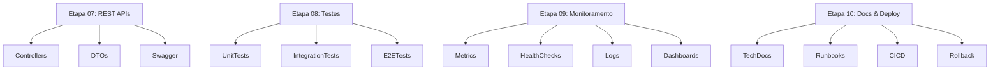

# Especificação Técnica: Completar Guia Prático - Etapas 07 a 10

## 1. VISÃO GERAL TÉCNICA

### 1.1 Objetivo
Implementar documentação técnica para as etapas finais do guia prático de desenvolvimento, mantendo total consistência com a metodologia estabelecida nas etapas 01-06.

### 1.2 Escopo Técnico
- **Etapa 07:** REST APIs (Controllers, DTOs, Swagger)
- **Etapa 08:** Testes & Validação (Unitários, Integração, E2E)
- **Etapa 09:** Monitoramento (Métricas, Health, Logs, Alertas)
- **Etapa 10:** Documentação & Deploy (Runbooks, CI/CD)

### 1.3 Metodologia Estabelecida
Cada etapa deve seguir a estrutura:
1. Objetivo e contexto (⏱️ duração, 👥 participantes, 📋 pré-requisitos)
2. Checklists de implementação (organizados por tópico)
3. Templates de código obrigatórios
4. Checkpoint de validação com critérios de aprovação
5. Pontos de atenção (❌ evitar / ✅ preferir)
6. Próximos passos e recursos de apoio

---

## 2. ARQUITETURA DA SOLUÇÃO

### 2.1 Componentes Envolvidos



### 2.2 Código-Fonte de Referência

| Etapa | Pacote de Referência | Classes Exemplo |
|-------|---------------------|----------------|
| 07 | `com.seguradora.hibrida.*.controller` | `CommandBusController`, `EventBusController`, `CQRSController` |
| 08 | `src/test/java` | Testes de `ExampleAggregate`, `TestCommandHandler` |
| 09 | `com.seguradora.hibrida.*.health`, `*.metrics` | `CQRSHealthIndicator`, `CQRSMetrics` |
| 10 | `doc/`, `docker/` | `README.md`, `docker-compose.yml`, `prometheus.yml` |

---

## 3. ESPECIFICAÇÃO DETALHADA POR ETAPA

### 3.1 ETAPA 07: REST APIs

#### 3.1.1 Estrutura do Documento
```markdown
# 🌐 ETAPA 07: IMPLEMENTAÇÃO DE REST APIs
## Controllers, DTOs, Validações e Documentação Swagger

### 🎯 OBJETIVO DA ETAPA
Implementar APIs REST seguindo padrões RESTful, separação CQRS, 
validações robustas e documentação OpenAPI 3.0.

**⏱️ Duração Estimada:** 3-5 horas
**👥 Participantes:** Desenvolvedor + Tech Lead
**📋 Pré-requisitos:** Etapa 06 concluída e aprovada
```

#### 3.1.2 Checklists Principais

**Checklist 1: Controllers de Comando**
- [ ] Controller criado no pacote `controller`
- [ ] Anotações REST (`@RestController`, `@RequestMapping`)
- [ ] Injeção de `CommandBus`
- [ ] Métodos POST para comandos
- [ ] DTOs de request com validações
- [ ] Tratamento de erros com `@ExceptionHandler`
- [ ] Documentação Swagger com `@Operation`
- [ ] Logs estruturados

**Checklist 2: Controllers de Query**
- [ ] Controller criado para consultas
- [ ] Injeção de `QueryService`
- [ ] Métodos GET com paginação
- [ ] DTOs de response otimizados
- [ ] Cache configurado (`@Cacheable`)
- [ ] Filtros e ordenação implementados
- [ ] Documentação Swagger completa

**Checklist 3: DTOs e Validações**
- [ ] DTOs de request com Bean Validation
- [ ] DTOs de response sem lógica de negócio
- [ ] Validações customizadas quando necessário
- [ ] Conversores (Entity ↔ DTO) implementados
- [ ] Exemplos no Swagger

**Checklist 4: Configuração Swagger**
- [ ] Dependência `springdoc-openapi-ui` configurada
- [ ] `OpenApiConfig` implementada
- [ ] Metadados da API documentados
- [ ] Schemas de segurança configurados
- [ ] Exemplos de requisições/respostas

#### 3.1.3 Templates de Código

**Template 1: Command Controller**
```java
@RestController
@RequestMapping("/api/v1/[dominio]")
@Tag(name = "[Dominio]", description = "Operações de comando")
@Slf4j
public class [Dominio]CommandController {
    
    private final CommandBus commandBus;
    
    @PostMapping
    @Operation(summary = "Criar novo [dominio]")
    @ApiResponses(value = {
        @ApiResponse(responseCode = "201", description = "Criado com sucesso"),
        @ApiResponse(responseCode = "400", description = "Validação falhou"),
        @ApiResponse(responseCode = "500", description = "Erro interno")
    })
    public ResponseEntity<[Dominio]Response> criar(
            @Valid @RequestBody [Criar][Dominio]Request request) {
        
        // Construir comando
        var command = [Criar][Dominio]Command.builder()
            .aggregateId(UUID.randomUUID().toString())
            .userId(getCurrentUserId())
            .[campo](request.get[Campo]())
            .build();
        
        // Enviar para command bus
        CommandResult result = commandBus.send(command);
        
        if (result.isSuccess()) {
            return ResponseEntity.status(HttpStatus.CREATED)
                .body([Dominio]Response.from(result));
        } else {
            throw new CommandExecutionException(result.getError());
        }
    }
}
```

**Template 2: Query Controller**
```java
@RestController
@RequestMapping("/api/v1/[dominio]")
@Tag(name = "[Dominio] Queries", description = "Operações de consulta")
@Slf4j
public class [Dominio]QueryController {
    
    private final [Dominio]QueryService queryService;
    
    @GetMapping("/{id}")
    @Operation(summary = "Buscar [dominio] por ID")
    @Cacheable(value = "dominio", key = "#id")
    public ResponseEntity<[Dominio]DetailResponse> buscarPorId(
            @PathVariable UUID id) {
        
        return queryService.findById(id)
            .map([Dominio]DetailResponse::from)
            .map(ResponseEntity::ok)
            .orElse(ResponseEntity.notFound().build());
    }
    
    @GetMapping
    @Operation(summary = "Listar [dominios] com filtros")
    public ResponseEntity<Page<[Dominio]ListResponse>> listar(
            @RequestParam(required = false) String filtro,
            @PageableDefault(size = 20) Pageable pageable) {
        
        Page<[Dominio]ListView> result = queryService.findWithFilters(
            [Dominio]Filter.builder().filtro(filtro).build(),
            pageable
        );
        
        return ResponseEntity.ok(
            result.map([Dominio]ListResponse::from)
        );
    }
}
```

**Template 3: DTO de Request**
```java
@Data
@Builder
@AllArgsConstructor
@NoArgsConstructor
@Schema(description = "Request para criar [dominio]")
public class [Criar][Dominio]Request {
    
    @NotBlank(message = "Campo obrigatório")
    @Size(max = 255, message = "Máximo 255 caracteres")
    @Schema(description = "Descrição do campo", example = "Exemplo")
    private String [campo];
    
    @Valid
    @Schema(description = "Objeto aninhado")
    private [Nested]Object [nested];
}
```

**Template 4: Exception Handler**
```java
@RestControllerAdvice
@Slf4j
public class GlobalExceptionHandler {
    
    @ExceptionHandler(CommandValidationException.class)
    public ResponseEntity<ErrorResponse> handleValidationException(
            CommandValidationException ex) {
        
        log.warn("Erro de validação: {}", ex.getMessage());
        
        return ResponseEntity.badRequest()
            .body(ErrorResponse.builder()
                .code("VALIDATION_ERROR")
                .message(ex.getMessage())
                .errors(ex.getValidationErrors())
                .timestamp(Instant.now())
                .build());
    }
    
    @ExceptionHandler(Exception.class)
    public ResponseEntity<ErrorResponse> handleGenericException(
            Exception ex) {
        
        log.error("Erro inesperado", ex);
        
        return ResponseEntity.status(HttpStatus.INTERNAL_SERVER_ERROR)
            .body(ErrorResponse.builder()
                .code("INTERNAL_ERROR")
                .message("Erro interno do servidor")
                .timestamp(Instant.now())
                .build());
    }
}
```

#### 3.1.4 Critérios de Validação
- ✅ Controllers seguem padrão REST
- ✅ Separação CQRS (command/query)
- ✅ Validações robustas
- ✅ Swagger completo e funcional
- ✅ Testes de API (mínimo 70% coverage)

---

### 3.2 ETAPA 08: TESTES & VALIDAÇÃO

#### 3.2.1 Estrutura do Documento
```markdown
# 🧪 ETAPA 08: TESTES & VALIDAÇÃO
## Estratégia Completa de Testes (Unitários, Integração, E2E)

### 🎯 OBJETIVO DA ETAPA
Implementar suite completa de testes garantindo qualidade, 
cobertura adequada e confiança para deploy em produção.

**⏱️ Duração Estimada:** 4-6 horas
**👥 Participantes:** Desenvolvedor + QA Lead
**📋 Pré-requisitos:** Etapa 07 concluída e aprovada
```

#### 3.2.2 Pirâmide de Testes
```
        /\         E2E Tests (10%)
       /  \        - Fluxos completos
      /____\       - Testes de aceitação
     /      \      
    / Integration \  Integration Tests (30%)
   /    Tests    \  - Banco de dados
  /______________\  - Message bus
 /                \
/   Unit Tests    \  Unit Tests (60%)
/   (Aggregates,  \  - Lógica de negócio
___Handlers,Svc)___  - Validações
```

#### 3.2.3 Checklists Principais

**Checklist 1: Testes Unitários**
- [ ] Testes de agregados (comportamento)
- [ ] Testes de command handlers
- [ ] Testes de event handlers
- [ ] Testes de business rules
- [ ] Testes de validadores
- [ ] Testes de services
- [ ] Mocks adequados (Mockito)
- [ ] Coverage > 80%

**Checklist 2: Testes de Integração**
- [ ] Testes com banco de dados real (Testcontainers)
- [ ] Testes com Event Bus
- [ ] Testes com Command Bus
- [ ] Testes de projeções
- [ ] Testes de repositories
- [ ] Testes de transações
- [ ] Configuração de ambiente de teste

**Checklist 3: Testes de Contrato (APIs)**
- [ ] Testes de controllers REST
- [ ] Validação de schemas de request/response
- [ ] Testes de validações
- [ ] Testes de tratamento de erros
- [ ] MockMvc configurado
- [ ] Testes de paginação e filtros

**Checklist 4: Testes End-to-End**
- [ ] Fluxos completos de negócio
- [ ] Testes de eventual consistency
- [ ] Testes de concorrência
- [ ] Testes de idempotência
- [ ] Testes de fallback

#### 3.2.4 Templates de Código

**Template 1: Teste Unitário de Agregado**
```java
@ExtendWith(MockitoExtension.class)
class [Dominio]AggregateTest {
    
    private [Dominio]Aggregate aggregate;
    
    @BeforeEach
    void setUp() {
        aggregate = new [Dominio]Aggregate();
    }
    
    @Test
    @DisplayName("Deve criar agregado com sucesso")
    void deveCriarAgregadoComSucesso() {
        // Given
        String campo = "valor";
        
        // When
        aggregate.criar(campo, "user-id");
        
        // Then
        assertThat(aggregate.get[Campo]()).isEqualTo(campo);
        assertThat(aggregate.getUncommittedEvents()).hasSize(1);
        assertThat(aggregate.getUncommittedEvents().get(0))
            .isInstanceOf([Dominio]CriadoEvent.class);
    }
    
    @Test
    @DisplayName("Deve lançar exceção ao violar regra de negócio")
    void deveLancarExcecaoAoViolarRegraNegocio() {
        // Given
        String campoInvalido = "";
        
        // When & Then
        assertThatThrownBy(() -> aggregate.criar(campoInvalido, "user-id"))
            .isInstanceOf(BusinessRuleViolationException.class)
            .hasMessageContaining("Campo não pode ser vazio");
    }
}
```

**Template 2: Teste de Integração**
```java
@SpringBootTest
@Testcontainers
@ActiveProfiles("test")
class [Dominio]IntegrationTest {
    
    @Container
    static PostgreSQLContainer<?> postgres = new PostgreSQLContainer<>("postgres:15")
        .withDatabaseName("test")
        .withUsername("test")
        .withPassword("test");
    
    @Autowired
    private CommandBus commandBus;
    
    @Autowired
    private [Dominio]QueryService queryService;
    
    @Test
    @DisplayName("Deve processar comando e atualizar projeção")
    void deveProcessarComandoEAtualizarProjecao() {
        // Given
        var command = [Criar][Dominio]Command.builder()
            .aggregateId(UUID.randomUUID().toString())
            .userId("test-user")
            .[campo]("valor")
            .build();
        
        // When
        CommandResult result = commandBus.send(command);
        
        // Then
        assertThat(result.isSuccess()).isTrue();
        
        // Aguardar processamento assíncrono
        await().atMost(5, TimeUnit.SECONDS).untilAsserted(() -> {
            Optional<[Dominio]DetailView> view = queryService.findById(
                UUID.fromString(command.getAggregateId())
            );
            assertThat(view).isPresent();
            assertThat(view.get().get[Campo]()).isEqualTo("valor");
        });
    }
}
```

**Template 3: Teste de API**
```java
@WebMvcTest([Dominio]CommandController.class)
class [Dominio]CommandControllerTest {
    
    @Autowired
    private MockMvc mockMvc;
    
    @MockBean
    private CommandBus commandBus;
    
    @Test
    @DisplayName("Deve criar [dominio] via API")
    void deveCriarDominioViaApi() throws Exception {
        // Given
        var request = [Criar][Dominio]Request.builder()
            .[campo]("valor")
            .build();
        
        when(commandBus.send(any()))
            .thenReturn(CommandResult.success());
        
        // When & Then
        mockMvc.perform(post("/api/v1/[dominio]")
            .contentType(MediaType.APPLICATION_JSON)
            .content(objectMapper.writeValueAsString(request)))
            .andExpect(status().isCreated())
            .andExpect(jsonPath("$.id").exists());
    }
    
    @Test
    @DisplayName("Deve retornar 400 para request inválido")
    void deveRetornar400ParaRequestInvalido() throws Exception {
        // Given
        var requestInvalido = [Criar][Dominio]Request.builder()
            .[campo]("") // campo vazio
            .build();
        
        // When & Then
        mockMvc.perform(post("/api/v1/[dominio]")
            .contentType(MediaType.APPLICATION_JSON)
            .content(objectMapper.writeValueAsString(requestInvalido)))
            .andExpect(status().isBadRequest())
            .andExpect(jsonPath("$.errors").isArray());
    }
}
```

#### 3.2.5 Configuração de Coverage
```xml
<!-- pom.xml -->
<plugin>
    <groupId>org.jacoco</groupId>
    <artifactId>jacoco-maven-plugin</artifactId>
    <version>0.8.8</version>
    <executions>
        <execution>
            <id>prepare-agent</id>
            <goals>
                <goal>prepare-agent</goal>
            </goals>
        </execution>
        <execution>
            <id>report</id>
            <phase>test</phase>
            <goals>
                <goal>report</goal>
            </goals>
        </execution>
        <execution>
            <id>check</id>
            <goals>
                <goal>check</goal>
            </goals>
            <configuration>
                <rules>
                    <rule>
                        <element>PACKAGE</element>
                        <limits>
                            <limit>
                                <counter>LINE</counter>
                                <value>COVEREDRATIO</value>
                                <minimum>0.80</minimum>
                            </limit>
                        </limits>
                    </rule>
                </rules>
            </configuration>
        </execution>
    </executions>
</plugin>
```

---

### 3.3 ETAPA 09: MONITORAMENTO & MÉTRICAS

#### 3.3.1 Estrutura do Documento
```markdown
# 📊 ETAPA 09: MONITORAMENTO & MÉTRICAS
## Observabilidade Completa (Métricas, Logs, Health, Alertas)

### 🎯 OBJETIVO DA ETAPA
Implementar observabilidade completa para produção com métricas 
customizadas, health checks, logs estruturados e alertas.

**⏱️ Duração Estimada:** 2-3 horas
**👥 Participantes:** Desenvolvedor + SRE
**📋 Pré-requisitos:** Etapa 08 concluída e aprovada
```

#### 3.3.2 Pilares de Observabilidade
```
┌─────────────────────────────────────────┐
│         OBSERVABILIDADE                 │
├─────────────────────────────────────────┤
│                                         │
│  📊 MÉTRICAS         📋 LOGS           │
│  - Counters          - Estruturados     │
│  - Gauges            - Correlation IDs  │
│  - Timers            - Níveis           │
│  - Histograms        - Agregação        │
│                                         │
│  🏥 HEALTH CHECKS    🔔 ALERTAS        │
│  - Liveness          - Thresholds       │
│  - Readiness         - Escalação        │
│  - Custom            - Canais           │
│                                         │
└─────────────────────────────────────────┘
```

#### 3.3.3 Templates de Código

**Template 1: Métricas Customizadas**
```java
@Component
public class [Dominio]Metrics {
    
    private final MeterRegistry registry;
    private final Counter operacoesRealizadas;
    private final Timer tempoProcessamento;
    private final Gauge itemsAtivos;
    
    public [Dominio]Metrics(MeterRegistry registry) {
        this.registry = registry;
        
        this.operacoesRealizadas = Counter.builder("dominio.operacoes")
            .tag("tipo", "total")
            .description("Total de operações realizadas")
            .register(registry);
        
        this.tempoProcessamento = Timer.builder("dominio.processamento.tempo")
            .description("Tempo de processamento")
            .register(registry);
        
        this.itemsAtivos = Gauge.builder("dominio.itens.ativos", this, 
                [Dominio]Metrics::getItensAtivos)
            .description("Número de itens ativos")
            .register(registry);
    }
    
    public void registrarOperacao(String tipo, boolean sucesso) {
        registry.counter("dominio.operacoes",
            "tipo", tipo,
            "status", sucesso ? "success" : "failure"
        ).increment();
    }
    
    public void registrarTempo(String operacao, long millis) {
        registry.timer("dominio.processamento.tempo",
            "operacao", operacao
        ).record(millis, TimeUnit.MILLISECONDS);
    }
    
    private double getItensAtivos() {
        // Implementar lógica para contar itens ativos
        return 0.0;
    }
}
```

**Template 2: Health Check Customizado**
```java
@Component
public class [Dominio]HealthIndicator implements HealthIndicator {
    
    private final [Dominio]Service service;
    private final EventBus eventBus;
    
    @Override
    public Health health() {
        try {
            Health.Builder builder = Health.up();
            
            // Verificar serviço
            boolean serviceHealthy = service.isHealthy();
            builder.withDetail("service", 
                serviceHealthy ? "healthy" : "unhealthy");
            
            // Verificar event bus
            boolean eventBusHealthy = eventBus.isHealthy();
            builder.withDetail("eventBus", 
                eventBusHealthy ? "healthy" : "unhealthy");
            
            // Estatísticas
            builder.withDetail("totalProcessados", 
                service.getTotalProcessados());
            builder.withDetail("taxaErro", 
                String.format("%.2f%%", service.getTaxaErro() * 100));
            
            if (!serviceHealthy || !eventBusHealthy) {
                builder.down();
            }
            
            return builder.build();
            
        } catch (Exception e) {
            return Health.down()
                .withDetail("error", e.getMessage())
                .build();
        }
    }
}
```

**Template 3: Logs Estruturados**
```java
@Slf4j
public class [Dominio]Service {
    
    public void processar([Dominio]Command command) {
        MDC.put("correlationId", command.getCorrelationId().toString());
        MDC.put("userId", command.getUserId());
        MDC.put("aggregateId", command.getAggregateId());
        
        try {
            log.info("Iniciando processamento", 
                kv("command", command.getClass().getSimpleName()),
                kv("timestamp", command.getTimestamp()));
            
            // Processamento
            
            log.info("Processamento concluído com sucesso",
                kv("duracao", duration));
            
        } catch (Exception e) {
            log.error("Erro no processamento",
                kv("command", command.getClass().getSimpleName()),
                kv("error", e.getClass().getSimpleName()),
                e);
            throw e;
        } finally {
            MDC.clear();
        }
    }
}
```

**Template 4: Dashboard Grafana**
```json
{
  "dashboard": {
    "title": "[Dominio] Monitoring",
    "panels": [
      {
        "title": "Operações por Segundo",
        "targets": [{
          "expr": "rate(dominio_operacoes_total[5m])"
        }]
      },
      {
        "title": "Tempo Médio de Processamento",
        "targets": [{
          "expr": "histogram_quantile(0.95, dominio_processamento_tempo_bucket)"
        }]
      },
      {
        "title": "Taxa de Erro",
        "targets": [{
          "expr": "rate(dominio_operacoes_total{status='failure'}[5m]) / rate(dominio_operacoes_total[5m])"
        }]
      },
      {
        "title": "Health Status",
        "targets": [{
          "expr": "up{job='app-arquitetura-hibrida'}"
        }]
      }
    ]
  }
}
```

---

### 3.4 ETAPA 10: DOCUMENTAÇÃO & DEPLOY

#### 3.4.1 Estrutura do Documento
```markdown
# 📚 ETAPA 10: DOCUMENTAÇÃO & DEPLOY
## Documentação Completa e Automação de Deploy

### 🎯 OBJETIVO DA ETAPA
Finalizar implementação com documentação completa, runbooks 
operacionais e pipeline CI/CD automatizado.

**⏱️ Duração Estimada:** 2-4 horas
**👥 Participantes:** Desenvolvedor + DevOps + Arquiteto
**📋 Pré-requisitos:** Etapa 09 concluída e aprovada
```

#### 3.4.2 Templates de Documentação

**Template 1: README do Domínio**
```markdown
# [Domínio] - Documentação Técnica

## Visão Geral
Descrição do domínio, responsabilidades e contexto de negócio.

## Arquitetura
### Agregados
- **[Agregado1]**: Responsabilidade e invariantes

### Comandos
| Comando | Descrição | Handler |
|---------|-----------|----------|
| Criar[Dominio]Command | Cria novo | Criar[Dominio]Handler |

### Eventos
| Evento | Quando Ocorre | Consumidores |
|--------|---------------|-------------|
| [Dominio]CriadoEvent | Criação | ProjectionHandler |

### Projeções
| Projeção | Propósito | Consultas |
|----------|-----------|----------|
| [Dominio]View | Listagem | findAll, search |

## APIs REST
### Endpoints
```
POST   /api/v1/[dominio]       - Criar
GET    /api/v1/[dominio]/{id}  - Buscar
GET    /api/v1/[dominio]       - Listar
PUT    /api/v1/[dominio]/{id}  - Atualizar
DELETE /api/v1/[dominio]/{id}  - Remover
```

## Configurações
### Variáveis de Ambiente
```bash
DB_WRITE_URL=jdbc:postgresql://localhost:5432/db_write
DB_READ_URL=jdbc:postgresql://localhost:5432/db_read
REDIS_HOST=localhost
REDIS_PORT=6379
```

## Testes
### Executar Testes
```bash
mvn clean test
mvn test -Dtest=[Dominio]*Test
```

### Coverage Report
```bash
mvn clean test jacoco:report
open target/site/jacoco/index.html
```

## Monitoramento
### Métricas Principais
- `dominio.operacoes.total` - Total de operações
- `dominio.processamento.tempo` - Tempo de processamento
- `dominio.itens.ativos` - Itens ativos

### Health Check
```bash
curl http://localhost:8080/actuator/health
```

### Dashboards
- Grafana: http://localhost:3000/d/[dominio]
- Prometheus: http://localhost:9090

## Troubleshooting
### Problema: Eventos não sendo processados
**Sintomas:** Projeções desatualizadas  
**Diagnóstico:**
```bash
# Verificar Event Bus
curl http://localhost:8080/actuator/health/eventBus

# Verificar logs
tail -f logs/app.log | grep EventBus
```
**Solução:**
1. Verificar conectividade com Kafka/Redis
2. Reprocessar eventos via endpoint de replay
3. Verificar Dead Letter Queue

### Problema: Performance degradada
**Sintomas:** Timeout em requisições  
**Diagnóstico:**
```bash
# Verificar métricas de pool
curl http://localhost:8080/actuator/metrics/hikaricp.connections.active

# Verificar slow queries
tail -f logs/app.log | grep "execution time > 1000ms"
```
**Solução:**
1. Aumentar connection pool
2. Otimizar queries lentas
3. Adicionar índices no banco
```

**Template 2: Runbook Operacional**
```markdown
# Runbook: [Domínio]

## 1. Deploy
### Pré-requisitos
- [ ] Branch `main` atualizada
- [ ] Todos testes passando
- [ ] Revisão de código aprovada
- [ ] Changelog atualizado

### Procedimento
1. Criar tag de release
   ```bash
   git tag -a v1.0.0 -m "Release 1.0.0"
   git push origin v1.0.0
   ```

2. Pipeline CI/CD executará automaticamente:
   - Build
   - Testes
   - Build de imagem Docker
   - Deploy em staging
   - Smoke tests
   - Deploy em produção

3. Verificar deploy
   ```bash
   curl https://api.prod.example.com/actuator/health
   ```

### Rollback
Em caso de problemas:
```bash
# Rollback automático para versão anterior
kubectl rollout undo deployment/app-hibrida

# Ou especificar versão
kubectl rollout undo deployment/app-hibrida --to-revision=2
```

## 2. Monitoramento Pós-Deploy
### Primeiros 15 minutos
- [ ] Health checks OK
- [ ] Taxa de erro < 1%
- [ ] Latência p95 < 500ms
- [ ] Sem alertas críticos

### Primeira hora
- [ ] Monitorar dashboards
- [ ] Verificar logs de erro
- [ ] Validar métricas de negócio

## 3. Incidentes
### Severidade 1 (Crítico)
**Definição:** Sistema indisponível  
**Ação Imediata:**
1. Acionar equipe on-call
2. Verificar health checks
3. Executar rollback se necessário
4. Investigar causa raiz

### Severidade 2 (Alto)
**Definição:** Funcionalidade degradada  
**Ação:**
1. Investigar logs e métricas
2. Aplicar fix ou rollback
3. Documentar em post-mortem

### Severidade 3 (Médio)
**Definição:** Problema não crítico  
**Ação:**
1. Criar issue para investigação
2. Planejar correção para próximo sprint
```

**Template 3: Pipeline CI/CD**
```yaml
# .github/workflows/ci-cd.yml
name: CI/CD Pipeline

on:
  push:
    branches: [ main, develop ]
  pull_request:
    branches: [ main ]

jobs:
  build-and-test:
    runs-on: ubuntu-latest
    
    steps:
    - uses: actions/checkout@v3
    
    - name: Set up JDK 17
      uses: actions/setup-java@v3
      with:
        java-version: '17'
        distribution: 'temurin'
        cache: maven
    
    - name: Build with Maven
      run: mvn clean package -DskipTests
    
    - name: Run Tests
      run: mvn test
    
    - name: Generate Coverage Report
      run: mvn jacoco:report
    
    - name: Check Coverage
      run: mvn jacoco:check
    
    - name: SonarQube Analysis
      run: mvn sonar:sonar
      env:
        SONAR_TOKEN: ${{ secrets.SONAR_TOKEN }}
    
    - name: Build Docker Image
      run: |
        docker build -t app-hibrida:${{ github.sha }} .
        docker tag app-hibrida:${{ github.sha }} app-hibrida:latest
    
    - name: Push to Registry
      if: github.ref == 'refs/heads/main'
      run: |
        echo ${{ secrets.DOCKER_PASSWORD }} | docker login -u ${{ secrets.DOCKER_USERNAME }} --password-stdin
        docker push app-hibrida:${{ github.sha }}
        docker push app-hibrida:latest
  
  deploy-staging:
    needs: build-and-test
    if: github.ref == 'refs/heads/main'
    runs-on: ubuntu-latest
    environment: staging
    
    steps:
    - name: Deploy to Staging
      run: |
        kubectl set image deployment/app-hibrida app-hibrida=app-hibrida:${{ github.sha }}
        kubectl rollout status deployment/app-hibrida
    
    - name: Smoke Tests
      run: |
        curl -f https://staging.example.com/actuator/health || exit 1
  
  deploy-production:
    needs: deploy-staging
    if: github.ref == 'refs/heads/main'
    runs-on: ubuntu-latest
    environment: production
    
    steps:
    - name: Deploy to Production
      run: |
        kubectl set image deployment/app-hibrida app-hibrida=app-hibrida:${{ github.sha }}
        kubectl rollout status deployment/app-hibrida
    
    - name: Health Check
      run: |
        curl -f https://api.example.com/actuator/health || exit 1
    
    - name: Notify Success
      run: |
        curl -X POST ${{ secrets.SLACK_WEBHOOK }} \
          -H 'Content-Type: application/json' \
          -d '{"text":"Deploy successful: ${{ github.sha }}"}'
```

---

## 4. DECISÕES TÉCNICAS

### 4.1 Padrões de Código
- **Controllers:** Um controller para commands, outro para queries (CQRS)
- **DTOs:** Separados por operação (CreateRequest, UpdateRequest, DetailResponse, ListResponse)
- **Validações:** Bean Validation para validações básicas, validadores customizados para regras complexas
- **Testes:** Pirâmide 60/30/10 (Unit/Integration/E2E)

### 4.2 Ferramentas
- **API Documentation:** Springdoc OpenAPI 3.0
- **Testing:** JUnit 5, Mockito, Testcontainers
- **Coverage:** JaCoCo (mínimo 80%)
- **Monitoring:** Micrometer + Prometheus + Grafana
- **Logging:** SLF4J + Logback com JSON format
- **CI/CD:** GitHub Actions (ou Jenkins/GitLab CI)

### 4.3 Estrutura de Arquivos
```
app-arquitetura-hibrida/
├── doc/
│   └── roteiro/
│       └── guia-pratico/
│           ├── README.md (índice geral)
│           ├── 01-analise-dominio.md
│           ├── 02-modelagem-agregados.md
│           ├── 03-implementacao-comandos.md
│           ├── 04-implementacao-eventos.md
│           ├── 05-implementacao-projecoes.md
│           ├── 06-configuracao-datasources.md
│           ├── 07-implementacao-apis.md (NOVA)
│           ├── 08-testes-validacao.md (NOVA)
│           ├── 09-monitoramento-metricas.md (NOVA)
│           └── 10-documentacao-deploy.md (NOVA)
```

---

## 5. IMPLEMENTAÇÃO

### 5.1 Ordem de Execução
1. **Obter templates** de especificação (business + technical)
2. **Criar especificações** completas
3. **Implementar Etapa 07** (REST APIs)
4. **Implementar Etapa 08** (Testes)
5. **Implementar Etapa 09** (Monitoramento)
6. **Implementar Etapa 10** (Docs & Deploy)
7. **Revisão final** e validação de consistência

### 5.2 Validação de Qualidade
Cada etapa deve:
- ✅ Seguir estrutura estabelecida (objetivo, checklists, templates, validação)
- ✅ Incluir 40-70 itens de checklist
- ✅ Fornecer 3-5 templates de código completos
- ✅ Referenciar código-fonte existente
- ✅ Ter seção "Armadilhas Comuns"
- ✅ Ter seção "Boas Práticas"
- ✅ Incluir recursos de apoio
- ✅ Link para próxima etapa

---

## 6. TESTES

### 6.1 Validação das Etapas
Cada etapa criada será validada por:
1. **Revisão de estrutura:** Conformidade com template
2. **Revisão de conteúdo:** Completude e clareza
3. **Validação de exemplos:** Código funcional e alinhado com projeto
4. **Revisão de links:** Todos links funcionando
5. **Aprovação final:** Arquiteto principal

### 6.2 Critérios de Aceite
- ✅ 4 etapas criadas (07, 08, 09, 10)
- ✅ Total de 200+ itens de checklist no guia completo
- ✅ Consistência 100% com metodologia estabelecida
- ✅ Todos exemplos validados contra código-fonte
- ✅ README principal atualizado com links

---

## 7. RISCOS E MITIGAÇÕES

| Risco | Impacto | Probabilidade | Mitigação |
|-------|---------|---------------|----------|
| Inconsistência com etapas anteriores | Alto | Média | Revisão detalhada da estrutura das etapas 01-06 |
| Exemplos de código desatualizados | Médio | Baixa | Validar todos exemplos contra código-fonte atual |
| Falta de detalhamento técnico | Alto | Baixa | Incluir templates completos e funcionais |
| Checklists incompletos | Médio | Média | Comparar com etapas existentes e expandir |

---

## 8. CRONOGRAMA DETALHADO

| Atividade | Duração | Responsável | Status |
|-----------|---------|-------------|--------|
| Análise de código-fonte | 2h | Desenvolvedor | ✅ Concluído |
| Criação de especificações | 2h | Arquiteto | 🔄 Em Andamento |
| Etapa 07 - REST APIs | 4h | Desenvolvedor | ⏳ Aguardando |
| Etapa 08 - Testes | 5h | Desenvolvedor + QA | ⏳ Aguardando |
| Etapa 09 - Monitoramento | 3h | Desenvolvedor + SRE | ⏳ Aguardando |
| Etapa 10 - Docs & Deploy | 4h | Desenvolvedor + DevOps | ⏳ Aguardando |
| Revisão e ajustes | 2h | Arquiteto | ⏳ Aguardando |
| **TOTAL** | **22h** | | **9% Completo** |

---

## 9. REFERÊNCIAS TÉCNICAS

### Código-Fonte
- `com.seguradora.hibrida.command.controller.CommandBusController`
- `com.seguradora.hibrida.eventbus.controller.EventBusController`
- `com.seguradora.hibrida.cqrs.controller.CQRSController`
- `com.seguradora.hibrida.*.health.*HealthIndicator`
- `com.seguradora.hibrida.*.metrics.*Metrics`

### Documentação
- [Spring Boot Documentation](https://docs.spring.io/spring-boot/docs/current/reference/html/)
- [Springdoc OpenAPI](https://springdoc.org/)
- [Micrometer Documentation](https://micrometer.io/docs)
- [JaCoCo Maven Plugin](https://www.jacoco.org/jacoco/trunk/doc/maven.html)

---

**Status:** Aguardando Implementação  
**Versão:** 1.0  
**Data:** 09/03/2026  
**Autor:** Principal Java Architect