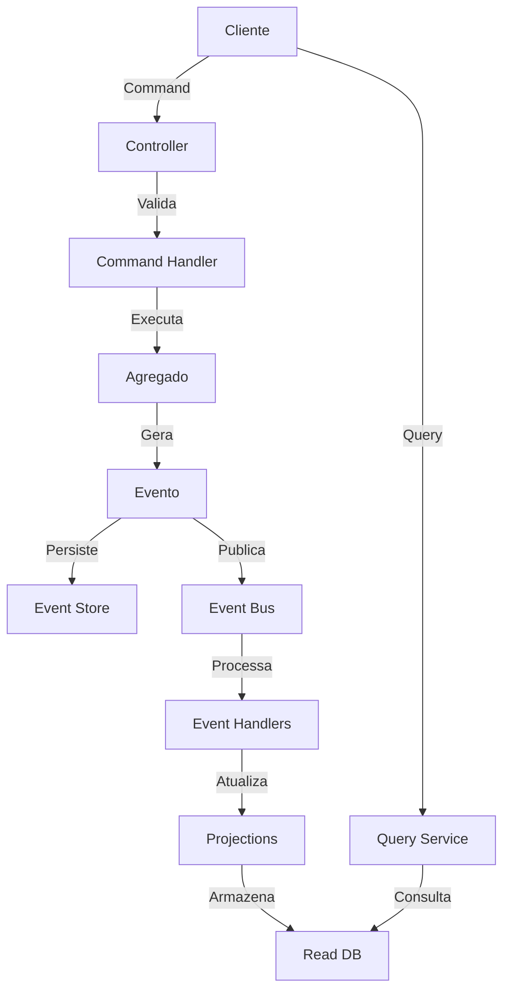

# 📚 ETAPA 10: DOCUMENTAÇÃO & DEPLOY
## Documentação Técnica e Preparação para Deploy

### 🎯 **OBJETIVO DA ETAPA**

Criar documentação técnica completa, guias operacionais, preparar configurações de deploy e estabelecer processos de CI/CD para garantir entregas seguras e rastreáveis.

**⏱️ Duração Estimada:** 2-4 horas  
**👥 Participantes:** Desenvolvedor + DevOps + Tech Lead  
**📋 Pré-requisitos:** Etapa 09 concluída e aprovada

---

## 📋 **CHECKLIST DE IMPLEMENTAÇÃO**

### **📚 1. DOCUMENTAÇÃO TÉCNICA**

#### **📖 README do Domínio:**
```markdown
# [DOMÍNIO] - Arquitetura Híbrida CQRS/Event Sourcing

## 📋 Visão Geral
[Descrição do domínio e sua responsabilidade no sistema]

## 🏗️ Componentes Implementados

### Command Side (Write)
- **Agregados**: [Lista de agregados]
- **Comandos**: [Lista de comandos principais]
- **Eventos**: [Lista de eventos de domínio]
- **Business Rules**: [Lista de regras de negócio]

### Query Side (Read)
- **Projections**: [Lista de projeções]
- **Query Models**: [Lista de modelos de consulta]
- **Query Services**: [Lista de serviços de query]

### Event Processing
- **Event Handlers**: [Lista de handlers implementados]
- **Integrações**: [Lista de integrações externas]

## 🔧 Configurações

### Variáveis de Ambiente
```bash
# Database Write
DB_WRITE_URL=jdbc:postgresql://localhost:5432/seguradora_write
DB_WRITE_USER=seguradora_write
DB_WRITE_PASSWORD=***

# Database Read
DB_READ_URL=jdbc:postgresql://localhost:5432/seguradora_read
DB_READ_USER=seguradora_read
DB_READ_PASSWORD=***

# Event Bus
EVENT_BUS_TYPE=kafka
KAFKA_BOOTSTRAP_SERVERS=localhost:9092

# Cache
REDIS_HOST=localhost
REDIS_PORT=6379
```

### Profiles Spring
- **local**: Desenvolvimento local
- **dev**: Ambiente de desenvolvimento
- **staging**: Ambiente de homologação
- **prod**: Ambiente de produção

## 🚀 Como Executar

### Localmente
```bash
mvn clean install
mvn spring-boot:run -Dspring-boot.run.profiles=local
```

### Docker
```bash
docker-compose up -d
mvn spring-boot:run -Dspring-boot.run.profiles=dev
```

## 🧪 Testes

### Executar Todos os Testes
```bash
mvn clean test
```

### Executar Testes de Integração
```bash
mvn verify -P integration-tests
```

### Coverage Report
```bash
mvn clean test jacoco:report
# Report disponível em: target/site/jacoco/index.html
```

## 📊 Monitoramento

### Endpoints de Saúde
- **Health Check**: `GET /actuator/health`
- **Métricas**: `GET /actuator/metrics`
- **Prometheus**: `GET /actuator/prometheus`

### Dashboards
- **Grafana**: http://localhost:3000
- **Prometheus**: http://localhost:9090

## 📡 APIs Disponíveis

### Command API
- `POST /api/v1/[dominio]` - Criar novo [domínio]
- `PUT /api/v1/[dominio]/{id}` - Atualizar [domínio]
- `DELETE /api/v1/[dominio]/{id}` - Remover [domínio]

### Query API
- `GET /api/v1/[dominio]/{id}` - Buscar por ID
- `GET /api/v1/[dominio]` - Listar com filtros
- `GET /api/v1/[dominio]/search?q={termo}` - Busca textual

### Swagger UI
- **URL**: http://localhost:8080/swagger-ui.html

## 🔄 Fluxo de Processamento



## 📝 Decisões Técnicas

### Event Sourcing
- Todos os eventos são armazenados permanentemente
- Snapshots a cada 50 eventos para otimização
- Retention de 5 anos para eventos arquivados

### CQRS
- Write e Read databases separados
- Eventual consistency entre write e read
- Cache de 15 minutos para queries frequentes

### Performance
- Connection pool: 20 write / 50 read
- Batch processing: 25 registros
- Query pagination: padrão de 20 itens/página

## 🚨 Troubleshooting

### Problemas Comuns

#### Erro de Conexão com Banco
```bash
# Verificar se o PostgreSQL está rodando
docker ps | grep postgres

# Verificar logs
docker logs postgres-container
```

#### Eventos não sendo processados
```bash
# Verificar Event Bus
curl http://localhost:8080/actuator/health/eventBus

# Verificar Dead Letter Queue
curl http://localhost:8080/api/admin/eventbus/dead-letter
```

#### Projeções desatualizadas
```bash
# Reconstruir projeção
curl -X POST http://localhost:8080/api/admin/projections/[dominio]/rebuild
```

## 👥 Equipe

- **Tech Lead**: [Nome]
- **Desenvolvedor Principal**: [Nome]
- **Code Reviewers**: [Nomes]

## 📅 Histórico

| Versão | Data | Autor | Mudanças |
|--------|------|-------|----------|
| 1.0.0 | [Data] | [Nome] | Implementação inicial |

## 📚 Referências

- [Roteiro Técnico](../../README.md)
- [Guia Prático](./README.md)
- [Código de Referência](../../../src/)
```

#### **✅ Checklist de README:**
- [ ] **Visão geral** clara do domínio
- [ ] **Componentes implementados** listados
- [ ] **Configurações** documentadas
- [ ] **Comandos de execução** funcionais
- [ ] **Fluxo de processamento** diagramado

---

### **📘 2. GUIAS OPERACIONAIS**

#### **🔧 Runbook Operacional:**
```markdown
# RUNBOOK - [DOMÍNIO]

## 🚀 Deploy

### Pré-requisitos
- [ ] Migrations aplicadas
- [ ] Variáveis de ambiente configuradas
- [ ] Health checks validados
- [ ] Smoke tests executados

### Processo de Deploy
1. **Preparação**
   ```bash
   # Build da aplicação
   mvn clean package -DskipTests
   
   # Tag da imagem
   docker build -t seguradora/[dominio]:${VERSION} .
   docker push seguradora/[dominio]:${VERSION}
   ```

2. **Deploy em Staging**
   ```bash
   kubectl apply -f k8s/staging/
   kubectl rollout status deployment/[dominio]-deployment -n staging
   ```

3. **Validação em Staging**
   ```bash
   # Health check
   curl https://staging.seguradora.com/actuator/health
   
   # Smoke tests
   ./scripts/smoke-tests.sh staging
   ```

4. **Deploy em Produção**
   ```bash
   kubectl apply -f k8s/production/
   kubectl rollout status deployment/[dominio]-deployment -n production
   ```

5. **Monitoramento Pós-Deploy**
   - Acompanhar logs por 30 minutos
   - Verificar métricas de erro
   - Validar processamento de eventos

### Rollback
```bash
# Em caso de problemas
kubectl rollout undo deployment/[dominio]-deployment -n production

# Verificar status
kubectl rollout status deployment/[dominio]-deployment -n production
```

## 🚨 Troubleshooting

### Alta Latência em Comandos
**Sintomas:**
- Timeout em requests
- Filas de comandos crescendo

**Diagnóstico:**
```bash
# Verificar pool de conexões
curl http://localhost:8080/actuator/metrics/hikari.connections.active

# Verificar thread pool
curl http://localhost:8080/actuator/metrics/command.bus.threads
```

**Solução:**
1. Aumentar pool de conexões write
2. Aumentar thread pool do Command Bus
3. Verificar queries lentas no banco

### Dead Letter Queue Crescendo
**Sintomas:**
- Eventos não processados
- Alertas de DLQ

**Diagnóstico:**
```bash
# Listar eventos em DLQ
curl http://localhost:8080/api/admin/eventbus/dead-letter

# Verificar logs de erros
kubectl logs -l app=[dominio] --tail=100 | grep ERROR
```

**Solução:**
1. Identificar causa raiz do erro
2. Corrigir problema (código ou infraestrutura)
3. Reprocessar eventos
   ```bash
   curl -X POST http://localhost:8080/api/admin/eventbus/dead-letter/reprocess
   ```

### Projeções Desatualizadas
**Sintomas:**
- Dados desatualizados nas consultas
- Inconsistência entre write e read

**Diagnóstico:**
```bash
# Verificar status das projeções
curl http://localhost:8080/api/admin/projections/status

# Verificar lag de processamento
curl http://localhost:8080/actuator/metrics/projection.processing.lag
```

**Solução:**
1. Verificar se Event Bus está funcionando
2. Verificar se handlers estão processando
3. Reconstruir projeção se necessário
   ```bash
   curl -X POST http://localhost:8080/api/admin/projections/[dominio]/rebuild
   ```

### Erro de Concorrência
**Sintomas:**
- Exceções de `ConcurrencyException`
- Conflitos de versão

**Diagnóstico:**
```bash
# Verificar métricas de concorrência
curl http://localhost:8080/actuator/metrics/command.concurrency.conflicts
```

**Solução:**
- Erro esperado em cenários de alta concorrência
- Cliente deve fazer retry do comando
- Se muito frequente, revisar design do agregado

## 📊 Métricas Críticas

### SLAs
- **Comandos**: < 500ms (p95)
- **Queries**: < 200ms (p95)
- **Event Processing**: < 1s (p95)

### Alertas
| Métrica | Threshold | Ação |
|---------|-----------|------|
| Command Error Rate | > 5% | Investigar logs |
| Query Error Rate | > 3% | Verificar read DB |
| DLQ Size | > 100 | Reprocessar eventos |
| Connection Pool Usage | > 80% | Aumentar pool |
| Memory Usage | > 85% | Verificar memory leaks |

## 🔄 Manutenção

### Backup de Event Store
```bash
# Backup diário automático
pg_dump -h eventstore-db -U postgres seguradora_write > backup_$(date +%Y%m%d).sql

# Retenção: 30 dias
```

### Limpeza de Eventos Antigos
```bash
# Arquivar eventos > 1 ano
curl -X POST http://localhost:8080/api/admin/eventstore/archive

# Verificar estatísticas
curl http://localhost:8080/api/admin/eventstore/statistics
```

### Rebuild de Projeções
```bash
# Agendar para fora do horário de pico
curl -X POST http://localhost:8080/api/admin/projections/[dominio]/rebuild-schedule \
  -H "Content-Type: application/json" \
  -d '{"scheduledTime": "2024-03-10T02:00:00Z"}'
```

## 📞 Contatos

- **Suporte Aplicação**: support@seguradora.com
- **Suporte Infra**: infra@seguradora.com
- **On-Call**: +55 11 99999-9999
```

#### **✅ Checklist de Runbook:**
- [ ] **Processo de deploy** documentado
- [ ] **Troubleshooting** para problemas comuns
- [ ] **Métricas e SLAs** definidos
- [ ] **Procedimentos de manutenção** documentados
- [ ] **Contatos** de suporte listados

---

### **🚀 3. CONFIGURAÇÃO DE CI/CD**

#### **📋 GitHub Actions Workflow:**
```yaml
# .github/workflows/[dominio]-ci-cd.yml
name: [Domínio] CI/CD Pipeline

on:
  push:
    branches:
      - main
      - develop
    paths:
      - 'src/main/java/com/seguradora/hibrida/[dominio]/**'
      - 'pom.xml'
  pull_request:
    branches:
      - main
      - develop

env:
  JAVA_VERSION: '17'
  MAVEN_OPTS: '-Xmx3072m'

jobs:
  build-and-test:
    name: Build & Test
    runs-on: ubuntu-latest
    
    steps:
      - name: Checkout código
        uses: actions/checkout@v3
        
      - name: Setup Java
        uses: actions/setup-java@v3
        with:
          java-version: ${{ env.JAVA_VERSION }}
          distribution: 'temurin'
          cache: 'maven'
          
      - name: Build com Maven
        run: mvn clean compile -B
        
      - name: Executar Testes Unitários
        run: mvn test -B
        
      - name: Executar Testes de Integração
        run: mvn verify -P integration-tests -B
        
      - name: Análise de Código (SonarQube)
        run: |
          mvn sonar:sonar \
            -Dsonar.projectKey=[dominio] \
            -Dsonar.host.url=${{ secrets.SONAR_HOST_URL }} \
            -Dsonar.login=${{ secrets.SONAR_TOKEN }}
            
      - name: Gerar Coverage Report
        run: mvn jacoco:report
        
      - name: Upload Coverage para Codecov
        uses: codecov/codecov-action@v3
        with:
          files: ./target/site/jacoco/jacoco.xml
          flags: unittests
          name: codecov-umbrella
          
      - name: Build Package
        run: mvn package -DskipTests -B
        
      - name: Upload Artifact
        uses: actions/upload-artifact@v3
        with:
          name: [dominio]-jar
          path: target/*.jar
          
  security-scan:
    name: Security Scan
    runs-on: ubuntu-latest
    needs: build-and-test
    
    steps:
      - name: Checkout código
        uses: actions/checkout@v3
        
      - name: Setup Java
        uses: actions/setup-java@v3
        with:
          java-version: ${{ env.JAVA_VERSION }}
          distribution: 'temurin'
          
      - name: OWASP Dependency Check
        run: mvn dependency-check:check
        
      - name: Upload Security Report
        uses: actions/upload-artifact@v3
        with:
          name: security-report
          path: target/dependency-check-report.html
          
  build-docker:
    name: Build Docker Image
    runs-on: ubuntu-latest
    needs: [build-and-test, security-scan]
    if: github.event_name == 'push'
    
    steps:
      - name: Checkout código
        uses: actions/checkout@v3
        
      - name: Setup Java
        uses: actions/setup-java@v3
        with:
          java-version: ${{ env.JAVA_VERSION }}
          distribution: 'temurin'
          cache: 'maven'
          
      - name: Build JAR
        run: mvn package -DskipTests -B
        
      - name: Set up Docker Buildx
        uses: docker/setup-buildx-action@v2
        
      - name: Login to Docker Registry
        uses: docker/login-action@v2
        with:
          registry: ${{ secrets.DOCKER_REGISTRY }}
          username: ${{ secrets.DOCKER_USERNAME }}
          password: ${{ secrets.DOCKER_PASSWORD }}
          
      - name: Build and Push Docker Image
        uses: docker/build-push-action@v4
        with:
          context: .
          file: ./Dockerfile
          push: true
          tags: |
            ${{ secrets.DOCKER_REGISTRY }}/[dominio]:${{ github.sha }}
            ${{ secrets.DOCKER_REGISTRY }}/[dominio]:latest
          cache-from: type=registry,ref=${{ secrets.DOCKER_REGISTRY }}/[dominio]:buildcache
          cache-to: type=registry,ref=${{ secrets.DOCKER_REGISTRY }}/[dominio]:buildcache,mode=max
          
  deploy-staging:
    name: Deploy to Staging
    runs-on: ubuntu-latest
    needs: build-docker
    if: github.ref == 'refs/heads/develop'
    environment:
      name: staging
      url: https://staging.seguradora.com
      
    steps:
      - name: Checkout código
        uses: actions/checkout@v3
        
      - name: Setup kubectl
        uses: azure/setup-kubectl@v3
        with:
          version: 'v1.28.0'
          
      - name: Configure AWS Credentials
        uses: aws-actions/configure-aws-credentials@v2
        with:
          aws-access-key-id: ${{ secrets.AWS_ACCESS_KEY_ID }}
          aws-secret-access-key: ${{ secrets.AWS_SECRET_ACCESS_KEY }}
          aws-region: us-east-1
          
      - name: Update kubeconfig
        run: |
          aws eks update-kubeconfig \
            --name seguradora-cluster \
            --region us-east-1
            
      - name: Deploy to Kubernetes
        run: |
          kubectl set image deployment/[dominio]-deployment \
            [dominio]=${{ secrets.DOCKER_REGISTRY }}/[dominio]:${{ github.sha }} \
            -n staging
            
          kubectl rollout status deployment/[dominio]-deployment -n staging
          
      - name: Run Smoke Tests
        run: |
          ./scripts/smoke-tests.sh staging
          
      - name: Notify Slack
        uses: 8398a7/action-slack@v3
        with:
          status: ${{ job.status }}
          text: 'Deploy to Staging: ${{ job.status }}'
          webhook_url: ${{ secrets.SLACK_WEBHOOK }}
          
  deploy-production:
    name: Deploy to Production
    runs-on: ubuntu-latest
    needs: build-docker
    if: github.ref == 'refs/heads/main'
    environment:
      name: production
      url: https://seguradora.com
      
    steps:
      - name: Checkout código
        uses: actions/checkout@v3
        
      - name: Setup kubectl
        uses: azure/setup-kubectl@v3
        with:
          version: 'v1.28.0'
          
      - name: Configure AWS Credentials
        uses: aws-actions/configure-aws-credentials@v2
        with:
          aws-access-key-id: ${{ secrets.AWS_ACCESS_KEY_ID }}
          aws-secret-access-key: ${{ secrets.AWS_SECRET_ACCESS_KEY }}
          aws-region: us-east-1
          
      - name: Update kubeconfig
        run: |
          aws eks update-kubeconfig \
            --name seguradora-cluster \
            --region us-east-1
            
      - name: Deploy to Kubernetes (Canary)
        run: |
          # Deploy canary (10% traffic)
          kubectl apply -f k8s/production/canary.yaml
          kubectl wait --for=condition=available \
            deployment/[dominio]-deployment-canary \
            -n production --timeout=300s
            
      - name: Monitor Canary
        run: |
          # Aguardar 5 minutos monitorando métricas
          sleep 300
          
          # Verificar métricas de erro
          ERROR_RATE=$(curl -s http://prometheus/api/v1/query?query=rate(http_requests_total{status=~"5.."}[5m]))
          
          if [ "$ERROR_RATE" -gt "0.05" ]; then
            echo "Error rate too high, rolling back"
            kubectl delete -f k8s/production/canary.yaml
            exit 1
          fi
          
      - name: Promote to Full Deployment
        run: |
          # Promover para 100% do tráfego
          kubectl set image deployment/[dominio]-deployment \
            [dominio]=${{ secrets.DOCKER_REGISTRY }}/[dominio]:${{ github.sha }} \
            -n production
            
          kubectl rollout status deployment/[dominio]-deployment -n production
          
          # Remover canary
          kubectl delete -f k8s/production/canary.yaml
          
      - name: Run Production Smoke Tests
        run: |
          ./scripts/smoke-tests.sh production
          
      - name: Tag Release
        run: |
          git tag -a v${{ github.run_number }} -m "Release v${{ github.run_number }}"
          git push origin v${{ github.run_number }}
          
      - name: Create GitHub Release
        uses: actions/create-release@v1
        env:
          GITHUB_TOKEN: ${{ secrets.GITHUB_TOKEN }}
        with:
          tag_name: v${{ github.run_number }}
          release_name: Release v${{ github.run_number }}
          body: |
            ## Changes in this Release
            - Auto-generated release from CI/CD pipeline
            
            ## Docker Image
            `${{ secrets.DOCKER_REGISTRY }}/[dominio]:${{ github.sha }}`
          draft: false
          prerelease: false
          
      - name: Notify Slack
        uses: 8398a7/action-slack@v3
        with:
          status: ${{ job.status }}
          text: 'Deploy to Production: ${{ job.status }}'
          webhook_url: ${{ secrets.SLACK_WEBHOOK }}
```

#### **✅ Checklist de CI/CD:**
- [ ] **Pipeline de build** configurado
- [ ] **Testes automatizados** executando
- [ ] **Security scan** implementado
- [ ] **Deploy automatizado** para staging e produção
- [ ] **Notificações** configuradas

---

### **🐳 4. CONFIGURAÇÃO DOCKER/KUBERNETES**

#### **📦 Dockerfile Otimizado:**
```dockerfile
# Multi-stage build para otimização
FROM maven:3.9-eclipse-temurin-17 AS build

WORKDIR /app

# Copiar apenas pom.xml primeiro para cache de dependências
COPY pom.xml .
RUN mvn dependency:go-offline -B

# Copiar código fonte
COPY src ./src

# Build da aplicação
RUN mvn clean package -DskipTests -B

# Stage de runtime
FROM eclipse-temurin:17-jre-alpine

# Adicionar usuário não-root
RUN addgroup -S spring && adduser -S spring -G spring

WORKDIR /app

# Copiar JAR do stage de build
COPY --from=build /app/target/*.jar app.jar

# Mudar para usuário não-root
USER spring:spring

# Expor porta
EXPOSE 8080

# Configurações JVM
ENV JAVA_OPTS="-XX:+UseContainerSupport \
               -XX:MaxRAMPercentage=75.0 \
               -XX:InitialRAMPercentage=50.0 \
               -XX:+HeapDumpOnOutOfMemoryError \
               -XX:HeapDumpPath=/tmp/heapdump.hprof \
               -Djava.security.egd=file:/dev/./urandom"

# Health check
HEALTHCHECK --interval=30s --timeout=3s --start-period=40s --retries=3 \
  CMD wget --no-verbose --tries=1 --spider http://localhost:8080/actuator/health || exit 1

# Entrypoint
ENTRYPOINT ["sh", "-c", "java $JAVA_OPTS -jar /app/app.jar"]
```

#### **☸️ Kubernetes Deployment:**
```yaml
# k8s/production/deployment.yaml
apiVersion: apps/v1
kind: Deployment
metadata:
  name: [dominio]-deployment
  namespace: production
  labels:
    app: [dominio]
    version: v1
spec:
  replicas: 3
  strategy:
    type: RollingUpdate
    rollingUpdate:
      maxSurge: 1
      maxUnavailable: 0
  selector:
    matchLabels:
      app: [dominio]
  template:
    metadata:
      labels:
        app: [dominio]
        version: v1
      annotations:
        prometheus.io/scrape: "true"
        prometheus.io/port: "8080"
        prometheus.io/path: "/actuator/prometheus"
    spec:
      serviceAccountName: [dominio]-sa
      
      containers:
        - name: [dominio]
          image: registry.seguradora.com/[dominio]:latest
          imagePullPolicy: Always
          
          ports:
            - name: http
              containerPort: 8080
              protocol: TCP
              
          env:
            - name: SPRING_PROFILES_ACTIVE
              value: "prod"
            - name: DB_WRITE_URL
              valueFrom:
                secretKeyRef:
                  name: [dominio]-secrets
                  key: db-write-url
            - name: DB_WRITE_USER
              valueFrom:
                secretKeyRef:
                  name: [dominio]-secrets
                  key: db-write-user
            - name: DB_WRITE_PASSWORD
              valueFrom:
                secretKeyRef:
                  name: [dominio]-secrets
                  key: db-write-password
            - name: DB_READ_URL
              valueFrom:
                secretKeyRef:
                  name: [dominio]-secrets
                  key: db-read-url
            - name: DB_READ_USER
              valueFrom:
                secretKeyRef:
                  name: [dominio]-secrets
                  key: db-read-user
            - name: DB_READ_PASSWORD
              valueFrom:
                secretKeyRef:
                  name: [dominio]-secrets
                  key: db-read-password
            - name: KAFKA_BOOTSTRAP_SERVERS
              valueFrom:
                configMapKeyRef:
                  name: [dominio]-config
                  key: kafka-bootstrap-servers
            - name: REDIS_HOST
              valueFrom:
                configMapKeyRef:
                  name: [dominio]-config
                  key: redis-host
            - name: REDIS_PORT
              valueFrom:
                configMapKeyRef:
                  name: [dominio]-config
                  key: redis-port
                  
          resources:
            requests:
              memory: "512Mi"
              cpu: "500m"
            limits:
              memory: "2Gi"
              cpu: "2000m"
              
          livenessProbe:
            httpGet:
              path: /actuator/health/liveness
              port: 8080
            initialDelaySeconds: 90
            periodSeconds: 10
            timeoutSeconds: 5
            failureThreshold: 3
            
          readinessProbe:
            httpGet:
              path: /actuator/health/readiness
              port: 8080
            initialDelaySeconds: 30
            periodSeconds: 5
            timeoutSeconds: 3
            failureThreshold: 3
            
          startupProbe:
            httpGet:
              path: /actuator/health/liveness
              port: 8080
            initialDelaySeconds: 0
            periodSeconds: 10
            timeoutSeconds: 3
            failureThreshold: 30
            
          volumeMounts:
            - name: logs
              mountPath: /app/logs
              
      volumes:
        - name: logs
          emptyDir: {}
          
      affinity:
        podAntiAffinity:
          preferredDuringSchedulingIgnoredDuringExecution:
            - weight: 100
              podAffinityTerm:
                labelSelector:
                  matchExpressions:
                    - key: app
                      operator: In
                      values:
                        - [dominio]
                topologyKey: kubernetes.io/hostname

---
apiVersion: v1
kind: Service
metadata:
  name: [dominio]-service
  namespace: production
  labels:
    app: [dominio]
spec:
  type: ClusterIP
  ports:
    - port: 80
      targetPort: 8080
      protocol: TCP
      name: http
  selector:
    app: [dominio]

---
apiVersion: autoscaling/v2
kind: HorizontalPodAutoscaler
metadata:
  name: [dominio]-hpa
  namespace: production
spec:
  scaleTargetRef:
    apiVersion: apps/v1
    kind: Deployment
    name: [dominio]-deployment
  minReplicas: 3
  maxReplicas: 10
  metrics:
    - type: Resource
      resource:
        name: cpu
        target:
          type: Utilization
          averageUtilization: 70
    - type: Resource
      resource:
        name: memory
        target:
          type: Utilization
          averageUtilization: 80
  behavior:
    scaleDown:
      stabilizationWindowSeconds: 300
      policies:
        - type: Percent
          value: 50
          periodSeconds: 60
    scaleUp:
      stabilizationWindowSeconds: 0
      policies:
        - type: Percent
          value: 100
          periodSeconds: 30
        - type: Pods
          value: 2
          periodSeconds: 60
      selectPolicy: Max
```

#### **✅ Checklist de Deploy:**
- [ ] **Dockerfile otimizado** com multi-stage build
- [ ] **Health checks** configurados
- [ ] **Secrets e ConfigMaps** criados
- [ ] **HPA** configurado
- [ ] **Affinity rules** implementadas

---

### **📊 5. DOCUMENTAÇÃO DE APIs**

#### **🔍 Swagger/OpenAPI Configuration:**
```java
@Configuration
@OpenAPIDefinition(
    info = @Info(
        title = "[Domínio] API",
        version = "1.0",
        description = "APIs para gestão de [domínio] usando arquitetura CQRS/Event Sourcing",
        contact = @Contact(
            name = "Equipe [Domínio]",
            email = "[dominio]@seguradora.com"
        ),
        license = @License(
            name = "Proprietary",
            url = "https://seguradora.com/license"
        )
    ),
    servers = {
        @Server(url = "http://localhost:8080", description = "Local"),
        @Server(url = "https://dev.seguradora.com", description = "Development"),
        @Server(url = "https://staging.seguradora.com", description = "Staging"),
        @Server(url = "https://api.seguradora.com", description = "Production")
    }
)
@SecurityScheme(
    name = "bearerAuth",
    type = SecuritySchemeType.HTTP,
    scheme = "bearer",
    bearerFormat = "JWT"
)
public class OpenApiConfiguration {
    
    @Bean
    public GroupedOpenApi commandApi() {
        return GroupedOpenApi.builder()
            .group("commands")
            .pathsToMatch("/api/v1/[dominio]/**")
            .pathsToExclude("/api/v1/[dominio]/query/**")
            .displayName("Command API")
            .build();
    }
    
    @Bean
    public GroupedOpenApi queryApi() {
        return GroupedOpenApi.builder()
            .group("queries")
            .pathsToMatch("/api/v1/[dominio]/query/**", "/api/v1/[dominio]/{id}")
            .displayName("Query API")
            .build();
    }
    
    @Bean
    public GroupedOpenApi adminApi() {
        return GroupedOpenApi.builder()
            .group("admin")
            .pathsToMatch("/api/admin/**")
            .displayName("Admin API")
            .build();
    }
}
```

#### **📝 Documentação de Endpoints:**
```java
@RestController
@RequestMapping("/api/v1/[dominio]")
@Tag(name = "[Domínio]", description = "APIs de gestão de [domínio]")
@SecurityRequirement(name = "bearerAuth")
public class [Dominio]Controller {
    
    @Operation(
        summary = "Criar novo [domínio]",
        description = "Cria um novo [domínio] no sistema. Este é um comando assíncrono que retorna imediatamente.",
        responses = {
            @ApiResponse(
                responseCode = "202",
                description = "Comando aceito para processamento",
                content = @Content(
                    mediaType = "application/json",
                    schema = @Schema(implementation = CommandResultDTO.class)
                )
            ),
            @ApiResponse(
                responseCode = "400",
                description = "Dados inválidos",
                content = @Content(
                    mediaType = "application/json",
                    schema = @Schema(implementation = ErrorResponse.class)
                )
            ),
            @ApiResponse(
                responseCode = "401",
                description = "Não autenticado"
            ),
            @ApiResponse(
                responseCode = "403",
                description = "Não autorizado"
            )
        }
    )
    @PostMapping
    public ResponseEntity<CommandResultDTO> criar(
        @Parameter(description = "Dados do [domínio] a ser criado", required = true)
        @Valid @RequestBody Criar[Dominio]Request request) {
        // Implementação
    }
    
    @Operation(
        summary = "Buscar [domínio] por ID",
        description = "Retorna os detalhes completos de um [domínio] específico",
        responses = {
            @ApiResponse(
                responseCode = "200",
                description = "Sucesso",
                content = @Content(
                    mediaType = "application/json",
                    schema = @Schema(implementation = [Dominio]DetailView.class)
                )
            ),
            @ApiResponse(
                responseCode = "404",
                description = "[Domínio] não encontrado"
            )
        }
    )
    @GetMapping("/{id}")
    public ResponseEntity<[Dominio]DetailView> buscarPorId(
        @Parameter(description = "ID do [domínio]", required = true)
        @PathVariable UUID id) {
        // Implementação
    }
}
```

#### **✅ Checklist de Documentação de APIs:**
- [ ] **OpenAPI configurado** corretamente
- [ ] **Todos os endpoints** documentados
- [ ] **Schemas de request/response** definidos
- [ ] **Códigos de resposta** documentados
- [ ] **Exemplos** de uso fornecidos

---

## ✅ **CHECKPOINT DE VALIDAÇÃO**

### **🎯 Critérios de Aprovação:**

#### **📚 Documentação:**
- [ ] **README** completo e atualizado
- [ ] **Runbook** operacional criado
- [ ] **Guias de troubleshooting** documentados
- [ ] **Decisões técnicas** justificadas
- [ ] **Swagger UI** acessível e funcional

#### **🚀 Deploy:**
- [ ] **CI/CD** configurado e funcionando
- [ ] **Dockerfile** otimizado
- [ ] **Kubernetes manifests** criados
- [ ] **Secrets** configurados
- [ ] **HPA** operacional

#### **📊 Qualidade:**
- [ ] **Build** automatizado
- [ ] **Testes** executando no pipeline
- [ ] **Security scan** implementado
- [ ] **Code coverage** > 80%
- [ ] **SonarQube** sem issues críticos

#### **🔄 Processos:**
- [ ] **Processo de deploy** testado
- [ ] **Rollback** validado
- [ ] **Monitoramento** pós-deploy configurado
- [ ] **Alertas** funcionando
- [ ] **Documentação** de incidentes criada

---

## 🚨 **PONTOS DE ATENÇÃO**

### **⚠️ Armadilhas Comuns:**

#### **🚫 Documentação Desatualizada:**
```markdown
# ❌ EVITAR: Documentação genérica e desatualizada
## Como executar
Execute o comando: java -jar app.jar

# ✅ PREFERIR: Documentação específica e atualizada
## Como executar
### Localmente (perfil local)
mvn spring-boot:run -Dspring-boot.run.profiles=local

### Docker (perfil dev)
docker-compose up -d
mvn spring-boot:run -Dspring-boot.run.profiles=dev

### Produção
kubectl apply -f k8s/production/
```

#### **🚫 Secrets no Código:**
```yaml
# ❌ EVITAR: Secrets hardcoded
env:
  - name: DB_PASSWORD
    value: "senha123"

# ✅ PREFERIR: Secrets via Kubernetes Secrets
env:
  - name: DB_PASSWORD
    valueFrom:
      secretKeyRef:
        name: [dominio]-secrets
        key: db-password
```

#### **🚫 Deploy Manual:**
```bash
# ❌ EVITAR: Deploy manual sem versionamento
docker build -t app:latest .
kubectl set image deployment/app app=app:latest

# ✅ PREFERIR: Deploy automatizado via CI/CD
# Commit → GitHub Actions → Build → Tests → Deploy
git commit -m "feat: nova funcionalidade"
git push origin main
```

### **✅ Boas Práticas:**

#### **📚 Documentação:**
- **Sempre** manter README atualizado
- **Sempre** documentar decisões técnicas
- **Sempre** criar runbooks operacionais
- **Sempre** incluir exemplos práticos

#### **🚀 Deploy:**
- **Sempre** usar versionamento semântico
- **Sempre** testar em staging primeiro
- **Sempre** ter processo de rollback
- **Sempre** monitorar pós-deploy

#### **🔒 Segurança:**
- **Sempre** usar secrets management
- **Sempre** escanear vulnerabilidades
- **Sempre** usar usuário não-root no Docker
- **Sempre** aplicar princípio do menor privilégio

---

## 🔄 **PRÓXIMOS PASSOS**

### **✅ Após Conclusão:**
1. **Validação Final** com Tech Lead
2. **Code Review** completo
3. **Deploy em Staging** para validação
4. **Go Live** em produção
5. **Monitoramento** ativo por 7 dias

### **📋 Handover:**
- [ ] **Documentação** entregue para equipe de suporte
- [ ] **Treinamento** realizado
- [ ] **Runbooks** validados
- [ ] **Alertas** configurados
- [ ] **On-call** definido

---

## 📚 **RECURSOS DE APOIO**

### **📖 Documentação de Referência:**
- **[Práticas de Desenvolvimento](../12-praticas-desenvolvimento-README.md)**: Boas práticas
- **[Monitoramento](../11-monitoramento-README.md)**: Guia de observabilidade
- **Código Existente**: Exemplos de implementação

### **🛠️ Ferramentas:**
- **Swagger UI**: Documentação interativa de APIs
- **Kubernetes Dashboard**: Visualização de deployments
- **Grafana**: Dashboards de monitoramento
- **SonarQube**: Análise de qualidade de código

### **📚 Templates:**
- **README Template**: Modelo de README
- **Runbook Template**: Modelo de runbook
- **Postman Collection**: Coleção de APIs

---

## 🏆 **CONCLUSÃO**

### **🎉 Parabéns!**
Você completou todas as 10 etapas do Guia Prático de Implementação de Domínios!

### **📊 Resumo Geral:**

| **Etapa** | **Foco** | **Status** |
|-----------|----------|------------|
| 01 | Análise de Domínio | ✅ |
| 02 | Modelagem de Agregados | ✅ |
| 03 | Implementação de Comandos | ✅ |
| 04 | Implementação de Eventos | ✅ |
| 05 | Implementação de Projeções | ✅ |
| 06 | Configuração de DataSources | ✅ |
| 07 | REST APIs | ✅ |
| 08 | Testes & Validação | ✅ |
| 09 | Monitoramento & Métricas | ✅ |
| 10 | Documentação & Deploy | ✅ |

### **🎯 Objetivos Alcançados:**
- ✅ **Domínio implementado** com 100% de aderência à arquitetura
- ✅ **CQRS + Event Sourcing** aplicados corretamente
- ✅ **Testes completos** com coverage adequado
- ✅ **Monitoramento** operacional
- ✅ **Documentação** completa
- ✅ **Deploy automatizado** configurado

### **🚀 Próximas Implementações:**
Este guia pode ser reutilizado para implementar novos domínios. Cada novo domínio se beneficiará da infraestrutura já estabelecida:
- Command Bus
- Event Bus
- Event Store
- Projection System
- Monitoring
- CI/CD Pipeline

### **📈 Evolução Contínua:**
- Contribua com melhorias no guia
- Compartilhe lições aprendidas
- Documente novos padrões
- Mentore outros desenvolvedores

---

**🎯 Guia elaborado por:** Principal Java Architect  
**📅 Data de Criação:** Março 2024  
**👥 Público-Alvo:** Desenvolvedores Java (Junior a Senior)  
**⏱️ Duração Total:** 28-49 horas (4-7 semanas)  
**🏆 Objetivo:** Implementação 100% aderente à arquitetura

---

### **🔄 Versão do Guia:** 1.0 - COMPLETO
### **📊 Etapas Disponíveis:** 10/10 (100%)
### **📝 Checklists Totais:** 150+ itens de validação
### **✅ Status:** Guia Completo e Pronto para Uso

**🎊 PARABÉNS PELA CONCLUSÃO DO GUIA PRÁTICO!**

---

**📋 Checklist Total:** 50+ itens de validação  
**⏱️ Tempo Médio:** 2-4 horas  
**🎯 Resultado:** Sistema documentado e pronto para produção  
**✅ Status:** GUIA COMPLETO!