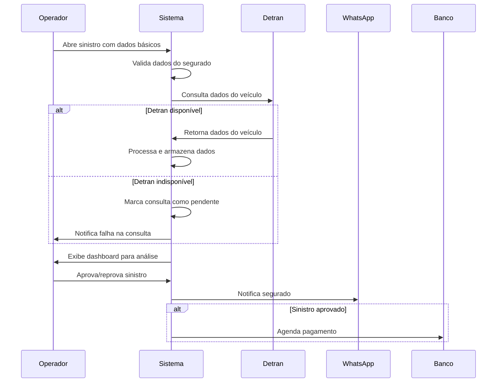

# Requisitos Funcionais - Sistema de Gestão de Sinistros de Veículos

## 1. Visão Geral

O sistema de gestão de sinistros de veículos é uma solução integrada que permite o registro, processamento e acompanhamento de sinistros reportados por segurados, com integração obrigatória ao sistema legado do Detran para validação de dados veiculares.

## 2. Atores do Sistema

- **Operador da Seguradora**: Funcionário responsável por registrar e processar sinistros
- **Segurado**: Cliente que reporta o sinistro
- **Sistema Detran**: Sistema legado externo para consulta de dados veiculares
- **Sistema Bancário**: Sistema externo para processamento de pagamentos

## 3. Requisitos Funcionais Principais

### RF001 - Abertura de Sinistro
**Descrição**: O sistema deve permitir que operadores registrem novos sinistros reportados pelos segurados.

**Critérios de Aceitação**:
- O operador deve informar dados básicos do segurado (CPF, nome, apólice)
- O sistema deve validar se o segurado possui apólice ativa
- Deve ser possível anexar documentos e fotos relacionadas ao sinistro
- O sistema deve gerar um número único de protocolo para o sinistro

**Prioridade**: Alta

### RF002 - Validação de Dados do Segurado
**Descrição**: O sistema deve validar automaticamente os dados do segurado no momento da abertura do sinistro.

**Critérios de Aceitação**:
- Verificar se o CPF é válido e está cadastrado no sistema
- Confirmar se a apólice está ativa na data do sinistro
- Validar se o veículo está coberto pela apólice informada
- Exibir alertas em caso de inconsistências

**Prioridade**: Alta

### RF003 - Integração com Sistema Detran (CRÍTICO)
**Descrição**: O sistema deve consultar automaticamente os dados do veículo no sistema do Detran através da placa ou RENAVAM.

**Critérios de Aceitação**:
- Realizar consulta via API REST (GET) informando placa e/ou RENAVAM
- Processar resposta completa do Detran incluindo:
  - Dados básicos do veículo (ano, modelo, cor, etc.)
  - Situação legal (débitos, multas, infrações)
  - Histórico de proprietários
  - Restrições e impedimentos
- Armazenar dados consultados para auditoria
- Implementar tratamento de erros para indisponibilidade do serviço
- Implementar retry automático em caso de timeout
- Registrar log de todas as tentativas de consulta

**Prioridade**: Crítica

### RF004 - Tratamento de Falhas na Integração Detran
**Descrição**: O sistema deve ser resiliente a falhas na integração com o Detran.

**Critérios de Aceitação**:
- Implementar circuit breaker para evitar sobrecarga
- Permitir consulta manual posterior em caso de falha
- Manter fila de consultas pendentes
- Notificar operadores sobre falhas na integração
- Permitir continuidade do processo com dados parciais quando aplicável

**Prioridade**: Crítica

### RF005 - Análise e Aprovação de Sinistro
**Descrição**: O sistema deve permitir análise dos dados coletados e decisão sobre aprovação do sinistro.

**Critérios de Aceitação**:
- Exibir dashboard consolidado com dados do segurado, veículo e Detran
- Permitir análise manual dos dados pelo operador
- Registrar decisão de aprovação/reprovação com justificativa
- Calcular valor a ser pago baseado na apólice e danos reportados
- Gerar relatório de análise do sinistro

**Prioridade**: Alta

### RF006 - Notificação ao Segurado
**Descrição**: O sistema deve notificar automaticamente o segurado sobre o resultado da análise via WhatsApp.

**Critérios de Aceitação**:
- Enviar mensagem automática após decisão do sinistro
- Incluir número do protocolo e resultado (aprovado/reprovado)
- Para sinistros aprovados, informar valor e prazo de pagamento
- Para sinistros reprovados, informar motivo da recusa
- Registrar histórico de notificações enviadas

**Prioridade**: Alta

### RF007 - Processamento de Pagamento
**Descrição**: O sistema deve agendar transferência bancária para sinistros aprovados.

**Critérios de Aceitação**:
- Integrar com sistema bancário para agendamento de TED/PIX
- Validar dados bancários do segurado
- Agendar pagamento conforme prazo estabelecido na apólice
- Registrar comprovante de agendamento
- Permitir acompanhamento do status do pagamento

**Prioridade**: Alta

### RF008 - Auditoria e Rastreabilidade
**Descrição**: O sistema deve manter histórico completo de todas as operações realizadas.

**Critérios de Aceitação**:
- Registrar log de todas as consultas ao Detran
- Manter histórico de alterações no sinistro
- Registrar timestamps de todas as operações
- Permitir consulta de auditoria por período e operador
- Exportar relatórios de auditoria

**Prioridade**: Média

## 4. Requisitos Não Funcionais Relacionados

### RNF001 - Performance da Integração Detran
- Timeout máximo de 30 segundos para consultas ao Detran
- Retry automático com backoff exponencial (3 tentativas)
- Cache de consultas por 24 horas para evitar consultas desnecessárias

### RNF002 - Disponibilidade
- Sistema deve funcionar mesmo com Detran indisponível
- Uptime mínimo de 99.5% para o sistema principal
- Degradação graceful em caso de falhas externas

### RNF003 - Segurança
- Criptografia de dados sensíveis em trânsito e repouso
- Autenticação e autorização para todos os endpoints
- Log de auditoria para operações críticas

## 5. Fluxo Principal - Abertura de Sinistro

## 6. Casos de Uso Críticos para Integração Detran

### UC001 - Consulta Bem-sucedida ao Detran
**Pré-condições**: Sinistro aberto, dados de placa/RENAVAM válidos
**Fluxo Principal**:
1. Sistema realiza consulta GET ao endpoint do Detran
2. Detran retorna dados completos do veículo
3. Sistema processa e armazena dados recebidos
4. Sistema prossegue com análise do sinistro

### UC002 - Falha de Timeout na Consulta Detran
**Pré-condições**: Sinistro aberto, Detran com alta latência
**Fluxo Principal**:
1. Sistema realiza consulta GET ao endpoint do Detran
2. Consulta excede timeout de 30 segundos
3. Sistema realiza retry automático (até 3 tentativas)
4. Se todas as tentativas falharem, marca consulta como pendente
5. Sistema notifica operador sobre a falha
6. Operador pode optar por continuar sem dados do Detran ou aguardar

### UC003 - Detran Indisponível
**Pré-condições**: Sinistro aberto, Detran fora do ar
**Fluxo Principal**:
1. Sistema realiza consulta GET ao endpoint do Detran
2. Recebe erro de conexão/indisponibilidade
3. Circuit breaker é ativado após múltiplas falhas
4. Sistema adiciona consulta à fila de pendências
5. Sistema permite continuidade do processo com dados parciais
6. Processo de retry em background tenta consulta periodicamente

## 7. Critérios de Aceitação para Integração Detran

- ✅ Consulta deve processar resposta completa com todos os campos especificados
- ✅ Sistema deve ser resiliente a timeouts e indisponibilidades
- ✅ Dados consultados devem ser armazenados para auditoria
- ✅ Falhas devem ser logadas com detalhes técnicos
- ✅ Operador deve ser notificado sobre falhas na integração
- ✅ Sistema deve permitir retry manual de consultas falhadas
- ✅ Cache deve evitar consultas desnecessárias ao mesmo veículo