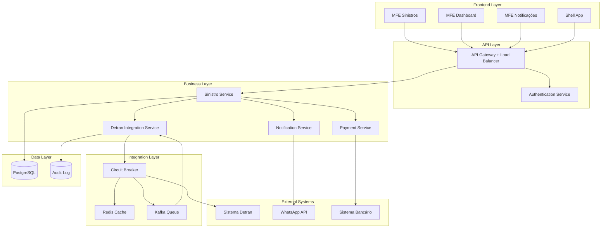
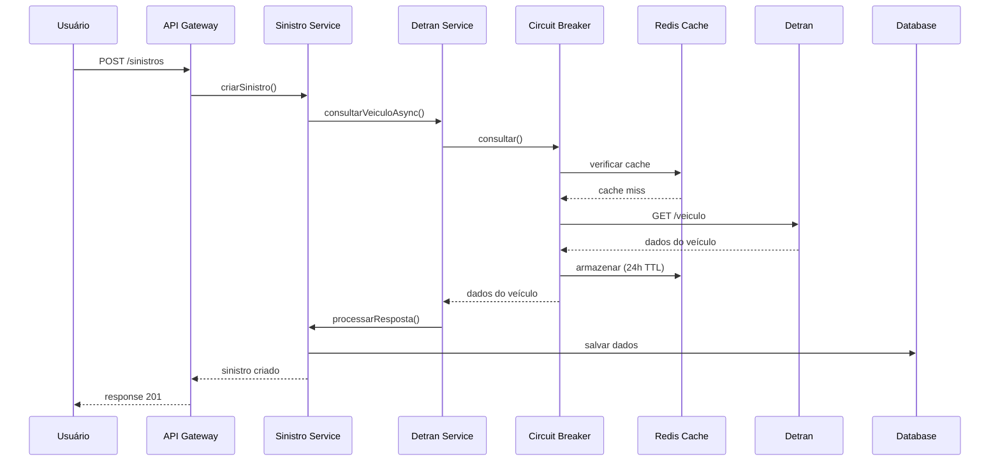
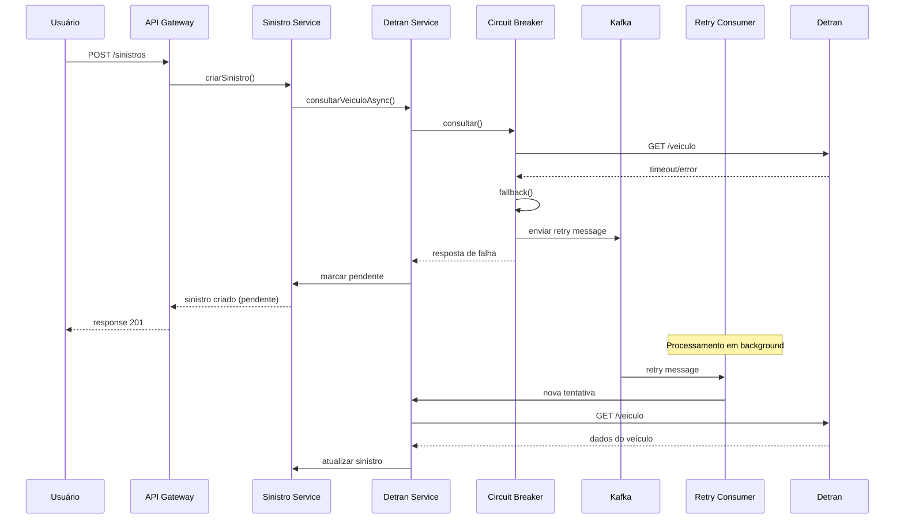

# Opção 1: Arquitetura Resiliente com Circuit Breaker e Cache Distribuído

## 1. Visão Geral da Solução

Esta arquitetura foca na **resiliência e disponibilidade** do sistema, implementando padrões como Circuit Breaker, Cache Distribuído e processamento assíncrono para garantir que o sistema continue operacional mesmo com instabilidades no Detran.

## 2. Componentes Arquiteturais

### 2.1 Frontend (Angular 21 MFEs)
```
┌─────────────────────────────────────────┐
│           Micro Frontends               │
├─────────────────────────────────────────┤
│ • MFE Sinistros (abertura/consulta)     │
│ • MFE Dashboard (análise/aprovação)     │
│ • MFE Notificações (status/alertas)     │
│ • Shell App (orquestração)             │
└─────────────────────────────────────────┘
```

### 2.2 Backend Services (Spring Boot 3)

#### API Gateway + Load Balancer
```java
@RestController
@RequestMapping("/api/v1")
public class SinistroController {
    
    @Autowired
    private SinistroService sinistroService;
    
    @PostMapping("/sinistros")
    public ResponseEntity<SinistroResponse> criarSinistro(
        @RequestBody @Valid SinistroRequest request) {
        return ResponseEntity.ok(sinistroService.criarSinistro(request));
    }
}
```

#### Sinistro Service (Core Business)
```java
@Service
@Transactional
public class SinistroService {
    
    @Autowired
    private DetranIntegrationService detranService;
    
    @Autowired
    private NotificationService notificationService;
    
    public SinistroResponse criarSinistro(SinistroRequest request) {
        // 1. Validar dados do segurado
        validarSegurado(request);
        
        // 2. Criar sinistro com status PENDENTE_DETRAN
        Sinistro sinistro = criarSinistroInicial(request);
        
        // 3. Consultar Detran de forma assíncrona
        detranService.consultarVeiculoAsync(sinistro.getId(), 
                                           request.getPlaca(), 
                                           request.getRenavam());
        
        return SinistroResponse.from(sinistro);
    }
}
```

#### Detran Integration Service (Resiliente)
```java
@Service
public class DetranIntegrationService {
    
    @Autowired
    private DetranClient detranClient;
    
    @Autowired
    private RedisTemplate<String, Object> redisTemplate;
    
    @Autowired
    private KafkaTemplate<String, Object> kafkaTemplate;
    
    @CircuitBreaker(name = "detran", fallbackMethod = "fallbackConsulta")
    @Retryable(value = {Exception.class}, maxAttempts = 3, 
               backoff = @Backoff(delay = 2000, multiplier = 2))
    @Cacheable(value = "detran-cache", key = "#placa + '_' + #renavam")
    public DetranResponse consultarVeiculo(String placa, String renavam) {
        
        // Verificar cache primeiro
        String cacheKey = "detran:" + placa + ":" + renavam;
        DetranResponse cached = (DetranResponse) redisTemplate.opsForValue().get(cacheKey);
        if (cached != null) {
            return cached;
        }
        
        // Consultar Detran
        DetranResponse response = detranClient.consultarVeiculo(placa, renavam);
        
        // Armazenar no cache por 24h
        redisTemplate.opsForValue().set(cacheKey, response, Duration.ofHours(24));
        
        return response;
    }
    
    public DetranResponse fallbackConsulta(String placa, String renavam, Exception ex) {
        // Log da falha
        log.error("Falha na consulta Detran para placa: {} - {}", placa, ex.getMessage());
        
        // Enviar para fila de retry
        kafkaTemplate.send("detran-retry-topic", 
                          DetranRetryMessage.builder()
                              .placa(placa)
                              .renavam(renavam)
                              .tentativa(1)
                              .build());
        
        // Retornar resposta indicando falha
        return DetranResponse.builder()
                .status("CONSULTA_PENDENTE")
                .erro("Detran temporariamente indisponível")
                .build();
    }
    
    @Async
    public void consultarVeiculoAsync(Long sinistroId, String placa, String renavam) {
        try {
            DetranResponse response = consultarVeiculo(placa, renavam);
            processarRespostaDetran(sinistroId, response);
        } catch (Exception e) {
            marcarConsultaPendente(sinistroId, placa, renavam);
        }
    }
}
```

### 2.3 Processamento Assíncrono com Kafka

#### Detran Retry Consumer
```java
@Component
@KafkaListener(topics = "detran-retry-topic")
public class DetranRetryConsumer {
    
    @Autowired
    private DetranIntegrationService detranService;
    
    @KafkaHandler
    public void processRetry(DetranRetryMessage message) {
        if (message.getTentativa() <= 5) { // Máximo 5 tentativas
            try {
                Thread.sleep(calculateBackoff(message.getTentativa()));
                
                DetranResponse response = detranService.consultarVeiculo(
                    message.getPlaca(), message.getRenavam());
                
                if (response.getStatus().equals("SUCESSO")) {
                    // Processar resposta bem-sucedida
                    processarSucesso(message, response);
                } else {
                    // Reagendar retry
                    reagendarRetry(message);
                }
                
            } catch (Exception e) {
                reagendarRetry(message);
            }
        } else {
            // Marcar como falha definitiva
            marcarFalhaDefinitiva(message);
        }
    }
    
    private long calculateBackoff(int tentativa) {
        return (long) (Math.pow(2, tentativa) * 1000); // Exponential backoff
    }
}
```

### 2.4 Cache Distribuído (Redis)

#### Configuração Redis
```java
@Configuration
@EnableCaching
public class CacheConfig {
    
    @Bean
    public RedisTemplate<String, Object> redisTemplate(RedisConnectionFactory factory) {
        RedisTemplate<String, Object> template = new RedisTemplate<>();
        template.setConnectionFactory(factory);
        template.setDefaultSerializer(new GenericJackson2JsonRedisSerializer());
        return template;
    }
    
    @Bean
    public CacheManager cacheManager(RedisConnectionFactory factory) {
        RedisCacheConfiguration config = RedisCacheConfiguration.defaultCacheConfig()
            .entryTtl(Duration.ofHours(24)) // TTL de 24h para dados do Detran
            .serializeKeysWith(RedisSerializationContext.SerializationPair
                .fromSerializer(new StringRedisSerializer()))
            .serializeValuesWith(RedisSerializationContext.SerializationPair
                .fromSerializer(new GenericJackson2JsonRedisSerializer()));
        
        return RedisCacheManager.builder(factory)
            .cacheDefaults(config)
            .build();
    }
}
```

## 3. Diagrama da Arquitetura



## 4. Fluxo de Processamento Resiliente

### 4.1 Fluxo Principal com Detran Disponível


### 4.2 Fluxo com Detran Indisponível


## 5. Configurações de Resiliência

### 5.1 Circuit Breaker Configuration
```yaml
resilience4j:
  circuitbreaker:
    instances:
      detran:
        registerHealthIndicator: true
        slidingWindowSize: 10
        minimumNumberOfCalls: 5
        permittedNumberOfCallsInHalfOpenState: 3
        automaticTransitionFromOpenToHalfOpenEnabled: true
        waitDurationInOpenState: 30s
        failureRateThreshold: 50
        eventConsumerBufferSize: 10
```

### 5.2 Retry Configuration
```yaml
resilience4j:
  retry:
    instances:
      detran:
        maxAttempts: 3
        waitDuration: 2s
        exponentialBackoffMultiplier: 2
        retryExceptions:
          - java.net.SocketTimeoutException
          - java.net.ConnectException
```

## 6. Monitoramento e Observabilidade

### 6.1 Métricas Importantes
- Taxa de sucesso/falha das consultas Detran
- Tempo de resposta médio do Detran
- Status do Circuit Breaker
- Tamanho da fila de retry
- Hit rate do cache Redis

### 6.2 Alertas Configurados
- Circuit Breaker aberto por mais de 5 minutos
- Fila de retry com mais de 100 mensagens
- Taxa de falha do Detran acima de 30%
- Cache Redis indisponível

## 7. Vantagens desta Arquitetura

✅ **Alta Resiliência**: Sistema continua funcionando mesmo com Detran instável
✅ **Performance**: Cache Redis reduz consultas desnecessárias
✅ **Escalabilidade**: Processamento assíncrono permite alta concorrência
✅ **Observabilidade**: Métricas detalhadas para monitoramento
✅ **Recuperação Automática**: Retry automático com backoff exponencial

## 8. Desvantagens

❌ **Complexidade**: Múltiplos componentes para gerenciar
❌ **Latência**: Processamento assíncrono pode aumentar tempo total
❌ **Dependências**: Redis e Kafka como pontos de falha adicionais
❌ **Custo**: Infraestrutura adicional para cache e mensageria

## 9. Casos de Uso Ideais

- **Ambientes com alta instabilidade do Detran**
- **Volume alto de consultas simultâneas**
- **Necessidade de SLA rigoroso de disponibilidade**
- **Tolerância a eventual consistência dos dados**