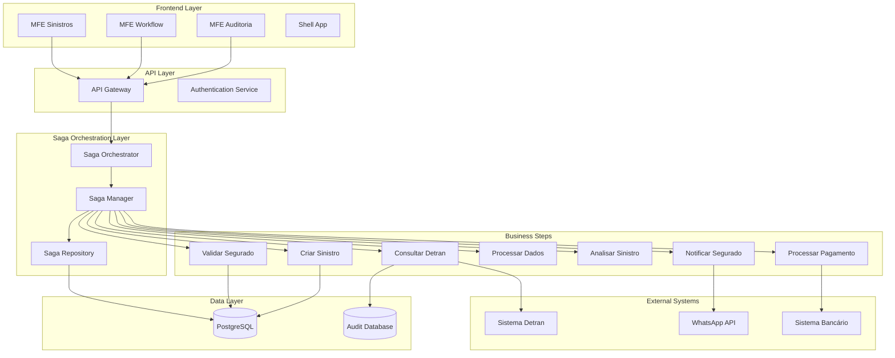
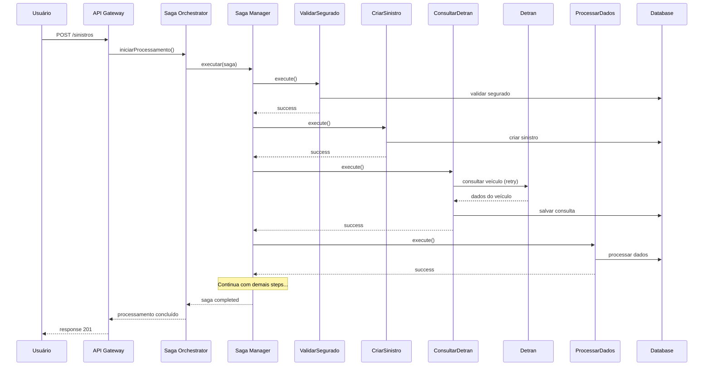
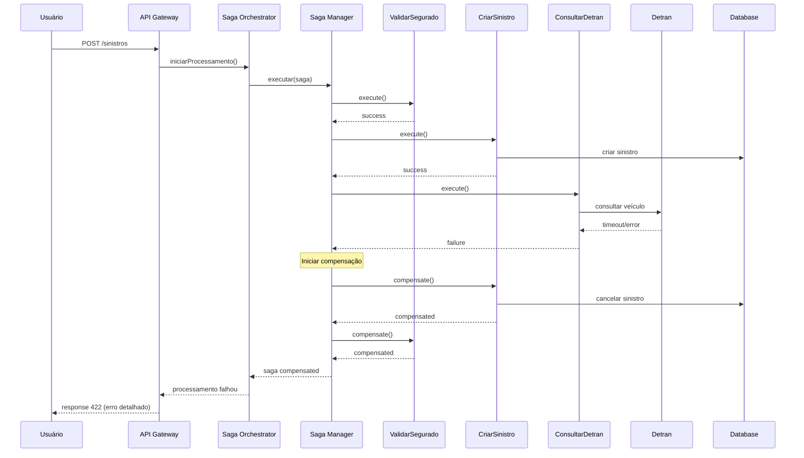

# Opção 2: Arquitetura Focada em Consistência de Dados com Saga Pattern

## 1. Visão Geral da Solução

Esta arquitetura prioriza a **consistência e integridade dos dados**, implementando o padrão Saga para garantir que todas as operações sejam executadas com sucesso ou revertidas completamente. Ideal para cenários onde a precisão dos dados é mais crítica que a velocidade de processamento.

## 2. Componentes Arquiteturais

### 2.1 Frontend (Angular 21 MFEs)
```
┌─────────────────────────────────────────┐
│           Micro Frontends               │
├─────────────────────────────────────────┤
│ • MFE Sinistros (CRUD completo)         │
│ • MFE Workflow (acompanhamento saga)    │
│ • MFE Auditoria (logs e histórico)      │
│ • Shell App (orquestração)             │
└─────────────────────────────────────────┘
```

### 2.2 Backend Services com Saga Orchestrator

#### Saga Orchestrator Service
```java
@Service
@Transactional
public class SinistroSagaOrchestrator {
    
    @Autowired
    private SagaManager sagaManager;
    
    @Autowired
    private SinistroRepository sinistroRepository;
    
    public SagaExecution iniciarProcessamentoSinistro(SinistroRequest request) {
        
        // Criar saga com steps definidos
        Saga saga = Saga.builder()
            .sagaId(UUID.randomUUID().toString())
            .tipo("PROCESSAMENTO_SINISTRO")
            .build();
        
        // Definir steps da saga
        saga.addStep(new ValidarSeguradoStep(request))
            .addStep(new CriarSinistroStep(request))
            .addStep(new ConsultarDetranStep(request.getPlaca(), request.getRenavam()))
            .addStep(new ProcessarDadosDetranStep())
            .addStep(new AnalisarSinistroStep())
            .addStep(new NotificarSeguradoStep())
            .addStep(new ProcessarPagamentoStep());
        
        return sagaManager.executar(saga);
    }
}
```

#### Saga Manager (Coordenador Central)
```java
@Component
public class SagaManager {
    
    @Autowired
    private SagaRepository sagaRepository;
    
    @Autowired
    private ApplicationEventPublisher eventPublisher;
    
    public SagaExecution executar(Saga saga) {
        try {
            // Salvar saga no banco
            sagaRepository.save(saga);
            
            // Executar steps sequencialmente
            for (SagaStep step : saga.getSteps()) {
                executarStep(saga, step);
            }
            
            // Marcar saga como concluída
            saga.setStatus(SagaStatus.COMPLETED);
            sagaRepository.save(saga);
            
            return SagaExecution.success(saga);
            
        } catch (Exception e) {
            // Iniciar compensação (rollback)
            iniciarCompensacao(saga, e);
            return SagaExecution.failure(saga, e);
        }
    }
    
    private void executarStep(Saga saga, SagaStep step) {
        try {
            step.setStatus(StepStatus.EXECUTING);
            sagaRepository.save(saga);
            
            StepResult result = step.execute();
            
            if (result.isSuccess()) {
                step.setStatus(StepStatus.COMPLETED);
                step.setResult(result.getData());
            } else {
                throw new SagaStepException(result.getError());
            }
            
            sagaRepository.save(saga);
            
        } catch (Exception e) {
            step.setStatus(StepStatus.FAILED);
            step.setError(e.getMessage());
            sagaRepository.save(saga);
            throw e;
        }
    }
    
    private void iniciarCompensacao(Saga saga, Exception originalError) {
        saga.setStatus(SagaStatus.COMPENSATING);
        saga.setError(originalError.getMessage());
        
        // Executar compensação dos steps já executados (ordem reversa)
        List<SagaStep> completedSteps = saga.getSteps().stream()
            .filter(step -> step.getStatus() == StepStatus.COMPLETED)
            .collect(Collectors.toList());
        
        Collections.reverse(completedSteps);
        
        for (SagaStep step : completedSteps) {
            try {
                step.compensate();
                step.setStatus(StepStatus.COMPENSATED);
            } catch (Exception e) {
                step.setStatus(StepStatus.COMPENSATION_FAILED);
                // Log erro mas continua compensação
                log.error("Falha na compensação do step: {}", step.getName(), e);
            }
        }
        
        saga.setStatus(SagaStatus.COMPENSATED);
        sagaRepository.save(saga);
    }
}
```

### 2.3 Implementação dos Steps da Saga

#### Step 1: Validar Segurado
```java
@Component
public class ValidarSeguradoStep implements SagaStep {
    
    @Autowired
    private SeguradoService seguradoService;
    
    private SinistroRequest request;
    private Segurado seguradoValidado;
    
    @Override
    public StepResult execute() {
        try {
            seguradoValidado = seguradoService.validarSegurado(request.getCpf());
            
            if (seguradoValidado == null) {
                return StepResult.failure("Segurado não encontrado");
            }
            
            if (!seguradoValidado.isApoliceAtiva()) {
                return StepResult.failure("Apólice inativa");
            }
            
            return StepResult.success(seguradoValidado);
            
        } catch (Exception e) {
            return StepResult.failure("Erro na validação: " + e.getMessage());
        }
    }
    
    @Override
    public void compensate() {
        // Não há compensação necessária para validação
        log.info("Compensação ValidarSeguradoStep - Nenhuma ação necessária");
    }
}
```

#### Step 3: Consultar Detran (Crítico)
```java
@Component
public class ConsultarDetranStep implements SagaStep {
    
    @Autowired
    private DetranClient detranClient;
    
    @Autowired
    private DetranConsultaRepository consultaRepository;
    
    private String placa;
    private String renavam;
    private DetranConsulta consultaRealizada;
    
    @Override
    public StepResult execute() {
        try {
            // Verificar se já existe consulta recente (cache manual)
            Optional<DetranConsulta> consultaExistente = 
                consultaRepository.findByPlacaAndRenavamAndDataConsultaAfter(
                    placa, renavam, LocalDateTime.now().minusHours(24));
            
            if (consultaExistente.isPresent()) {
                consultaRealizada = consultaExistente.get();
                return StepResult.success(consultaRealizada.getDados());
            }
            
            // Realizar consulta com retry síncrono
            DetranResponse response = consultarComRetry();
            
            // Salvar consulta para auditoria e cache
            consultaRealizada = DetranConsulta.builder()
                .placa(placa)
                .renavam(renavam)
                .dataConsulta(LocalDateTime.now())
                .dados(response)
                .status("SUCESSO")
                .build();
            
            consultaRepository.save(consultaRealizada);
            
            return StepResult.success(response);
            
        } catch (DetranIndisponivelException e) {
            // Salvar tentativa falhada
            consultaRealizada = DetranConsulta.builder()
                .placa(placa)
                .renavam(renavam)
                .dataConsulta(LocalDateTime.now())
                .status("FALHA")
                .erro(e.getMessage())
                .build();
            
            consultaRepository.save(consultaRealizada);
            
            return StepResult.failure("Detran indisponível: " + e.getMessage());
        }
    }
    
    private DetranResponse consultarComRetry() throws DetranIndisponivelException {
        int maxTentativas = 3;
        int tentativa = 1;
        
        while (tentativa <= maxTentativas) {
            try {
                log.info("Consultando Detran - Tentativa {}/{}", tentativa, maxTentativas);
                
                DetranResponse response = detranClient.consultarVeiculo(placa, renavam);
                
                if (response != null && response.isValido()) {
                    return response;
                }
                
            } catch (Exception e) {
                log.warn("Falha na tentativa {} de consulta ao Detran: {}", 
                        tentativa, e.getMessage());
                
                if (tentativa == maxTentativas) {
                    throw new DetranIndisponivelException(
                        "Detran indisponível após " + maxTentativas + " tentativas", e);
                }
                
                // Aguardar antes da próxima tentativa (backoff)
                try {
                    Thread.sleep(tentativa * 2000L); // 2s, 4s, 6s
                } catch (InterruptedException ie) {
                    Thread.currentThread().interrupt();
                    throw new DetranIndisponivelException("Consulta interrompida", ie);
                }
            }
            
            tentativa++;
        }
        
        throw new DetranIndisponivelException("Falha em todas as tentativas");
    }
    
    @Override
    public void compensate() {
        if (consultaRealizada != null) {
            // Marcar consulta como compensada (para auditoria)
            consultaRealizada.setStatus("COMPENSADA");
            consultaRepository.save(consultaRealizada);
        }
    }
}
```

#### Step 2: Criar Sinistro
```java
@Component
public class CriarSinistroStep implements SagaStep {
    
    @Autowired
    private SinistroRepository sinistroRepository;
    
    private SinistroRequest request;
    private Sinistro sinistroCriado;
    
    @Override
    public StepResult execute() {
        try {
            sinistroCriado = Sinistro.builder()
                .protocolo(gerarProtocolo())
                .cpfSegurado(request.getCpf())
                .placa(request.getPlaca())
                .renavam(request.getRenavam())
                .descricao(request.getDescricao())
                .status(SinistroStatus.EM_PROCESSAMENTO)
                .dataAbertura(LocalDateTime.now())
                .build();
            
            sinistroCriado = sinistroRepository.save(sinistroCriado);
            
            return StepResult.success(sinistroCriado);
            
        } catch (Exception e) {
            return StepResult.failure("Erro ao criar sinistro: " + e.getMessage());
        }
    }
    
    @Override
    public void compensate() {
        if (sinistroCriado != null) {
            // Marcar sinistro como cancelado ao invés de deletar
            sinistroCriado.setStatus(SinistroStatus.CANCELADO);
            sinistroCriado.setMotivoCompensacao("Falha no processamento da saga");
            sinistroRepository.save(sinistroCriado);
            
            log.info("Sinistro {} compensado (cancelado)", sinistroCriado.getProtocolo());
        }
    }
}
```

### 2.4 Modelo de Dados para Saga

#### Entidade Saga
```java
@Entity
@Table(name = "sagas")
public class Saga {
    
    @Id
    private String sagaId;
    
    @Enumerated(EnumType.STRING)
    private SagaStatus status;
    
    private String tipo;
    
    @Column(columnDefinition = "TEXT")
    private String dadosEntrada;
    
    @Column(columnDefinition = "TEXT")
    private String erro;
    
    @CreationTimestamp
    private LocalDateTime dataInicio;
    
    @UpdateTimestamp
    private LocalDateTime dataAtualizacao;
    
    @OneToMany(mappedBy = "saga", cascade = CascadeType.ALL, fetch = FetchType.LAZY)
    private List<SagaStepExecution> steps = new ArrayList<>();
    
    // getters, setters, builders...
}

@Entity
@Table(name = "saga_step_executions")
public class SagaStepExecution {
    
    @Id
    @GeneratedValue(strategy = GenerationType.IDENTITY)
    private Long id;
    
    @ManyToOne
    @JoinColumn(name = "saga_id")
    private Saga saga;
    
    private String stepName;
    private Integer ordem;
    
    @Enumerated(EnumType.STRING)
    private StepStatus status;
    
    @Column(columnDefinition = "TEXT")
    private String resultado;
    
    @Column(columnDefinition = "TEXT")
    private String erro;
    
    private LocalDateTime dataInicio;
    private LocalDateTime dataFim;
    
    // getters, setters...
}
```

## 3. Diagrama da Arquitetura



## 4. Fluxo de Processamento com Saga

### 4.1 Fluxo de Sucesso Completo


### 4.2 Fluxo com Falha e Compensação


## 5. Configurações de Consistência

### 5.1 Transações e Isolamento
```yaml
spring:
  datasource:
    url: jdbc:postgresql://localhost:5432/sinistros
    hikari:
      maximum-pool-size: 20
      connection-timeout: 30000
      idle-timeout: 600000
      max-lifetime: 1800000
  
  jpa:
    properties:
      hibernate:
        connection:
          isolation: READ_COMMITTED
        jdbc:
          batch_size: 20
        order_inserts: true
        order_updates: true
```

### 5.2 Configuração de Timeout
```yaml
saga:
  timeout:
    step-execution: 60s
    detran-consultation: 30s
    total-saga: 300s
  retry:
    max-attempts: 3
    backoff-delay: 2s
```

## 6. Monitoramento e Auditoria

### 6.1 Dashboard de Sagas
```java
@RestController
@RequestMapping("/api/v1/sagas")
public class SagaMonitoringController {
    
    @GetMapping("/status")
    public SagaStatusReport getStatusReport() {
        return SagaStatusReport.builder()
            .sagasEmExecucao(sagaRepository.countByStatus(SagaStatus.EXECUTING))
            .sagasCompensando(sagaRepository.countByStatus(SagaStatus.COMPENSATING))
            .sagasFalhadas(sagaRepository.countByStatus(SagaStatus.FAILED))
            .sagasConcluidas(sagaRepository.countByStatus(SagaStatus.COMPLETED))
            .build();
    }
    
    @GetMapping("/{sagaId}/timeline")
    public List<SagaStepTimeline> getSagaTimeline(@PathVariable String sagaId) {
        return sagaService.getSagaTimeline(sagaId);
    }
}
```

### 6.2 Métricas Importantes
- Taxa de sucesso das sagas por tipo
- Tempo médio de execução por step
- Taxa de compensação por step
- Disponibilidade do Detran por período

## 7. Vantagens desta Arquitetura

✅ **Consistência Garantida**: Dados sempre íntegros através de compensação
✅ **Auditoria Completa**: Histórico detalhado de todas as operações
✅ **Recuperação Determinística**: Rollback automático em caso de falha
✅ **Visibilidade**: Acompanhamento em tempo real do processamento
✅ **Confiabilidade**: Operações atômicas distribuídas

## 8. Desvantagens

❌ **Complexidade de Implementação**: Saga pattern requer código adicional
❌ **Performance**: Processamento síncrono pode ser mais lento
❌ **Overhead de Armazenamento**: Logs detalhados de cada step
❌ **Latência**: Compensação pode demorar em cenários de falha

## 9. Casos de Uso Ideais

- **Ambientes regulamentados** (seguros, bancos)
- **Processos críticos** onde consistência é fundamental
- **Necessidade de auditoria detalhada**
- **Baixa tolerância a inconsistências de dados**
- **Cenários onde rollback é obrigatório**