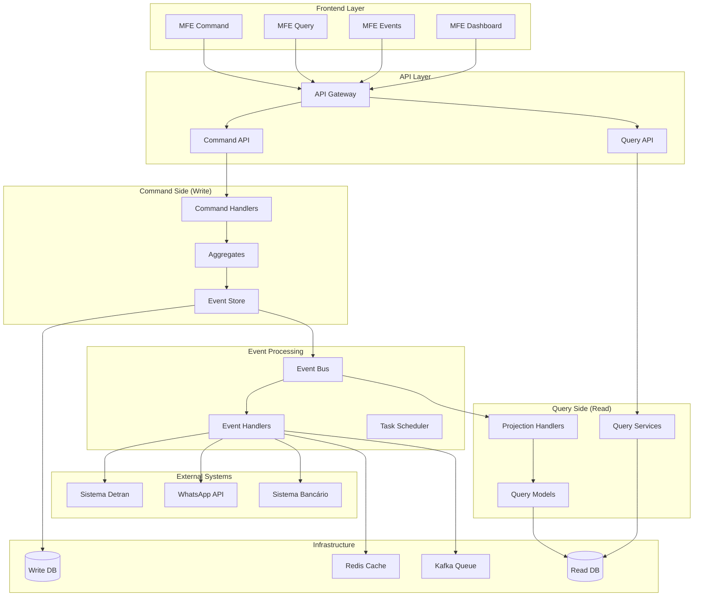
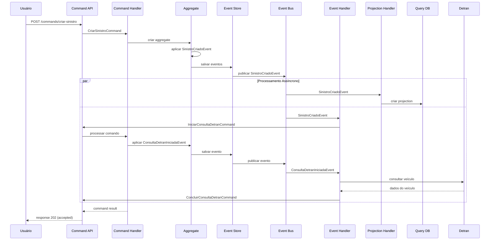

# Opção 3: Arquitetura Híbrida com Event Sourcing e CQRS

## 1. Visão Geral da Solução

Esta arquitetura combina **Event Sourcing** para auditoria completa, **CQRS** para separação de responsabilidades e **processamento híbrido** (síncrono para operações críticas, assíncrono para integrações). Oferece o melhor dos dois mundos: consistência eventual com alta performance.

## 2. Componentes Arquiteturais

### 2.1 Frontend (Angular 21 MFEs)
```
┌─────────────────────────────────────────┐
│           Micro Frontends               │
├─────────────────────────────────────────┤
│ • MFE Command (operações de escrita)    │
│ • MFE Query (consultas e relatórios)    │
│ • MFE Events (timeline de eventos)      │
│ • MFE Dashboard (visão consolidada)     │
│ • Shell App (orquestração)             │
└─────────────────────────────────────────┘
```

### 2.2 Command Side (Escrita)

#### Command Handler para Sinistros
```java
@Component
public class SinistroCommandHandler {
    
    @Autowired
    private EventStore eventStore;
    
    @Autowired
    private SinistroAggregate sinistroAggregate;
    
    @CommandHandler
    public CommandResult handle(CriarSinistroCommand command) {
        try {
            // Validações síncronas críticas
            validarComandoCriacao(command);
            
            // Criar aggregate e aplicar evento
            SinistroAggregate aggregate = new SinistroAggregate(command.getSinistroId());
            
            // Aplicar evento de criação
            SinistroCriadoEvent evento = SinistroCriadoEvent.builder()
                .sinistroId(command.getSinistroId())
                .cpfSegurado(command.getCpf())
                .placa(command.getPlaca())
                .renavam(command.getRenavam())
                .descricao(command.getDescricao())
                .timestamp(Instant.now())
                .build();
            
            aggregate.aplicarEvento(evento);
            
            // Salvar no Event Store
            eventStore.salvarEventos(aggregate.getId(), 
                                   aggregate.getEventosNaoCommitados());
            
            // Publicar evento para processamento assíncrono
            publicarEvento(evento);
            
            return CommandResult.success(aggregate.getId());
            
        } catch (Exception e) {
            return CommandResult.failure(e.getMessage());
        }
    }
    
    @CommandHandler
    public CommandResult handle(IniciarConsultaDetranCommand command) {
        try {
            // Carregar aggregate do Event Store
            SinistroAggregate aggregate = carregarAggregate(command.getSinistroId());
            
            // Aplicar evento de início de consulta
            ConsultaDetranIniciadaEvent evento = ConsultaDetranIniciadaEvent.builder()
                .sinistroId(command.getSinistroId())
                .placa(command.getPlaca())
                .renavam(command.getRenavam())
                .tentativa(1)
                .timestamp(Instant.now())
                .build();
            
            aggregate.aplicarEvento(evento);
            
            // Salvar eventos
            eventStore.salvarEventos(aggregate.getId(), 
                                   aggregate.getEventosNaoCommitados());
            
            // Publicar para processamento assíncrono
            publicarEvento(evento);
            
            return CommandResult.success();
            
        } catch (Exception e) {
            return CommandResult.failure(e.getMessage());
        }
    }
}
```

#### Sinistro Aggregate (Domain Model)
```java
@AggregateRoot
public class SinistroAggregate {
    
    private String id;
    private String cpfSegurado;
    private String placa;
    private String renavam;
    private SinistroStatus status;
    private DetranConsultaStatus consultaDetranStatus;
    private DetranResponse dadosDetran;
    private List<DomainEvent> eventosNaoCommitados = new ArrayList<>();
    
    public SinistroAggregate(String id) {
        this.id = id;
        this.status = SinistroStatus.NOVO;
        this.consultaDetranStatus = DetranConsultaStatus.PENDENTE;
    }
    
    // Aplicar eventos para reconstruir estado
    @EventSourcingHandler
    public void on(SinistroCriadoEvent evento) {
        this.id = evento.getSinistroId();
        this.cpfSegurado = evento.getCpfSegurado();
        this.placa = evento.getPlaca();
        this.renavam = evento.getRenavam();
        this.status = SinistroStatus.CRIADO;
    }
    
    @EventSourcingHandler
    public void on(ConsultaDetranIniciadaEvent evento) {
        this.consultaDetranStatus = DetranConsultaStatus.EM_ANDAMENTO;
    }
    
    @EventSourcingHandler
    public void on(ConsultaDetranConcluidaEvent evento) {
        this.dadosDetran = evento.getDadosDetran();
        this.consultaDetranStatus = DetranConsultaStatus.CONCLUIDA;
        this.status = SinistroStatus.DADOS_COLETADOS;
    }
    
    @EventSourcingHandler
    public void on(ConsultaDetranFalhadaEvent evento) {
        this.consultaDetranStatus = DetranConsultaStatus.FALHADA;
        // Manter status anterior para permitir retry
    }
    
    // Métodos de negócio
    public void iniciarConsultaDetran() {
        if (this.consultaDetranStatus != DetranConsultaStatus.PENDENTE) {
            throw new IllegalStateException("Consulta Detran já foi iniciada");
        }
        
        aplicarEvento(ConsultaDetranIniciadaEvent.builder()
            .sinistroId(this.id)
            .placa(this.placa)
            .renavam(this.renavam)
            .timestamp(Instant.now())
            .build());
    }
    
    public void concluirConsultaDetran(DetranResponse dados) {
        if (this.consultaDetranStatus != DetranConsultaStatus.EM_ANDAMENTO) {
            throw new IllegalStateException("Consulta Detran não está em andamento");
        }
        
        aplicarEvento(ConsultaDetranConcluidaEvent.builder()
            .sinistroId(this.id)
            .dadosDetran(dados)
            .timestamp(Instant.now())
            .build());
    }
    
    protected void aplicarEvento(DomainEvent evento) {
        // Aplicar evento ao estado atual
        AggregateLifecycle.apply(evento);
        // Adicionar à lista de eventos não commitados
        this.eventosNaoCommitados.add(evento);
    }
}
```

### 2.3 Query Side (Leitura)

#### Projection Handler
```java
@Component
public class SinistroProjectionHandler {
    
    @Autowired
    private SinistroQueryRepository queryRepository;
    
    @Autowired
    private DetranConsultaQueryRepository detranQueryRepository;
    
    @EventHandler
    public void on(SinistroCriadoEvent evento) {
        SinistroQueryModel sinistro = SinistroQueryModel.builder()
            .id(evento.getSinistroId())
            .cpfSegurado(evento.getCpfSegurado())
            .placa(evento.getPlaca())
            .renavam(evento.getRenavam())
            .descricao(evento.getDescricao())
            .status("CRIADO")
            .dataAbertura(evento.getTimestamp())
            .build();
        
        queryRepository.save(sinistro);
    }
    
    @EventHandler
    public void on(ConsultaDetranIniciadaEvent evento) {
        // Atualizar projection do sinistro
        SinistroQueryModel sinistro = queryRepository.findById(evento.getSinistroId())
            .orElseThrow();
        sinistro.setConsultaDetranStatus("EM_ANDAMENTO");
        sinistro.setUltimaAtualizacao(evento.getTimestamp());
        queryRepository.save(sinistro);
        
        // Criar projection específica para consulta Detran
        DetranConsultaQueryModel consulta = DetranConsultaQueryModel.builder()
            .sinistroId(evento.getSinistroId())
            .placa(evento.getPlaca())
            .renavam(evento.getRenavam())
            .status("EM_ANDAMENTO")
            .dataInicio(evento.getTimestamp())
            .tentativa(evento.getTentativa())
            .build();
        
        detranQueryRepository.save(consulta);
    }
    
    @EventHandler
    public void on(ConsultaDetranConcluidaEvent evento) {
        // Atualizar sinistro
        SinistroQueryModel sinistro = queryRepository.findById(evento.getSinistroId())
            .orElseThrow();
        sinistro.setConsultaDetranStatus("CONCLUIDA");
        sinistro.setStatus("DADOS_COLETADOS");
        sinistro.setUltimaAtualizacao(evento.getTimestamp());
        queryRepository.save(sinistro);
        
        // Atualizar consulta Detran
        DetranConsultaQueryModel consulta = detranQueryRepository
            .findBySinistroId(evento.getSinistroId()).orElseThrow();
        consulta.setStatus("CONCLUIDA");
        consulta.setDataConclusao(evento.getTimestamp());
        consulta.setDadosRetornados(evento.getDadosDetran());
        detranQueryRepository.save(consulta);
    }
}
```

#### Query Service
```java
@Service
@Transactional(readOnly = true)
public class SinistroQueryService {
    
    @Autowired
    private SinistroQueryRepository queryRepository;
    
    @Autowired
    private DetranConsultaQueryRepository detranQueryRepository;
    
    public SinistroDetailView buscarSinistroPorId(String sinistroId) {
        SinistroQueryModel sinistro = queryRepository.findById(sinistroId)
            .orElseThrow(() -> new SinistroNotFoundException(sinistroId));
        
        DetranConsultaQueryModel consultaDetran = detranQueryRepository
            .findBySinistroId(sinistroId).orElse(null);
        
        return SinistroDetailView.builder()
            .sinistro(sinistro)
            .consultaDetran(consultaDetran)
            .build();
    }
    
    public Page<SinistroListView> listarSinistros(SinistroFilter filter, Pageable pageable) {
        return queryRepository.findByFilter(filter, pageable)
            .map(SinistroListView::from);
    }
    
    public List<DetranConsultaStatus> obterStatusConsultasDetran() {
        return detranQueryRepository.findConsultasEmAndamento()
            .stream()
            .map(DetranConsultaStatus::from)
            .collect(Collectors.toList());
    }
}
```

### 2.4 Event Processing (Assíncrono)

#### Detran Integration Event Handler
```java
@Component
public class DetranIntegrationEventHandler {
    
    @Autowired
    private DetranClient detranClient;
    
    @Autowired
    private CommandGateway commandGateway;
    
    @Autowired
    private RedisTemplate<String, Object> redisTemplate;
    
    @EventHandler
    @Async
    public void handle(ConsultaDetranIniciadaEvent evento) {
        processarConsultaDetran(evento);
    }
    
    private void processarConsultaDetran(ConsultaDetranIniciadaEvent evento) {
        String cacheKey = "detran:" + evento.getPlaca() + ":" + evento.getRenavam();
        
        try {
            // Verificar cache primeiro
            DetranResponse cached = (DetranResponse) redisTemplate.opsForValue().get(cacheKey);
            if (cached != null && cached.isValido()) {
                // Usar dados do cache
                commandGateway.send(ConcluirConsultaDetranCommand.builder()
                    .sinistroId(evento.getSinistroId())
                    .dadosDetran(cached)
                    .origem("CACHE")
                    .build());
                return;
            }
            
            // Consultar Detran com retry
            DetranResponse response = consultarDetranComRetry(
                evento.getPlaca(), evento.getRenavam(), evento.getTentativa());
            
            if (response != null && response.isValido()) {
                // Cache por 24h
                redisTemplate.opsForValue().set(cacheKey, response, Duration.ofHours(24));
                
                // Comando para concluir consulta
                commandGateway.send(ConcluirConsultaDetranCommand.builder()
                    .sinistroId(evento.getSinistroId())
                    .dadosDetran(response)
                    .origem("DETRAN")
                    .build());
            } else {
                // Falha na consulta
                commandGateway.send(FalharConsultaDetranCommand.builder()
                    .sinistroId(evento.getSinistroId())
                    .erro("Dados inválidos retornados pelo Detran")
                    .tentativa(evento.getTentativa())
                    .build());
            }
            
        } catch (DetranIndisponivelException e) {
            // Reagendar retry se não excedeu limite
            if (evento.getTentativa() < 5) {
                reagendarConsulta(evento, e);
            } else {
                // Falha definitiva
                commandGateway.send(FalharConsultaDetranCommand.builder()
                    .sinistroId(evento.getSinistroId())
                    .erro("Detran indisponível após 5 tentativas")
                    .tentativa(evento.getTentativa())
                    .build());
            }
        }
    }
    
    private DetranResponse consultarDetranComRetry(String placa, String renavam, int tentativa) 
            throws DetranIndisponivelException {
        
        try {
            return detranClient.consultarVeiculo(placa, renavam);
        } catch (Exception e) {
            log.warn("Falha na consulta Detran (tentativa {}): {}", tentativa, e.getMessage());
            throw new DetranIndisponivelException("Detran indisponível", e);
        }
    }
    
    private void reagendarConsulta(ConsultaDetranIniciadaEvent eventoOriginal, Exception erro) {
        // Calcular delay com backoff exponencial
        long delay = (long) (Math.pow(2, eventoOriginal.getTentativa()) * 1000);
        
        // Agendar nova tentativa
        ScheduledExecutorService scheduler = Executors.newScheduledThreadPool(1);
        scheduler.schedule(() -> {
            commandGateway.send(IniciarConsultaDetranCommand.builder()
                .sinistroId(eventoOriginal.getSinistroId())
                .placa(eventoOriginal.getPlaca())
                .renavam(eventoOriginal.getRenavam())
                .tentativa(eventoOriginal.getTentativa() + 1)
                .build());
        }, delay, TimeUnit.MILLISECONDS);
    }
}
```

### 2.5 Event Store Implementation

#### Event Store Service
```java
@Service
public class EventStoreService implements EventStore {
    
    @Autowired
    private EventStoreRepository repository;
    
    @Autowired
    private ApplicationEventPublisher eventPublisher;
    
    @Override
    public void salvarEventos(String aggregateId, List<DomainEvent> eventos) {
        long versaoEsperada = obterVersaoAtual(aggregateId);
        
        for (DomainEvent evento : eventos) {
            EventStoreEntry entry = EventStoreEntry.builder()
                .aggregateId(aggregateId)
                .aggregateType("SinistroAggregate")
                .eventType(evento.getClass().getSimpleName())
                .eventData(serializarEvento(evento))
                .versao(++versaoEsperada)
                .timestamp(evento.getTimestamp())
                .build();
            
            repository.save(entry);
            
            // Publicar evento para projections
            eventPublisher.publishEvent(evento);
        }
    }
    
    @Override
    public List<DomainEvent> carregarEventos(String aggregateId) {
        return repository.findByAggregateIdOrderByVersao(aggregateId)
            .stream()
            .map(this::deserializarEvento)
            .collect(Collectors.toList());
    }
    
    @Override
    public List<DomainEvent> carregarEventos(String aggregateId, long versaoInicial) {
        return repository.findByAggregateIdAndVersaoGreaterThanOrderByVersao(
                aggregateId, versaoInicial)
            .stream()
            .map(this::deserializarEvento)
            .collect(Collectors.toList());
    }
    
    private long obterVersaoAtual(String aggregateId) {
        return repository.findMaxVersaoByAggregateId(aggregateId).orElse(0L);
    }
}
```

## 3. Diagrama da Arquitetura



## 4. Fluxo de Processamento Híbrido

### 4.1 Fluxo Command-Query com Event Sourcing


## 5. Configurações da Arquitetura

### 5.1 Event Store Configuration
```yaml
eventstore:
  batch-size: 100
  snapshot:
    frequency: 50  # snapshot a cada 50 eventos
    async: true
  serialization:
    format: json
    compression: gzip
```

### 5.2 CQRS Configuration
```yaml
cqrs:
  command:
    timeout: 30s
    retry:
      max-attempts: 3
      backoff: 1s
  query:
    cache:
      ttl: 300s
      max-size: 10000
  projection:
    batch-size: 50
    parallel: true
```

### 5.3 Async Processing
```yaml
async:
  core-pool-size: 10
  max-pool-size: 50
  queue-capacity: 1000
  thread-name-prefix: "async-"
```

## 6. Monitoramento e Observabilidade

### 6.1 Event Store Metrics
```java
@Component
public class EventStoreMetrics {
    
    private final MeterRegistry meterRegistry;
    private final Counter eventsSaved;
    private final Timer eventProcessingTime;
    
    public EventStoreMetrics(MeterRegistry meterRegistry) {
        this.meterRegistry = meterRegistry;
        this.eventsSaved = Counter.builder("events.saved")
            .description("Total events saved to event store")
            .register(meterRegistry);
        this.eventProcessingTime = Timer.builder("events.processing.time")
            .description("Event processing time")
            .register(meterRegistry);
    }
    
    public void recordEventSaved(String eventType) {
        eventsSaved.increment(Tags.of("type", eventType));
    }
    
    public void recordProcessingTime(String eventType, Duration duration) {
        eventProcessingTime.record(duration, Tags.of("type", eventType));
    }
}
```

### 6.2 Projection Health Check
```java
@Component
public class ProjectionHealthIndicator implements HealthIndicator {
    
    @Autowired
    private EventStoreService eventStore;
    
    @Autowired
    private SinistroQueryRepository queryRepository;
    
    @Override
    public Health health() {
        try {
            // Verificar lag das projections
            long lastEventVersion = eventStore.getLastEventVersion();
            long lastProjectionVersion = queryRepository.getLastProcessedVersion();
            
            long lag = lastEventVersion - lastProjectionVersion;
            
            if (lag > 100) {
                return Health.down()
                    .withDetail("projection-lag", lag)
                    .withDetail("status", "HIGH_LAG")
                    .build();
            }
            
            return Health.up()
                .withDetail("projection-lag", lag)
                .withDetail("last-event-version", lastEventVersion)
                .withDetail("last-projection-version", lastProjectionVersion)
                .build();
                
        } catch (Exception e) {
            return Health.down(e).build();
        }
    }
}
```

## 7. Vantagens desta Arquitetura

✅ **Auditoria Completa**: Event Sourcing mantém histórico completo
✅ **Performance de Leitura**: CQRS otimiza consultas
✅ **Escalabilidade**: Separação de responsabilidades permite escala independente
✅ **Flexibilidade**: Novas projections podem ser criadas facilmente
✅ **Resiliência**: Processamento assíncrono com retry automático
✅ **Consistência Eventual**: Melhor performance com garantias de consistência
✅ **Replay de Eventos**: Possibilidade de reprocessar eventos históricos

## 8. Desvantagens

❌ **Complexidade Arquitetural**: Múltiplos padrões e conceitos
❌ **Curva de Aprendizado**: Equipe precisa dominar Event Sourcing e CQRS
❌ **Consistência Eventual**: Pode haver delay entre comando e query
❌ **Overhead de Armazenamento**: Event Store pode crescer rapidamente
❌ **Debugging Complexo**: Rastreamento através de múltiplos componentes

## 9. Casos de Uso Ideais

- **Sistemas com alta carga de leitura e escrita**
- **Necessidade de auditoria detalhada e compliance**
- **Requisitos de escalabilidade horizontal**
- **Tolerância a consistência eventual**
- **Necessidade de análise histórica e replay de eventos**
- **Arquiteturas orientadas a eventos**